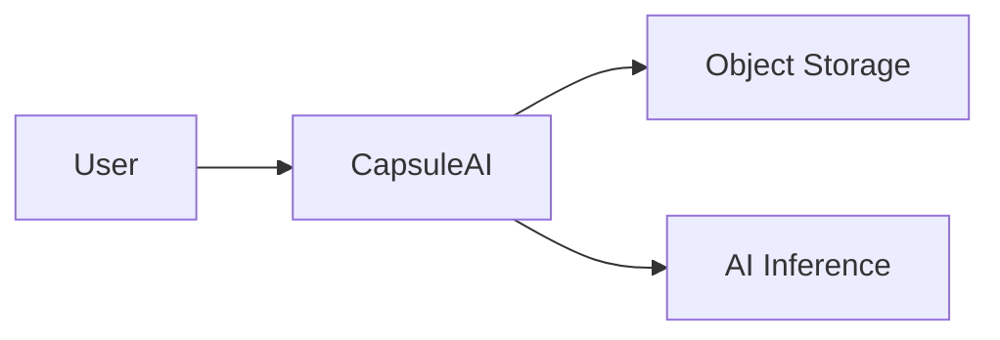
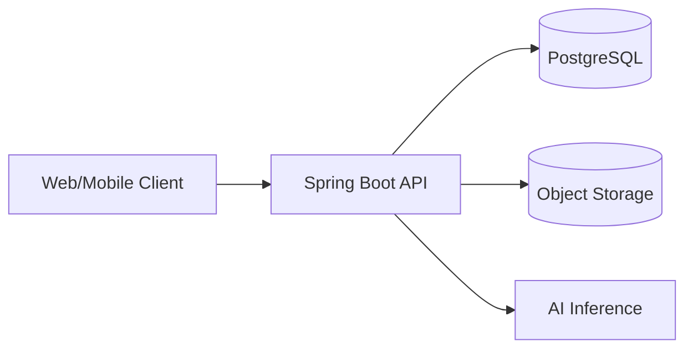
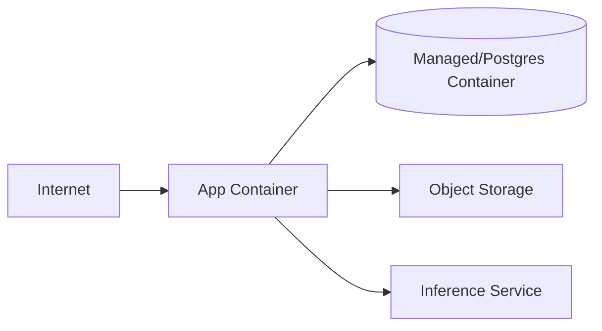
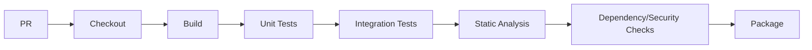
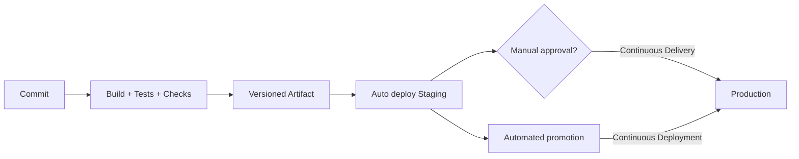
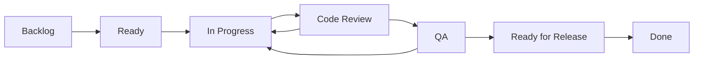
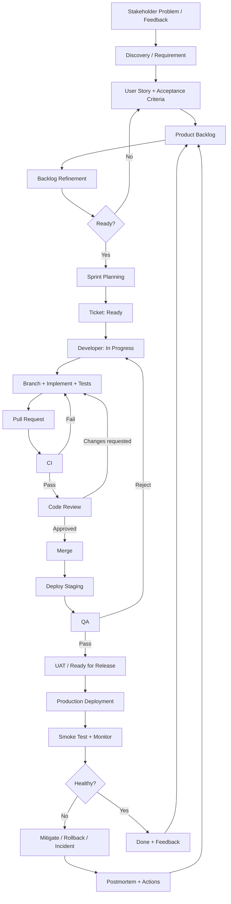

# Software Company Development Workflow

> **Mục tiêu:** mô phỏng một quy trình phát triển phần mềm chuyên nghiệp trong đồ án đại học 3–6 người, ưu tiên những thói quen mà intern/junior developer thực sự sẽ gặp: ticket, refinement, Sprint, Git branch, Pull Request, CI, Code Review, testing, staging, release, monitoring, incident và feedback.

---

## 0. Cách đọc tài liệu này

Không có một công ty nào dùng chính xác một quy trình giống nhau. Tài liệu này tách rõ ba mức:

- **Phổ biến trong công ty:** thực hành xuất hiện ở nhiều đội ngũ chuyên nghiệp.
- **Có thể thay đổi:** phụ thuộc sản phẩm, quy mô, regulatory requirements, mức độ trưởng thành của công ty.
- **Nên mô phỏng trong đồ án:** phiên bản gọn nhưng đủ thực tế cho đội 3–6 sinh viên.

Tư tưởng xuyên suốt là:

```text
Không phải: Requirements → Code → Demo

Mà là:
Problem → Discovery → Requirements → Backlog → Refinement → Planning
→ Design → Ticket → Branch → Implementation → Tests → PR → CI → Review
→ QA → Staging → UAT → Release → Production → Monitoring
→ Incident/Maintenance → Feedback → Backlog → vòng lặp tiếp theo
```

---

# 1. Big Picture — toàn bộ vòng đời phát triển phần mềm


## 1.1 SDLC, Agile, Scrum, DevOps, DevSecOps, CI/CD khác nhau thế nào?

| Khái niệm | Nó trả lời câu hỏi gì? | Ý nghĩa thực tế |
|---|---|---|
| **SDLC** | Phần mềm đi từ ý tưởng đến vận hành qua những loại công việc nào? | Discovery, requirements, design, implementation, verification, deployment, operation, maintenance. |
| **Agile** | Làm sao thích nghi khi yêu cầu thay đổi và nhận feedback sớm? | Chia nhỏ giá trị, làm lặp, giao tiếp thường xuyên, học từ feedback. |
| **Scrum** | Nhóm tổ chức công việc lặp theo Sprint như thế nào? | Product Backlog, Sprint Planning, Daily Scrum, Sprint Review, Retrospective, Increment, DoD. |
| **DevOps** | Làm sao development và operations cùng chịu trách nhiệm đưa phần mềm ra production ổn định? | Automation, CI/CD, environment, deployment, observability, ownership. |
| **DevSecOps** | Security nằm ở đâu? | Security được tích hợp xuyên suốt requirements, design, coding, CI, deployment và operation. |
| **CI** | Làm sao biết thay đổi mới có phá hệ thống không? | Build/test/static checks tự động khi push/PR. |
| **Continuous Delivery** | Làm sao luôn có artifact sẵn sàng deploy? | Sau CI, build được chuẩn hóa và có thể promote; production thường có manual approval. |
| **Continuous Deployment** | Làm sao tự động đưa thay đổi hợp lệ lên production? | Mọi thay đổi qua pipeline thành công có thể tự deploy production mà không cần approval thủ công. |

### Điểm cần nhớ

Scrum **không định nghĩa** Git, Pull Request, CI, Docker, QA environment hay production monitoring. Các practice này được ghép vào SDLC/Scrum để tạo thành workflow engineering hoàn chỉnh.

Modern teams thường dùng **iterative SDLC**: requirements, design, implementation, testing và operation không phải chỉ làm một lần. Mỗi feature/release nhỏ sẽ đi qua vòng lặp tương tự.

---

# 2. Professional Team Roles

| Role | Trách nhiệm chính | Thường tương tác với |
|---|---|---|
| Client / Stakeholder | Nêu nhu cầu, business goals, chấp nhận kết quả | PM/PO/BA, UX, team |
| Product Manager | Product strategy, market, roadmap, outcome | Stakeholders, PO, engineering |
| Product Owner | Quản lý Product Backlog, ưu tiên giá trị | Developers, QA, Scrum Master |
| Business Analyst | Khai thác/chuẩn hóa requirements, business rules | Stakeholder, PO, QA, Dev |
| Project Manager | Scope, schedule, budget, dependency, risk | Toàn nhóm |
| Scrum Master | Giúp Scrum Team vận hành Scrum hiệu quả, tháo impediment | Scrum Team |
| UI/UX Designer | User flow, wireframe, prototype, usability | PO/BA, FE/Mobile |
| Solution Architect | System-level design, constraints, quality attributes | Tech Lead, DevOps, security |
| Tech Lead | Technical direction, design/review, engineering quality | Developers, architect, QA |
| Backend Developer | API, domain logic, DB, integrations, tests | FE/Mobile, QA, DevOps |
| Frontend Developer | Web UI, state, API integration, tests | UX, BE, QA |
| Mobile Developer | Mobile app, device integrations | BE, UX, QA |
| AI/ML Engineer | Model/data pipeline/inference/evaluation | BE, Data, DevOps |
| QA Engineer | Test strategy, scenarios, exploratory/regression testing | PO/BA, Dev |
| Automation QA | Automated API/E2E/regression suites | QA, Dev, CI |
| DevOps Engineer | CI/CD, infrastructure, environments, deployment | Dev, QA, SRE |
| SRE | Reliability, observability, incident response, SLOs | DevOps, Dev, support |
| Security Engineer | Threat modeling, AppSec controls, vulnerability management | Architect, Dev, DevOps |

## 2.1 Role assignment cho đội sinh viên 3–6 người

### 3 người

- Người A: PO/BA + Backend.
- Người B: Tech Lead + Backend/DevOps.
- Người C: Frontend/Mobile + QA coordinator.
- Tất cả: Code Review chéo, testing, Sprint Review, Retro.

### 4–6 người

- 1 Product/BA + UI/UX part-time.
- 1 Tech Lead/Backend.
- 1–2 Backend/AI.
- 1–2 Frontend/Mobile.
- QA và DevOps luân phiên/kiêm nhiệm.

**Không nên:** giả lập 15 chức danh khác nhau bằng paperwork. Điều cần học là **trách nhiệm và handoff**, không phải tên chức danh.

---

# 3. Project Initiation & Product Discovery

## Purpose
Xác minh nhóm đang giải quyết **đúng vấn đề**, cho **đúng người dùng**, với phạm vi khả thi.

## Participants
Stakeholder, PM/PO, BA, UX, Tech Lead/Architect; developer tham gia để đánh giá feasibility.

## Inputs
Ý tưởng, vấn đề người dùng, domain knowledge, hạn chế thời gian/ngân sách/công nghệ.

## Activities

1. Viết **problem statement**.
2. Xác định stakeholders và target users.
3. Thu thập pain points.
4. Định nghĩa product vision.
5. Đặt product/business goals.
6. Chọn success metrics.
7. Liệt kê assumptions, constraints, risks.
8. Chốt MVP.
9. Tách in-scope / out-of-scope.
10. Technical feasibility + schedule feasibility.

## How It Is Actually Done

Ví dụ CapsuleAI:

```text
Problem:
Người dùng có nhiều quần áo nhưng khó ghi nhớ wardrobe và phối outfit phù hợp.

Target users:
Sinh viên/người đi làm sử dụng smartphone, muốn quản lý wardrobe cá nhân.

MVP:
- Register/login
- Upload garment image
- Extract garment attributes
- Store wardrobe item
- View/search wardrobe
- Generate simple outfit recommendations

Out of scope for MVP:
- Social network
- Marketplace
- AR virtual try-on
- Multi-region production architecture
```

### Success metrics mẫu

- ≥ 90% successful garment upload requests trong test set.
- P95 API latency cho CRUD wardrobe < 500 ms trong mức tải mục tiêu của project.
- 100% core user stories có Acceptance Criteria và QA evidence.
- Mọi merge vào `main` phải qua PR + CI.

## Outputs / Deliverables

Tối thiểu:

- `docs/product/product-vision.md`
- `docs/product/project-scope.md`
- `docs/product/personas-or-users.md`
- `docs/product/mvp.md`
- Risk list ngắn.

## Tools
Notion/Markdown, FigJam/Miro, Jira/GitHub Projects, Figma.

## Exit Criteria

- Vấn đề và target user rõ.
- MVP đủ nhỏ để hoàn thành.
- Có success metrics.
- In/out scope được thống nhất.
- Các risk lớn đã được ghi nhận.

## Common Student Mistakes

- Chọn quá nhiều feature.
- Bắt đầu code trước khi hiểu user/problem.
- “AI”, “microservices”, “real-time” được thêm chỉ để trông phức tạp.

## How I Should Simulate It
Một buổi discovery 2–3 giờ + tài liệu 2–4 trang là đủ.

---

# 4. Requirement Elicitation

## Purpose
Biến nhu cầu mơ hồ thành thông tin đủ để phân tích.

## Kỹ thuật

- Stakeholder interviews.
- Workshops.
- Questionnaires.
- Observation.
- Competitor analysis.
- Existing-system analysis.
- Brainstorming.
- Prototyping.

## Cách hỏi follow-up thay vì chấp nhận yêu cầu mơ hồ

| Stakeholder nói | Câu hỏi follow-up | Requirement rõ hơn |
|---|---|---|
| “Upload ảnh phải nhanh.” | Bao nhiêu giây? ảnh tối đa bao nhiêu MB? mạng nào? | Ảnh ≤ 10 MB; API nhận file trong ≤ 2 s ở môi trường test, không tính thời gian model inference. |
| “Chỉ chủ sở hữu được xem wardrobe.” | Có admin không? shared wardrobe? | User chỉ đọc/sửa/xóa item thuộc `user_id` của mình; admin không có quyền xem ảnh riêng tư trừ support flow được định nghĩa. |
| “Hệ thống gợi ý outfit phù hợp.” | Phù hợp theo tiêu chí nào? weather? color? occasion? | MVP dùng category + color harmony + occasion; weather chưa nằm trong scope. |

## Deliverable
- Meeting notes.
- Raw requirements log.
- Open questions.
- Decision log.

## Exit Criteria
Các câu hỏi làm thay đổi scope/business rule không còn “treo” trước khi story vào Ready.

---

# 5. Requirement Analysis

Raw requirement cần được phân loại và kiểm tra tính testable.

## 5.1 Các nhóm requirement

### Functional Requirements
Hệ thống phải làm gì.

> FR-012: Authenticated user can upload one garment image and create a wardrobe item.

### Non-Functional Requirements
Quality attributes.

- Performance.
- Availability.
- Security.
- Maintainability.
- Scalability.
- Observability.

### Business Rules

> BR-007: Một wardrobe item phải thuộc đúng một user.

### Constraints

> Backend dùng Java/Spring Boot; PostgreSQL; deadline 16 tuần.

### Assumptions

> MVP giả định mỗi request upload chỉ chứa một garment chính.

### Dependencies

> Garment extraction phụ thuộc inference service/model.

### Edge/Error cases

- File rỗng.
- Unsupported MIME type.
- File quá lớn.
- Model timeout.
- Object storage failure.
- DB transaction failure.
- Duplicate retry.

## 5.2 Requirement tệ → tốt

**Tệ:** “Hệ thống phải bảo mật.”

**Tốt:**

- Password được hash bằng password hashing algorithm phù hợp, không lưu plaintext.
- Wardrobe APIs yêu cầu authenticated user.
- Authorization kiểm tra ownership của resource.
- Secrets không commit vào Git.
- Failed authentication được log ở mức phù hợp nhưng không log password/token.

**Tệ:** “API phải nhanh.”

**Tốt:** “Ở test workload đã định nghĩa, CRUD endpoints có P95 latency < 500 ms.”

## Exit Criteria
Mỗi requirement quan trọng có thể trả lời: **ai**, **hành vi**, **điều kiện**, **kết quả**, **failure behavior**, **cách test**.

---

# 6. Epic → Feature → User Story → Task/Subtask/Bug

```text
Epic: Wardrobe Management
  └─ Feature: Garment Upload
      ├─ User Story: Upload garment image
      │   ├─ Task: Design POST /wardrobe/items endpoint
      │   ├─ Task: Implement object storage adapter
      │   ├─ Task: Persist wardrobe metadata
      │   └─ Subtask: Add integration test
      └─ Bug: Upload returns 500 for unsupported image type
```

## User Story format

```text
As a wardrobe owner,
I want to upload a garment image,
so that I can add the garment to my digital wardrobe.
```

## Acceptance Criteria — Given/When/Then

```gherkin
Given an authenticated user
And a valid JPEG image smaller than 10 MB
When the user uploads the image
Then the API returns 201 Created
And a wardrobe item is created for that user
And the response contains the new item id
```

```gherkin
Given an authenticated user
And a file with an unsupported media type
When the user uploads the file
Then the API returns 415 Unsupported Media Type
And no wardrobe item is persisted
```

## Acceptance Criteria vs Definition of Ready vs Definition of Done

| Khái niệm | Phạm vi | Câu hỏi |
|---|---|---|
| Acceptance Criteria | Một story | “Story này phải hành xử thế nào để business chấp nhận?” |
| Definition of Ready (team convention) | Trước khi kéo item vào Sprint | “Item đã đủ rõ để team bắt đầu chưa?” |
| Definition of Done | Chất lượng của Increment/work hoàn thành | “Work có thật sự hoàn tất theo chuẩn team không?” |

> **Lưu ý:** Definition of Ready là practice thường dùng bởi nhiều team, nhưng không phải artifact/commitment chính thức được Scrum Guide định nghĩa như Definition of Done.

### DoR gọn cho đồ án

- Story có value rõ.
- Acceptance Criteria có thể test.
- Dependencies/risk lớn được biết.
- UX/API mock cần thiết đã có.
- Không còn câu hỏi business blocking.
- Team có thể ước lượng.

### DoD gọn

- Acceptance Criteria pass.
- Code + automated tests hoàn tất.
- PR approved.
- Required CI checks pass.
- DB migration/API docs cập nhật nếu có.
- Security checks liên quan đã thực hiện.
- QA pass trên staging.
- Không có blocker/critical defect mở.

---

# 7. Product Backlog

Product Backlog là danh sách có thứ tự của những gì cần thiết để cải thiện product. Product Owner chịu trách nhiệm tối đa hóa value và quản lý Product Backlog trong Scrum.

## Backlog mẫu

| ID | Type | Item | Priority | Estimate | Dependency |
|---|---|---|---|---:|---|
| EP-01 | Epic | Wardrobe Management | High | — | — |
| US-001 | Story | Register account | High | 3 | — |
| US-002 | Story | Login | High | 3 | US-001 |
| US-003 | Story | Upload garment image | High | 8 | US-002 |
| US-004 | Story | Extract garment attributes | High | 8 | US-003 |
| US-005 | Story | View wardrobe list | High | 5 | US-003 |
| US-006 | Story | Edit garment metadata | Medium | 3 | US-005 |
| US-007 | Story | Delete garment | Medium | 3 | US-005 |
| US-008 | Story | Search/filter wardrobe | Medium | 5 | US-005 |
| US-009 | Story | Generate outfit recommendation | High | 8 | US-004 |
| US-010 | Story | Save favorite outfit | Low | 5 | US-009 |
| BUG-01 | Bug | Wrong ownership check on item fetch | Critical | 2 | — |
| TECH-01 | Tech Debt | Add Testcontainers integration suite | Medium | 5 | — |
| SPIKE-01 | Spike | Evaluate object storage provider | Medium | 3 | — |

## Prioritization

Có thể dùng:

- Business value + risk + dependency.
- MoSCoW.
- RICE/WSJF khi cần.

Đồ án nên dùng **High/Medium/Low + giải thích ngắn**, tránh giả tạo độ chính xác.

## Story Points
Là relative estimate cho effort/complexity/uncertainty, không phải “1 point = 1 giờ”.

## Jira / GitHub Projects representation

Fields đủ dùng:

- ID.
- Title.
- Type.
- Priority.
- Estimate.
- Assignee.
- Sprint.
- Status.
- Labels/components.
- Acceptance Criteria/link to spec.

---

# 8. Backlog Refinement

## Purpose
Làm cho những item sắp được thực hiện trở nên rõ, nhỏ, testable và ước lượng được.

## Participants
PO/BA, Developers, QA; Tech Lead khi có design/risk quan trọng.

## Checklist mỗi story

- Value rõ chưa?
- Acceptance Criteria đầy đủ chưa?
- Edge/error cases?
- Security concerns?
- Dependency?
- API/DB impact?
- Testable?
- Quá lớn không? cần split?
- Estimate?

## Hội thoại refinement mẫu

**PO:** “US-003 cho phép user upload garment image.”

**Developer:** “Một request có hỗ trợ nhiều ảnh không?”

**PO:** “MVP chỉ một ảnh chính.”

**QA:** “File GIF, HEIC hoặc ảnh 20 MB thì sao?”

**PO:** “Chỉ JPEG/PNG, tối đa 10 MB.”

**Tech Lead:** “Model inference có thể timeout. API nên fail toàn bộ hay tạo item ở trạng thái `PROCESSING_FAILED`?”

**PO:** “Không mất ảnh; tạo item với trạng thái `PROCESSING_FAILED` và cho retry.”

**QA:** “Vậy cần AC cho timeout + retry.”

**Developer:** “Có object storage và DB, cần xử lý consistency. Tôi ước lượng 8 points.”

### Output
Story được cập nhật Acceptance Criteria, edge cases, estimate, dependencies và có thể chuyển `Backlog → Ready`.

---

# 9. Software Architecture & System Design

## Purpose
Quyết định cấu trúc hệ thống đủ sớm để các feature có chỗ “đi vào”, nhưng không design toàn bộ tương lai.

## Nên thiết kế

- Architectural style.
- System boundaries.
- Modules + responsibilities.
- Data stores.
- External integrations.
- Sync/async communication.
- Data flow.
- Security/trust boundaries.
- Failure handling.
- Deployment topology.
- Quality attributes quan trọng.

## Khuyến nghị cho đồ án

**Modular monolith trước, microservices chỉ khi có lý do thật.**

Ví dụ:

```text
Spring Boot application
├─ auth
├─ user
├─ wardrobe
├─ recommendation
├─ media
└─ shared

External:
- PostgreSQL
- Object Storage
- AI inference component/service
```

## C4 Model

### System Context



### Container



### Component
Chỉ vẽ cho phần phức tạp cần trao đổi, ví dụ `wardrobe` upload flow.

### Deployment



## Nên duy trì diagram nào?

**Essential:** System Context + Container + một Deployment diagram đơn giản.

**Optional:** Component diagram cho module phức tạp.

**Bỏ:** class diagram cho toàn bộ codebase nếu nó luôn stale và IDE đã thể hiện cấu trúc tốt hơn.

---

# 10. Architecture Decision Records (ADR)

ADR ghi lại **vì sao** một technical decision quan trọng được chọn.

## Template

```markdown
# ADR-00X: <Title>

## Status
Proposed | Accepted | Superseded | Deprecated

## Context
Vấn đề, constraints, quality attributes.

## Decision
Quyết định đã chọn.

## Alternatives Considered
- Option A
- Option B

## Consequences
### Positive
### Negative / Trade-offs
```

## ADR nên có cho project

- ADR-001: PostgreSQL thay vì MongoDB.
- ADR-002: JWT vs session authentication.
- ADR-003: Modular monolith thay vì microservices.
- ADR-004: Object storage thay vì lưu image BLOB trong DB.
- ADR-005: Synchronous inference hay queue-based async processing.

**Không cần ADR** cho mọi thư viện nhỏ.

---

# 11. Database Design Workflow

```text
Domain analysis
→ Entities/Aggregates
→ Relationships
→ ERD
→ Logical schema
→ Constraints
→ Indexes
→ Migration
→ Integration tests
```

## Checklist

- PK: ổn định, unique.
- FK: enforce relationships.
- `NOT NULL`: field bắt buộc.
- `UNIQUE`: invariant uniqueness.
- `CHECK`: invariant đơn giản tại DB.
- Index: phục vụ query thực tế; không index mọi column.
- Transaction: bao quanh unit of work cần atomicity.
- Normalization: tránh duplicated mutable facts; denormalize khi có lý do đo được.
- Seed data: deterministic cho dev/test.

## Migration

Ví dụ Flyway:

```text
src/main/resources/db/migration/
├── V1__create_users.sql
├── V2__create_wardrobe_items.sql
└── V3__add_wardrobe_indexes.sql
```

**Không sửa production DB thủ công** vì:

- Không reproducible.
- Không review được.
- Environment drift.
- Không có lịch sử deployment đáng tin.
- Rollback/forward-fix khó.

Schema change nên là code + migration versioned + review + pipeline.

---

# 12. API Design Before Implementation

## Quy tắc REST thực dụng

```http
POST   /api/v1/wardrobe/items
GET    /api/v1/wardrobe/items/{id}
GET    /api/v1/wardrobe/items?page=0&size=20&category=TOP&sort=createdAt,desc
PATCH  /api/v1/wardrobe/items/{id}
DELETE /api/v1/wardrobe/items/{id}
```

## Status codes

- `200 OK`: read/update thành công.
- `201 Created`: resource mới.
- `204 No Content`: delete thành công.
- `400 Bad Request`: malformed/business input chung.
- `401 Unauthorized`: chưa authenticate/credential không hợp lệ.
- `403 Forbidden`: đã authenticate nhưng không có quyền.
- `404 Not Found`: resource không tồn tại/không visible.
- `409 Conflict`: state conflict/duplicate invariant.
- `415 Unsupported Media Type`: type file không hỗ trợ.
- `422 Unprocessable Content`: dùng nếu API convention của team chọn cho semantic validation.

## Error response thống nhất

```json
{
  "code": "WARDROBE_UNSUPPORTED_IMAGE_TYPE",
  "message": "Only JPEG and PNG images are supported",
  "traceId": "abc-123",
  "fieldErrors": []
}
```

## DTO + validation

Không expose JPA entity trực tiếp làm public API contract. Dùng request/response DTOs và validation rõ ràng.

## Pagination/filter/sort
Luôn xác định:

- Default size.
- Max size.
- Stable sort.
- Filter semantics.

## Idempotency
Áp dụng nơi retry có nguy cơ tạo duplicate side effects, ví dụ payment/order creation; upload đơn giản có thể dùng request id/idempotency key nếu retry semantics quan trọng.

## OpenAPI
API contract nên cập nhật cùng code. Với Spring Boot có thể dùng OpenAPI tooling phù hợp để generate/serve spec.

---

# 13. Security Throughout SDLC

Security không phải “bước cuối cùng”.

```text
Discovery: data sensitivity, abuse cases
Requirements: authentication/authorization/privacy requirements
Design: trust boundaries, threat modeling
Coding: validation, secure APIs, secrets
PR/CI: dependency/code scanning, tests
Deployment: least privilege, TLS, secrets, secure config
Production: logging, alerts, incident response, patches
```

## Practical checklist

- Password: password hashing, không plaintext/reversible encryption.
- AuthN: JWT/session lifecycle rõ.
- AuthZ: resource-level authorization, không chỉ role ở UI.
- Input validation: server-side.
- SQL injection: parameterized queries/ORM binding đúng cách.
- Secrets: environment/secret manager, không commit Git.
- Logs: không log password, raw token, secret, sensitive payload không cần thiết.
- Dependency security: scan và update.
- Encryption: HTTPS/TLS in transit; at-rest theo platform/threat model.
- File upload: MIME/size validation, randomized object key, access control.
- Rate limiting: áp dụng cho auth/upload endpoint nếu cần.

## Threat modeling siêu gọn

Với upload flow hỏi 4 câu:

1. What are we building?
2. What can go wrong?
3. What are we going to do about it?
4. Did we do a good enough job?

Ví dụ threats:

- User truy cập ảnh người khác → ownership authorization.
- Malicious file → allow-list content types, size limits, isolated processing.
- Stolen JWT → short-lived access token/secure refresh strategy tùy architecture.
- Object URL public → private bucket + signed/authorized access.

---

# 14. Sprint 0 / Engineering Setup

> Sprint 0 không phải khái niệm bắt buộc của Scrum. Ở đây dùng như tên thực dụng cho giai đoạn bootstrap kỹ thuật trước feature sprints.

## Checklist

### Repository

- README.
- `.gitignore`.
- LICENSE nếu cần.
- `CONTRIBUTING.md`.
- Issue templates.
- PR template.

### Environments/config

- `.env.example` hoặc config example không chứa secret.
- Local setup instructions.
- Dev/test/staging/prod config separation.

### Code quality

- Formatter.
- Linter/static analysis.
- Coding conventions.
- Compiler warnings hợp lý.

### GitHub

- `main` protected.
- Require PR.
- Require at least 1 approval cho đồ án nếu plan hỗ trợ.
- Required CI status checks.
- Không force-push/delete `main`.

### CI

- Compile/build.
- Unit tests.
- Integration tests tối thiểu.
- Static checks.
- Package artifact.

### Database

- Docker Compose local DB.
- Flyway/Liquibase.
- Test DB strategy.

### API docs
OpenAPI/Swagger.

## Repository structure đề xuất

```text
project/
├── .github/
│   ├── workflows/
│   │   ├── ci.yml
│   │   └── deploy-staging.yml
│   ├── ISSUE_TEMPLATE/
│   └── pull_request_template.md
├── docs/
├── src/
├── docker/
├── compose.yaml
├── pom.xml
├── README.md
└── CONTRIBUTING.md
```

---

# 15. Git Workflow — GitHub Flow gọn

```text
main
 └─ feat/US-023-upload-garment
      commits...
      ↓
   Pull Request
      ↓ review + CI
   squash merge
      ↓
main
```

## Branch naming

```text
feat/US-023-upload-garment
fix/BUG-014-image-validation
chore/TECH-008-upgrade-flyway
```

## Commit messages

```text
feat(wardrobe): add garment upload endpoint
fix(auth): reject expired refresh token
refactor(media): extract object storage adapter
 test(wardrobe): add upload integration tests
```

## Quy tắc

- Pull latest `main` trước khi bắt đầu/merge khi cần.
- Một branch gắn với một ticket/nhóm thay đổi coherent.
- Không direct push `main`.
- PR nhỏ dễ review hơn PR 2,000 dòng.
- Đồ án: ưu tiên squash merge để history `main` gọn.

---

# 16. Sprint Planning

## Inputs

- Ordered Product Backlog.
- Refined Ready items.
- Team capacity.
- Product Goal/context.
- Previous velocity chỉ dùng tham khảo, không làm KPI cá nhân.

## Outputs

- Sprint Goal.
- Selected Product Backlog Items.
- Plan/task breakdown = Sprint Backlog.

## Ví dụ Sprint 1 — 2 tuần

### Sprint Goal
“User có thể tạo tài khoản, đăng nhập và thêm garment đầu tiên vào wardrobe.”

### Capacity
4 người × khoảng 6 development days hữu dụng = 24 person-days sau khi trừ học/họp.

### Selected items

- US-001 Register — 3.
- US-002 Login — 3.
- US-003 Upload garment — 8.
- US-005 View wardrobe list — 5.
- TECH-01 Integration test foundation — 5.

Nếu tổng vượt capacity/uncertainty cao, bỏ item thấp hơn thay vì “cam kết làm thêm đêm”.

### Breakdown US-003

- Finalize API contract.
- Add DB migration.
- Implement storage adapter.
- Implement service.
- Implement controller/validation.
- Unit tests.
- Integration tests.
- OpenAPI update.
- QA test data.

---

# 17. Daily Developer Workflow — từ ticket đến production

Đây là workflow cần luyện nhiều nhất.

```text
Ticket
→ Read requirements
→ Clarify
→ Move to In Progress
→ Sync main
→ Create branch
→ Implement small slices
→ Write/run tests
→ Local verification
→ Commit
→ Push
→ Open PR
→ CI
→ Code Review
→ Address feedback
→ Approval
→ Merge
→ Deploy staging
→ QA
→ Ready for Release
→ Production
→ Monitor
→ Done
```

## Step-by-step

### 1. Nhận ticket
Đọc title, description, AC, designs, dependencies, related issues.

### 2. Clarify trước khi code
Nếu AC mâu thuẫn hoặc thiếu behavior: hỏi PO/BA/QA. Nếu design concern: hỏi Tech Lead.

### 3. Move `Ready → In Progress`
Board phải phản ánh thực tế.

### 4. Sync code

```bash
git checkout main
git pull origin main
git checkout -b feat/US-023-upload-garment
```

### 5. Implement theo vertical slice nhỏ
Không viết toàn hệ thống rồi test cuối Sprint.

### 6. Automated tests
Ít nhất unit/integration test cho logic và boundary quan trọng.

### 7. Local verification

```bash
mvn clean verify
```

Kiểm tra API bằng automated test; Postman chỉ nên bổ trợ exploratory/manual verification.

### 8. Commit meaningful changes
Không commit “fix”, “update”, “final-final”.

### 9. Push + PR
PR mô tả why/what/how/test/effects.

### 10. CI
Nếu fail, **author sửa trước**; đừng yêu cầu reviewer review một PR đỏ nếu failure thuộc code hiện tại.

### 11. Code Review
Trả lời comments; không resolve comment mà chưa xử lý/thảo luận.

### 12. Merge
Chỉ merge khi required checks + approvals pass.

### 13. QA/Staging
QA verify AC, error cases, regression risk.

### 14. Release
Item chỉ `Done` khi theo board/DoD của team. Nếu team định nghĩa QA staging là DoD thì code merged chưa phải Done.

## Khi developer nói chuyện với ai?

- **PO/BA:** behavior/business ambiguity.
- **QA:** testability, reproduction, edge case.
- **Tech Lead:** architecture, risky migration, concurrency/security/performance.
- **Other developers:** shared module/API contract/conflict/dependency.

---

# 18. Pull Request Workflow

## PR Template

```markdown
## Summary
What problem does this PR solve?

## Related Issue
Closes #123 / US-023

## Changes
- ...

## Testing
- [ ] Unit tests
- [ ] Integration tests
- [ ] Manual/exploratory verification where relevant

## API Changes
- None / describe endpoint/schema changes

## Database Migration
- None / `V12__...sql`

## Screenshots
If UI change.

## Breaking / Deployment Concerns
- None / describe compatibility, config, migration order

## Checklist
- [ ] Acceptance Criteria covered
- [ ] Local `mvn verify` passes
- [ ] Tests added/updated
- [ ] No secrets committed
- [ ] Docs/OpenAPI updated if needed
- [ ] Migration is backward-compatible where required
```

## Sau khi mở PR

1. CI chạy.
2. Author self-review diff.
3. Reviewer đọc context + code + tests.
4. Comments/request changes.
5. Author push fix; CI rerun.
6. Approval.
7. Merge theo policy.
8. Branch delete.
9. Deployment pipeline tiếp tục.

---

# 19. Code Review

## Reviewer kiểm tra

- Correctness.
- Readability.
- API/DB contract.
- Architecture/module boundaries.
- Error handling.
- Tests.
- Security.
- Concurrency khi có shared state/transaction.
- Performance chỉ khi relevant.
- Backward compatibility/migration risk.

## Comment taxonomy nội bộ đề xuất

- **Blocking:** phải sửa trước merge.
- **Suggestion:** cải thiện đáng làm nhưng không blocker.
- **Question:** cần hiểu intent/assumption.
- **Nit:** style nhỏ, không nên kéo dài review.

## Hội thoại mẫu

**Reviewer — Blocking:** “Endpoint lấy `itemId` nhưng repository query chỉ theo id, chưa theo owner. Authenticated user có thể đoán id người khác. Hãy enforce ownership ở query/service.”

**Author:** “Đúng. Tôi đổi thành `findByIdAndUserId` và thêm integration test user B nhận 404 khi đọc item của user A.”

**Reviewer:** “Test pass, issue đã giải quyết. Approved.”

## Khi bất đồng

1. Làm rõ goal/constraint.
2. Dựa trên codebase conventions, test, benchmark, docs/ADR.
3. Nếu trade-off kiến trúc đáng kể, Tech Lead quyết định và ghi ADR nếu cần.
4. Không biến preference style thành blocker nếu formatter/convention không yêu cầu.

---

# 20. Continuous Integration — GitHub Actions + Maven



## Workflow mẫu

```yaml
name: CI

on:
  pull_request:
  push:
    branches: [main]

jobs:
  verify:
    runs-on: ubuntu-latest
    steps:
      - uses: actions/checkout@v6

      - uses: actions/setup-java@v4
        with:
          distribution: temurin
          java-version: '21'
          cache: maven

      - name: Verify
        run: mvn --batch-mode clean verify

      - name: Upload artifact
        if: github.ref == 'refs/heads/main'
        uses: actions/upload-artifact@v4
        with:
          name: application-jar
          path: target/*.jar
```

Thực tế có thể bổ sung:

- Checkstyle/SpotBugs/PMD.
- Dependency scanning.
- Testcontainers integration tests.
- Docker image build.

## Vì sao CI fail phải block merge?
Nếu `main` nhận code không build/test được, các developer khác bị chặn và release confidence giảm.

---

# 21. Testing Strategy

| Type | Objective | Ai | Khi chạy | Nên automate? | Example |
|---|---|---|---|---|---|
| Unit | Logic nhỏ cô lập | Dev | local + CI | Yes | garment rule validator |
| Integration | Nhiều component thật tích hợp | Dev/QA | CI | Yes | service + PostgreSQL |
| Repository/DB | Query/mapping/constraint | Dev | CI | Yes | ownership query |
| API | Contract/HTTP behavior | Dev/QA | CI/staging | Mostly | POST upload returns 415 |
| E2E | Critical user journey | QA/Dev | staging/release | Một số | login→upload→view |
| Regression | Đảm bảo feature cũ không hỏng | QA/team | CI/release | Max feasible | core suite |
| Smoke | Build vừa deploy có sống không | DevOps/QA | after deploy | Yes | health + login + core read |
| Security | Known security classes | Dev/Security | PR/CI/release | Partially | authz test, dependency scan |
| Performance | latency/load/capacity | Dev/SRE | before risky release/periodic | Automate scenario | upload/list load |
| Manual exploratory | Tìm issue khó script | QA/team | staging | No | unexpected flows |

## Test Pyramid thực dụng

Nhiều fast unit/component tests ở đáy, ít integration/API hơn, một số E2E critical paths ở đỉnh. Không chạy hàng trăm E2E brittle nếu unit/integration test có thể cover tốt hơn.

---

# 22. QA Workflow

```text
Dev complete
→ PR + CI
→ Merge/deploy staging
→ QA takes ticket
→ Test AC + edge/regression
→ Pass OR Reject
```

## Test case mẫu

| Field | Value |
|---|---|
| Scenario | Unsupported file upload |
| Preconditions | Authenticated user |
| Steps | Upload `.pdf` as garment |
| Expected | 415; no DB record |
| Actual | 500; record partially inserted |
| Result | Fail |

## Bug Ticket Template

```markdown
# BUG-014: Uploading PDF returns 500 and creates partial item

## Environment
Staging, build `1.4.0-rc.2`

## Severity
High

## Priority
High

## Preconditions
Authenticated user.

## Steps to Reproduce
1. Open upload screen.
2. Select `sample.pdf`.
3. Submit.

## Expected Result
415 Unsupported Media Type; no item persisted.

## Actual Result
500 Internal Server Error; item row exists without valid media.

## Evidence
Logs / screenshot / request id.

## Regression?
Unknown / first seen in build...
```

### Severity vs Priority

- **Severity:** technical/user impact.
- **Priority:** thứ tự business muốn sửa.

Critical security bug thường cả hai cao; cosmetic issue có thể severity thấp nhưng priority cao trước demo/launch.

---

# 23. Environments

| Env | Mục đích | Data | Deploy |
|---|---|---|---|
| Local | Developer coding/debugging | local synthetic | manual |
| Development | Shared integration tùy team | non-prod | frequent |
| Test | Automated QA/integration | controlled | pipeline |
| Staging | Release candidate gần prod | sanitized/synthetic | pipeline |
| Production | Real users | real data | controlled |

## Staging nên giống production ở đâu?

- Same application artifact/container image.
- Same major runtime/DB versions.
- Similar config shape.
- Same migration mechanism.
- Same health checks/deployment mechanism.

Không cần cùng scale/cost.

## Config/secrets

```text
Code/config defaults → Git
Environment-specific non-secret config → env/config service
Secrets → platform secret store / protected CI secrets
```

Không commit `.env` thật.

---

# 24. User Acceptance Testing (UAT)

QA hỏi: **“Hệ thống có đúng spec và không bị defect quan trọng không?”**

UAT hỏi: **“Business/user có chấp nhận feature này để dùng/release không?”**

## UAT scenario

```text
Scenario: First wardrobe item
Actor: Product Owner acting as target user
1. Register/login.
2. Upload valid shirt image.
3. Wait for extraction.
4. Confirm category/color are shown.
5. Edit incorrect metadata.
6. Confirm item appears in wardrobe.
Expected: complete journey can be performed without technical assistance.
```

Sign-off đơn giản:

```text
UAT: PASS
Build: 1.4.0-rc.2
Accepted by: Product Owner
Known accepted limitations: HEIC not supported in MVP
```

---

# 25. Sprint Review

## Purpose
Inspect Increment cùng stakeholders và điều chỉnh Product Backlog.

## Flow mẫu

1. Nhắc Sprint Goal.
2. Demo only Done items trên staging.
3. Nói item chưa Done minh bạch.
4. Stakeholder feedback.
5. Thay đổi assumptions/market/scope.
6. PO cập nhật backlog.

**Không biến Sprint Review thành “slide báo cáo tiến độ”.** Nó là working session về product/increment/next steps.

---

# 26. Sprint Retrospective

## Mẫu

### Went well
- PR size trung bình nhỏ hơn Sprint trước.
- Integration tests bắt được migration bug trước staging.

### Went poorly
- QA nhận 4 tickets dồn vào ngày cuối.

### Root cause
- Developer giữ branch 5–6 ngày mới mở PR.
- Story quá lớn.

### Action
- Story > 8 points phải xem xét split trong refinement.
- PR draft mở sau tối đa 2 development days nếu feature dài.
- WIP limit: mỗi developer tối đa 1 primary story.

**Action phải có owner và Sprint áp dụng**, không chỉ “communicate better”.

---

# 27. Release Management

```text
Merge
→ CI
→ Build immutable artifact / Docker image
→ Deploy staging
→ Validation / QA / UAT
→ Release approval
→ Production deploy
→ Migration
→ Smoke test
→ Monitoring
```

## Versioning
Cho đồ án có thể dùng SemVer-like:

```text
1.0.0
1.1.0
1.1.1
```

## Release notes mẫu

```markdown
# v1.3.0

## Added
- Garment image upload
- Wardrobe list

## Fixed
- Ownership authorization bug

## Database
- Applies `V5__add_media_status.sql`

## Known Limitations
- HEIC images not supported
```

## Release checklist

- CI green.
- Image/artifact identified by immutable version/SHA.
- Migrations reviewed.
- Required config/secrets exist.
- Staging pass.
- UAT/approval if required.
- Rollback/forward-fix plan considered.
- Monitoring dashboard/log access ready.

---

# 28. CI/CD rõ ràng



## Đồ án nên automate gì?

**Bắt buộc học:**

- PR build/test.
- Package artifact.
- Deploy staging tự động hoặc one-click reproducible.
- Production deployment reproducible.

**Tốt nếu kịp:**

- Docker image build/push.
- Smoke test after deployment.
- Manual production approval gate.

**Không cần:** multi-region progressive delivery platform chỉ để trình diễn.

---

# 29. Deployment

## Checklist

- Build artifact/Docker image immutable.
- Environment variables available.
- Secrets injected securely.
- DB migration step known.
- Health endpoint.
- Startup validation.
- Deploy.
- Smoke tests.
- Watch logs/metrics.

## Strategies

- **Rolling:** replace instances gradually.
- **Blue-green:** old/new environments song song, switch traffic.
- **Canary:** đưa một phần traffic sang version mới rồi tăng dần.

### Đồ án
Single-instance/reproducible Docker deployment + health check + rollback là đủ. Nếu platform hỗ trợ rolling sẵn, dùng nó; không cần tự xây orchestrator.

---

# 30. Rollback Strategy

## Vì sao cần nghĩ trước?
Release có thể fail vì code, config, migration, dependency hoặc platform.

## Các lớp rollback

- Application: redeploy previous known-good image.
- Configuration: restore previous config.
- Database: ưu tiên backward-compatible forward migrations; DB “down migration” có thể rủi ro dữ liệu.

## Expand/Contract migration ví dụ

Thay vì rename column trực tiếp:

```text
Release A: add new column, app writes both
Release B: backfill/read new column
Release C: stop using old column
Release D: remove old column
```

## Failure scenario

```text
19:00 deploy v1.5.0
19:03 5xx rate tăng mạnh
19:05 stop rollout / switch previous image v1.4.2
19:08 health + smoke test pass
19:10 traffic stable
Next: inspect root cause, fix forward, postmortem if impact significant
```

---

# 31. Observability & Monitoring

## Ba tín hiệu observability cốt lõi

- Logs.
- Metrics.
- Traces.

Cộng thêm dashboards, alerts và health checks để vận hành.

## Backend metrics nên có

- Request count/traffic.
- P50/P95/P99 latency.
- HTTP 4xx/5xx rate.
- JVM heap/GC/thread metrics.
- CPU/memory.
- DB connection pool usage/wait.
- Authentication failures.
- External AI/storage failures.
- Upload processing duration/failure rate.

Google SRE gợi ý bốn “golden signals” cho user-facing systems: **latency, traffic, errors, saturation**.

## Spring Boot stack thực dụng

```text
Spring Boot Actuator
+ Micrometer
+ Prometheus (optional for project)
+ Grafana (optional)
+ OpenTelemetry tracing (optional)
```

### Minimum student implementation

- `/actuator/health` được cấu hình an toàn.
- Structured application logs với request/trace id.
- Một dashboard hoặc ít nhất platform metrics.
- Một alert thực tế: service unavailable hoặc 5xx spike nếu hosting hỗ trợ.

---

# 32. Incident Management

```text
Detection
→ Triage
→ Assign owner
→ Mitigation
→ Recovery
→ Validate service
→ Root Cause Analysis
→ Postmortem
→ Preventive Actions
→ Backlog
```

## Severity mẫu

- SEV-1: core service unavailable/data/security impact nghiêm trọng.
- SEV-2: major feature degraded, workaround hạn chế.
- SEV-3: moderate impact, không cần emergency response.

Đồ án không cần mô phỏng on-call 24/7; hãy chạy **1 incident game day**.

## Full incident example

### Incident
Sau release `v1.5.0`, upload requests trả 500.

### Detection
5xx alert + user report.

### Triage
Log cho thấy DB error: new app expects `media_status` column nhưng migration chưa chạy.

### Mitigation
Rollback application về `v1.4.2`.

### Recovery
Smoke test upload/list; error rate về baseline.

### Root cause
Deployment workflow cho phép app deploy trước migration validation.

### Contributing factors
- Staging DB đã có column do developer từng sửa thủ công.
- Không có clean-environment migration integration test.

### Preventive actions

1. CI tạo fresh DB và chạy toàn bộ Flyway migrations.
2. Không cho manual schema changes trên shared env.
3. Deployment chạy migration job trước app rollout theo strategy đã chọn.
4. Add release checklist item “migration from previous production schema tested”.

### Postmortem principle
Tập trung vào **system/process**, không đổ lỗi cá nhân.

---

# 33. Maintenance

Production không phải “the end”. Các loại work quay lại backlog:

- Bug fixes.
- Dependency upgrades.
- Security patches.
- Refactoring.
- Technical debt.
- Performance improvements.
- Feature requests.
- Monitoring improvements.
- Database maintenance.

Flow:

```text
Production signal/feedback
→ create Bug/Story/Tech Debt item
→ triage/prioritize
→ refinement
→ Sprint
→ normal engineering workflow
```

---

# 34. End-to-End Ticket Example — “User uploads a garment image”

## 34.1 Stakeholder Request
“User chụp hoặc chọn ảnh quần áo và đưa vào wardrobe.”

## 34.2 Clarified Requirement
Authenticated user can upload one JPEG/PNG ≤ 10 MB. System stores the image securely, creates a wardrobe item owned by the user, invokes attribute extraction, and exposes processing status.

## 34.3 User Story

```text
US-023
As a wardrobe owner,
I want to upload a garment image,
so that I can add the item to my digital wardrobe.
```

## 34.4 Acceptance Criteria

```gherkin
Scenario: valid image
Given I am authenticated
And I select a JPEG smaller than 10 MB
When I upload it
Then an item is created for my account
And I receive 201 with item id and processing status
```

```gherkin
Scenario: invalid type
Given I am authenticated
When I upload a PDF
Then I receive 415
And no item or object is persisted
```

```gherkin
Scenario: inference failure
Given the image is stored successfully
When inference times out
Then the item status becomes PROCESSING_FAILED
And I can retry processing
```

## 34.5 Backlog
PO places US-023 high because recommendation requires wardrobe data.

## 34.6 Refinement
Team clarifies MIME, size, async/sync behavior, ownership, object storage, error cases.

## 34.7 Estimate
8 points because crosses API + object storage + DB + inference + integration tests.

## 34.8 Sprint Planning
Selected under Sprint Goal “first usable wardrobe”.

## 34.9 Architecture consideration

```text
Client → API → Object Storage
            → PostgreSQL
            → Inference component
```

Decision: store binary in object storage, metadata/status in PostgreSQL. Record ADR because it affects architecture.

## 34.10 DB Design

```sql
CREATE TABLE wardrobe_items (
    id BIGINT GENERATED ALWAYS AS IDENTITY PRIMARY KEY,
    user_id BIGINT NOT NULL REFERENCES users(id),
    image_key VARCHAR(500) NOT NULL,
    processing_status VARCHAR(30) NOT NULL,
    category VARCHAR(80),
    primary_color VARCHAR(30),
    created_at TIMESTAMP NOT NULL
);

CREATE INDEX idx_wardrobe_items_user_created
ON wardrobe_items(user_id, created_at DESC);
```

Migration: `V8__create_wardrobe_items.sql`.

## 34.11 API Design

```http
POST /api/v1/wardrobe/items
Content-Type: multipart/form-data
Authorization: Bearer ...
```

Response:

```json
{
  "id": 845,
  "processingStatus": "PROCESSING"
}
```

## 34.12 Branch

```bash
git checkout main
git pull
git checkout -b feat/US-023-upload-garment
```

## 34.13 Implementation

- Controller validates media type/size.
- Service verifies authenticated principal.
- Storage adapter uploads with generated private key.
- Repository persists ownership/status.
- Inference flow runs according to chosen design.
- Error cleanup/compensation behavior defined.

## 34.14 Tests

### Unit
- invalid MIME rejected.
- size validator.
- processing state transition.

### Integration
- valid upload persists owner.
- user B cannot fetch user A item.
- DB migration works from clean schema.
- storage/inference failure path via stub/test double.

## 34.15 Pull Request

```text
Title: feat(wardrobe): implement garment upload (US-023)
```

PR lists API change, migration, tests, storage config.

## 34.16 CI
`mvn clean verify`; static/security checks; package.

## 34.17 Code Review
Reviewer finds ownership query and compensation logic; author fixes and adds test.

## 34.18 QA
Deploy staging. QA executes AC + PDF + 11 MB + duplicate retry + unauthorized access + inference timeout.

## 34.19 Staging/UAT
PO performs full upload→view→edit journey.

## 34.20 Release
Tag/image `v1.3.0`; release notes mention migration/config.

## 34.21 Production
Deploy → health check → smoke upload with safe test account → monitor errors/latency.

## 34.22 Possible Incident
Inference timeout causes threads to accumulate; latency rises. Team disables/reduces inference path or rolls back, then fixes timeout/bulkhead/async strategy depending architecture.

## 34.23 Feedback
Users want multiple garment images. New story goes to Product Backlog; existing story is not silently expanded after Done.

---

# 35. Project Board Workflow



| State | Khi vào | Khi ra |
|---|---|---|
| Backlog | Idea/story chưa sẵn sàng | Refined + DoR → Ready |
| Ready | Có thể lấy vào Sprint/work | Developer bắt đầu → In Progress |
| In Progress | Coding/testing local | PR ready → Code Review |
| Code Review | PR + CI | Approved/merged → QA; changes → In Progress |
| QA | Build trên staging | Pass → Ready for Release; fail → In Progress |
| Ready for Release | Verified, chờ release | Production + verification → Done |
| Done | Meets team DoD | Không reopen tùy tiện; defect mới tạo Bug |

## Trường hợp đặc biệt

### CI fails
Ticket/PR không rời Code Review path; author sửa build/test.

### Reviewer requests changes
`Code Review → In Progress` hoặc giữ state Code Review nhưng dùng sub-status; đồ án nên chuyển về `In Progress` để board trực quan.

### QA rejects
`QA → In Progress`, attach bug evidence hoặc reopen linked ticket tùy convention.

### Requirement changes giữa Sprint
PO + developers đánh giá impact; không silently đổi AC. Nếu làm Sprint Goal obsolete thì Scrum có cơ chế hủy Sprint bởi Product Owner, nhưng đồ án hầu như không cần dùng trừ tình huống cực đoan.

### Production bug
Tạo `BUG-*`, triage severity/priority, hotfix nếu cần; sau đó regression + release workflow bình thường.

---

# 36. Documentation Structure

```text
docs/
├── product/
│   ├── vision.md
│   ├── scope.md
│   └── roadmap.md
├── requirements/
│   ├── business-rules.md
│   └── non-functional-requirements.md
├── architecture/
│   ├── system-context.md
│   ├── containers.md
│   └── deployment.md
├── adr/
│   ├── ADR-001-postgresql.md
│   └── ADR-002-auth-strategy.md
├── api/
│   └── api-conventions.md
├── database/
│   └── data-model.md
├── security/
│   └── threat-model.md
├── testing/
│   ├── strategy.md
│   └── test-data.md
└── operations/
    ├── deployment.md
    ├── rollback.md
    ├── monitoring.md
    └── incident-runbook.md
```

## Essential

- README/setup.
- Product scope/MVP.
- NFR/business rules quan trọng.
- C4 Context + Container.
- ADRs cho decisions lớn.
- API/OpenAPI.
- DB migrations.
- Test strategy ngắn.
- Deploy/rollback/runbook.

## Useful optional

- Component diagram cho module khó.
- Threat model chi tiết cho risk cao.
- Performance test report.

## Không đáng làm cho team nhỏ

- 100-page SRS duplicate tickets.
- Sequence diagram cho mọi endpoint CRUD.
- Class diagram phải update bằng tay cho toàn codebase.
- Weekly status reports nếu board/Sprint Review đã đủ transparency.

---

# 37. Definition of Done cho project

Một Product Backlog Item được xem là Done khi, nếu applicable:

- [ ] Acceptance Criteria pass.
- [ ] Code hoàn tất và theo coding conventions.
- [ ] Unit tests added/updated.
- [ ] Integration/API tests added cho behavior quan trọng.
- [ ] Local verification pass.
- [ ] Pull Request reviewed và approved.
- [ ] Required CI checks pass.
- [ ] Security implications reviewed.
- [ ] No secrets/sensitive logs introduced.
- [ ] Database migration versioned/reviewed/tested.
- [ ] API/OpenAPI/docs updated.
- [ ] Deployed to staging.
- [ ] QA pass.
- [ ] UAT nếu story/release yêu cầu.
- [ ] Monitoring/logging updated cho behavior operationally important.
- [ ] No known blocker/critical defect.

**“Code completed” không bằng “Done”** vì chưa chứng minh integration, review, test, deployability và acceptance.

---

# 38. Kế hoạch 14–16 tuần

## Week 1 — Discovery

**Objectives:** hiểu problem/users/MVP.

**Activities:** stakeholder workshop, product vision, scope, success metrics, risks.

**Deliverables:** vision, MVP, in/out scope, initial backlog themes.

**Exit:** team thống nhất “xây cái gì và không xây cái gì”.

## Week 2 — Requirements + Architecture Baseline

**Objectives:** biến MVP thành implementable backlog.

**Activities:** elicitation, business rules, NFRs, stories/AC, C4, initial ERD/API conventions, ADRs lớn.

**Deliverables:** refined top backlog, context/container diagram, initial data model.

**Exit:** đủ Ready items cho Sprint 1.

## Week 3 — Engineering Setup / Sprint 0

**Objectives:** tạo đường ray kỹ thuật.

**Activities:** repo, branch protection, CI, Docker Compose, Flyway, test foundation, staging skeleton, observability baseline.

**Deliverables:** green CI, deployable skeleton, contribution workflow.

**Exit:** Hello-world/simple endpoint có thể đi qua PR→CI→staging.

## Weeks 4–5 — Sprint 1

**Goal:** auth + first core vertical slice.

**Practice focus:** tickets, branches, PR, review, CI, QA.

**Exit:** một user journey usable trên staging.

## Weeks 6–7 — Sprint 2

**Goal:** core wardrobe flows.

**Practice focus:** DB migrations, API integration, integration tests, refinement quality.

## Weeks 8–9 — Sprint 3

**Goal:** AI/recommendation integration.

**Practice focus:** external dependency failure, timeout/retry, observability.

## Weeks 10–11 — Sprint 4

**Goal:** complete MVP value flow + UX polish.

**Practice focus:** regression, security checks, performance hotspots.

## Weeks 12–13 — Hardening Sprint

**Objectives:** chất lượng, không feature race.

**Activities:** bugs, technical debt, test gaps, security review, performance baseline, documentation/runbook, deployment rehearsal.

**Exit:** release candidate.

## Week 14 — UAT + Release

**Activities:** staging validation, UAT, release notes, production deployment, smoke tests, monitoring.

**Exit:** production release có evidence.

## Week 15 — Incident Simulation + Maintenance

**Activities:** inject failure (bad config/dependency outage), detect, triage, rollback/mitigate, write postmortem, create action items.

**Exit:** team đã thực hành operational lifecycle.

## Week 16 — Final Improvement + Retrospective

**Activities:** close critical actions, final retro, internship readiness checklist, architecture/docs cleanup.

**Exit:** có portfolio evidence không chỉ về code mà về engineering process.

---

# 39. Minimum Professional Workflow I Should Actually Implement

Nếu thời gian hạn chế, **đây là phần bắt buộc nên làm**:

1. Product vision + MVP + in/out scope.
2. Product Backlog với User Stories + Acceptance Criteria.
3. Backlog Refinement trước Sprint.
4. 2-week Sprints với Sprint Goal, Planning, Review, Retro.
5. Board: `Backlog → Ready → In Progress → Code Review → QA → Ready for Release → Done`.
6. Mỗi feature gắn ticket.
7. Feature branch; không direct push `main`.
8. Pull Request template + ít nhất 1 reviewer.
9. Branch protection + required CI.
10. `mvn clean verify` trong GitHub Actions.
11. Unit + integration tests cho core behavior.
12. Flyway/Liquibase migrations.
13. Local + staging + production tách config.
14. Deploy staging trước production.
15. Release checklist + release notes.
16. Health check + logs + vài metrics thiết yếu.
17. Rollback/redeploy previous version được thử thật.
18. Ít nhất một simulated production incident + postmortem.
19. Retro actions được đưa thành task/process change.
20. README/runbook đủ để teammate mới chạy project.

### Những thứ **không cần** chỉ để “trông enterprise”

- Kubernetes nếu project không cần.
- Microservices nếu modular monolith đủ.
- Kafka nếu không có async/event problem thật.
- Nhiều approval layers.
- Hàng chục môi trường.
- Bộ tài liệu UML khổng lồ.

---

# 40. Internship Readiness Checklist

## Requirements / Product

- [ ] Tôi có thể đọc một ticket và chỉ ra requirement chưa rõ.
- [ ] Tôi từng hỏi clarification trước khi code.
- [ ] Tôi viết được User Story + Given/When/Then Acceptance Criteria.
- [ ] Tôi từng tham gia refinement và estimate.
- [ ] Tôi biết phân biệt bug, story, task, technical debt, spike.

## Agile / Teamwork

- [ ] Tôi từng làm ít nhất 3–4 Sprints thực sự.
- [ ] Tôi hiểu Sprint Goal và Sprint Backlog.
- [ ] Tôi từng demo Sprint Review.
- [ ] Tôi từng tham gia Retro và thực hiện action item ở Sprint sau.

## Git / Collaboration

- [ ] Tôi dùng feature branch từ `main`.
- [ ] Tôi viết meaningful commits.
- [ ] Tôi mở Pull Request đầy đủ context.
- [ ] Tôi review PR của người khác.
- [ ] Tôi nhận và xử lý review comments.
- [ ] Tôi từng giải quyết merge conflict.
- [ ] Tôi không direct push protected `main`.

## Testing / Quality

- [ ] Tôi viết unit tests.
- [ ] Tôi viết integration tests với database thật/test container.
- [ ] Tôi biết đọc test failure trong CI.
- [ ] Tôi từng reproduce bug từ QA ticket.
- [ ] Tôi thực hiện regression/smoke test cơ bản.

## Database

- [ ] Tôi tạo schema change bằng Flyway/Liquibase migration.
- [ ] Tôi hiểu PK/FK/unique/check/not-null/index.
- [ ] Tôi từng xử lý migration conflict/failure ở non-prod.
- [ ] Tôi không dựa vào manual DB changes.

## CI/CD / DevOps

- [ ] PR tự chạy build + tests.
- [ ] Tôi từng debug một CI failure.
- [ ] Tôi build được versioned artifact/Docker image.
- [ ] Tôi deploy staging.
- [ ] Tôi deploy production bằng procedure reproducible.
- [ ] Tôi biết config và secret khác nhau thế nào.
- [ ] Tôi chạy smoke tests sau deploy.

## Operations

- [ ] Tôi đọc production logs để tìm request failure.
- [ ] Tôi biết health check đang kiểm tra gì.
- [ ] Tôi theo dõi latency/error/traffic/resource signal cơ bản.
- [ ] Tôi từng rollback/redeploy previous known-good version.
- [ ] Tôi từng tham gia simulated incident.
- [ ] Tôi viết được incident timeline + root cause + corrective actions.
- [ ] Tôi viết postmortem không đổ lỗi cá nhân.

## Architecture / Communication

- [ ] Tôi giải thích được system bằng C4 Context/Container diagram.
- [ ] Tôi viết ADR cho một decision có trade-off thật.
- [ ] Tôi giải thích được tại sao project chọn modular monolith/PostgreSQL/auth strategy.
- [ ] Tôi có thể onboarding teammate mới bằng README + docs hiện có.

---

# 41. Master Workflow — quy trình nên mô phỏng mỗi ngày



---

# 42. Một ngày làm việc mẫu của intern/junior trong workflow này

```text
09:00  Check board/PR/CI
09:15  Daily Scrum
09:30  Continue US-023
10:30  Clarify one AC with PO/QA
11:00  Implement + tests
13:30  Run local verify
14:00  Push + open PR
14:10  CI fails integration test → inspect logs → fix
15:00  CI green
15:15  Review teammate PR
16:00  Address reviewer comment on own PR
16:30  PR approved + merged
16:40  staging deployment succeeds
17:00  QA finds edge-case bug → ticket moves back In Progress
17:15  reproduce + plan fix for next work block
```

Điều quan trọng không phải lịch giờ chính xác, mà là bạn quen với **work item → collaboration → automation → verification → delivery**.

---

# 43. Các artefact nên có khi kết thúc đồ án

```text
Product
- Vision/MVP/scope
- Product Backlog export/screenshot
- Sample refined tickets

Architecture
- C4 Context + Container
- ERD/data model
- 3–5 ADRs

Engineering
- Protected main
- PR history + review discussions
- CI workflow history
- Unit/integration tests
- Versioned migrations

Delivery
- Staging URL/environment
- Production deployment evidence
- Release notes/tags
- Rollback procedure

Operations
- Health/metrics/log screenshots or dashboard
- Incident simulation record
- Postmortem + corrective actions

Process
- Sprint Goals
- Sprint Reviews
- Retrospective actions
```

Đây là evidence mạnh cho internship interview vì bạn có thể trả lời bằng trải nghiệm thực tế thay vì chỉ định nghĩa lý thuyết.

---

# 44. Sources / Authoritative References

Tài liệu này tổng hợp engineering practice, không giả định một nguồn đơn lẻ định nghĩa toàn bộ software-company workflow.

1. **The Scrum Guide (official, 2020)** — Scrum Team, Product Backlog, Sprint Planning, Daily Scrum, Sprint Review, Sprint Retrospective, Increment, Definition of Done.  
   https://scrumguides.org/scrum-guide.html

2. **GitHub Docs — About Pull Requests** — branch/PR/review/check/merge collaboration workflow.  
   https://docs.github.com/en/pull-requests/get-started/about-pull-requests

3. **GitHub Docs — Protected Branches** — required reviews/status checks and branch protection.  
   https://docs.github.com/en/repositories/configuring-branches-and-merges-in-your-repository/managing-protected-branches/about-protected-branches

4. **GitHub Docs — Building and testing Java with Maven** — GitHub Actions CI for Maven projects.  
   https://docs.github.com/en/actions/tutorials/build-and-test-code/java-with-maven

5. **NIST SP 800-218 — Secure Software Development Framework (SSDF) v1.1** — secure development practices integrated into SDLC.  
   https://csrc.nist.gov/pubs/sp/800/218/final

6. **OWASP Threat Modeling Cheat Sheet** — threat modeling as an iterative SDLC activity.  
   https://cheatsheetseries.owasp.org/cheatsheets/Threat_Modeling_Cheat_Sheet.html

7. **C4 Model — official site by Simon Brown** — Context/Container/Component/Deployment concepts and pragmatic diagram selection.  
   https://c4model.com/diagrams

8. **AWS — Practicing CI/CD** — distinction among CI, Continuous Delivery and Continuous Deployment; deployment approaches.  
   https://docs.aws.amazon.com/whitepapers/latest/practicing-continuous-integration-continuous-delivery/what-is-continuous-integration-and-continuous-deliverydeployment.html

9. **Google Site Reliability Engineering — Monitoring Distributed Systems** — monitoring principles and four golden signals.  
   https://sre.google/sre-book/monitoring-distributed-systems/

10. **Google SRE — Incident Management Guide** — prepare, respond, remediate, learn, blameless postmortems.  
    https://sre.google/resources/practices-and-processes/incident-management-guide/

11. **Google SRE — Postmortem Culture** — incident learning, root cause, preventive actions and blameless practice.  
    https://sre.google/sre-book/postmortem-culture/

12. **Spring Boot Reference — Observability / Metrics** — Actuator, Micrometer, metrics/traces/OpenTelemetry integration.  
    https://docs.spring.io/spring-boot/reference/actuator/observability.html  
    https://docs.spring.io/spring-boot/reference/actuator/metrics.html

---

# 45. Final Recommendation

Nếu mục tiêu là **đi thực tập không bỡ ngỡ**, hãy đánh giá thành công của đồ án bằng câu hỏi:

> “Nhóm đã thực hiện bao nhiêu lần một feature đi trọn đường từ requirement → ticket → branch → PR → CI → review → QA → staging → production → monitoring/feedback?”

Một project có **8–12 feature nhỏ nhưng đi đúng workflow nhiều lần** sẽ dạy engineering habits tốt hơn một project có 40 feature được code song song rồi merge gấp trước ngày demo.

Ưu tiên cuối cùng:

```text
Clear requirements
+ small tickets
+ disciplined Git/PR workflow
+ automated tests/CI
+ real staging/release process
+ basic observability
+ incident/rollback practice
+ retrospectives that change behavior
```

Đó là phiên bản “professional software company simulation” thực tế, đủ sâu để chuẩn bị internship nhưng không biến đồ án sinh viên thành một enterprise bureaucracy giả lập.
