# Software Company Development Workflow

> **Mục tiêu:** mô phỏng một quy trình phát triển phần mềm chuyên nghiệp trong đồ án đại học 3–6 người, ưu tiên những thói quen mà intern/junior developer thực sự sẽ gặp: ticket, refinement, Sprint, Git branch, Pull Request, CI, Code Review, testing, staging, release, monitoring, incident và feedback.

---

## 0. Cách đọc tài liệu này

Không có một công ty nào dùng chính xác một quy trình giống nhau. Tài liệu này tách rõ ba mức:

- **Phổ biến trong công ty:** thực hành xuất hiện ở nhiều đội ngũ chuyên nghiệp.
- **Có thể thay đổi:** phụ thuộc sản phẩm, quy mô, regulatory requirements, mức độ trưởng thành của công ty.
- **Nên mô phỏng trong đồ án:** phiên bản gọn nhưng đủ thực tế cho đội 3–6 sinh viên.

Tư tưởng xuyên suốt là:

```text
Không phải: Requirements → Code → Demo

Mà là:
Problem → Discovery → Requirements → Backlog → Refinement → Planning
→ Design → Ticket → Branch → Implementation → Tests → PR → CI → Review
→ QA → Staging → UAT → Release → Production → Monitoring
→ Incident/Maintenance → Feedback → Backlog → vòng lặp tiếp theo
```

---

# 1. Big Picture — toàn bộ vòng đời phát triển phần mềm


## 1.1 SDLC, Agile, Scrum, DevOps, DevSecOps, CI/CD khác nhau thế nào?

| Khái niệm                 | Nó trả lời câu hỏi gì?                                                                      | Ý nghĩa thực tế                                                                                    |
| ------------------------- | ------------------------------------------------------------------------------------------- | -------------------------------------------------------------------------------------------------- |
| **SDLC**                  | Phần mềm đi từ ý tưởng đến vận hành qua những loại công việc nào?                           | Discovery, requirements, design, implementation, verification, deployment, operation, maintenance. |
| **Agile**                 | Làm sao thích nghi khi yêu cầu thay đổi và nhận feedback sớm?                               | Chia nhỏ giá trị, làm lặp, giao tiếp thường xuyên, học từ feedback.                                |
| **Scrum**                 | Nhóm tổ chức công việc lặp theo Sprint như thế nào?                                         | Product Backlog, Sprint Planning, Daily Scrum, Sprint Review, Retrospective, Increment, DoD.       |
| **DevOps**                | Làm sao development và operations cùng chịu trách nhiệm đưa phần mềm ra production ổn định? | Automation, CI/CD, environment, deployment, observability, ownership.                              |
| **DevSecOps**             | Security nằm ở đâu?                                                                         | Security được tích hợp xuyên suốt requirements, design, coding, CI, deployment và operation.       |
| **CI**                    | Làm sao biết thay đổi mới có phá hệ thống không?                                            | Build/test/static checks tự động khi push/PR.                                                      |
| **Continuous Delivery**   | Làm sao luôn có artifact sẵn sàng deploy?                                                   | Sau CI, build được chuẩn hóa và có thể promote; production thường có manual approval.              |
| **Continuous Deployment** | Làm sao tự động đưa thay đổi hợp lệ lên production?                                         | Mọi thay đổi qua pipeline thành công có thể tự deploy production mà không cần approval thủ công.   |

### Điểm cần nhớ

Scrum **không định nghĩa** Git, Pull Request, CI, Docker, QA environment hay production monitoring. Các practice này được ghép vào SDLC/Scrum để tạo thành workflow engineering hoàn chỉnh.

Modern teams thường dùng **iterative SDLC**: requirements, design, implementation, testing và operation không phải chỉ làm một lần. Mỗi feature/release nhỏ sẽ đi qua vòng lặp tương tự.

---

# 2. Professional Team Roles

| Role                 | Trách nhiệm chính                                          | Thường tương tác với          |
| -------------------- | ---------------------------------------------------------- | ----------------------------- |
| Client / Stakeholder | Nêu nhu cầu, business goals, chấp nhận kết quả             | PM/PO/BA, UX, team            |
| Product Manager      | Product strategy, market, roadmap, outcome                 | Stakeholders, PO, engineering |
| Product Owner        | Quản lý Product Backlog, ưu tiên giá trị                   | Developers, QA, Scrum Master  |
| Business Analyst     | Khai thác/chuẩn hóa requirements, business rules           | Stakeholder, PO, QA, Dev      |
| Project Manager      | Scope, schedule, budget, dependency, risk                  | Toàn nhóm                     |
| Scrum Master         | Giúp Scrum Team vận hành Scrum hiệu quả, tháo impediment   | Scrum Team                    |
| UI/UX Designer       | User flow, wireframe, prototype, usability                 | PO/BA, FE/Mobile              |
| Solution Architect   | System-level design, constraints, quality attributes       | Tech Lead, DevOps, security   |
| Tech Lead            | Technical direction, design/review, engineering quality    | Developers, architect, QA     |
| Backend Developer    | API, domain logic, DB, integrations, tests                 | FE/Mobile, QA, DevOps         |
| Frontend Developer   | Web UI, state, API integration, tests                      | UX, BE, QA                    |
| Mobile Developer     | Mobile app, device integrations                            | BE, UX, QA                    |
| AI/ML Engineer       | Model/data pipeline/inference/evaluation                   | BE, Data, DevOps              |
| QA Engineer          | Test strategy, scenarios, exploratory/regression testing   | PO/BA, Dev                    |
| Automation QA        | Automated API/E2E/regression suites                        | QA, Dev, CI                   |
| DevOps Engineer      | CI/CD, infrastructure, environments, deployment            | Dev, QA, SRE                  |
| SRE                  | Reliability, observability, incident response, SLOs        | DevOps, Dev, support          |
| Security Engineer    | Threat modeling, AppSec controls, vulnerability management | Architect, Dev, DevOps        |

## 2.1 Role assignment cho đội sinh viên 3–6 người

### 3 người

- Người A: PO/BA + Backend.
- Người B: Tech Lead + Backend/DevOps.
- Người C: Frontend/Mobile + QA coordinator.
- Tất cả: Code Review chéo, testing, Sprint Review, Retro.

### 4–6 người

- 1 Product/BA + UI/UX part-time.
- 1 Tech Lead/Backend.
- 1–2 Backend/AI.
- 1–2 Frontend/Mobile.
- QA và DevOps luân phiên/kiêm nhiệm.

**Không nên:** giả lập 15 chức danh khác nhau bằng paperwork. Điều cần học là **trách nhiệm và handoff**, không phải tên chức danh.

---

# Software Project Artifact Lifecycle

Phần này là “bản đồ thông tin” của toàn project. Mục tiêu không phải biến Agile thành Waterfall, mà để trả lời câu hỏi rất thực tế:

> **Một Jira Story tồn tại vì thông tin nào trước đó? Ai tạo ra thông tin đó? Sau Story, thông tin tiếp tục đi vào code, test, release và production như thế nào?**

## 2A.1 Master artifact lifecycle

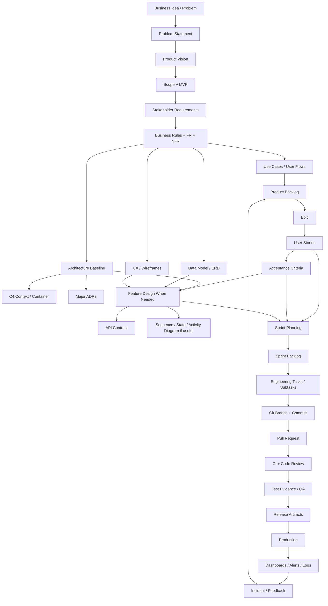

### Điều quan trọng: đây không phải một chuỗi Waterfall cứng

Các artifact có lifecycle khác nhau:

| Nhóm                                   | Ví dụ                                                          | Khi tạo                           | Khi cập nhật                                           |
| -------------------------------------- | -------------------------------------------------------------- | --------------------------------- | ------------------------------------------------------ |
| **Created once, refined continuously** | Product Vision, Scope, C4 Context                              | đầu project                       | khi product direction/system boundary thay đổi         |
| **Per feature**                        | Story, AC, API change, Sequence Diagram, migration, Test Cases | khi feature được phân tích/refine | trong refinement/implementation nếu hiểu biết thay đổi |
| **Per Sprint**                         | Sprint Goal, Sprint Backlog, Review/Retro notes                | mỗi Sprint                        | trong Sprint theo Scrum rules/team workflow            |
| **Per release**                        | Release Notes, deployment checklist, version/tag               | mỗi release                       | khi release scope thay đổi trước deploy                |
| **Operational / event-driven**         | Alert, Incident Ticket, RCA/Postmortem                         | khi vận hành hoặc sự cố xảy ra    | sau khi có thêm evidence/action items                  |

Một team Agile có thể bắt đầu implementation khi **đủ thông tin để làm an toàn**, rồi tiếp tục tinh chỉnh docs. Không cần “hoàn tất toàn bộ tài liệu project” trước khi Sprint 1 bắt đầu.

---

# Artifact Ownership Matrix

> “Owner” dưới đây là **typical primary author/maintainer**, không phải người duy nhất được phép chỉnh sửa. Ở team nhỏ, một người có thể đóng nhiều role.

## 2A.2 Product / Business artifacts

| Artifact              | Phase Created       | Primary Owner    | Contributors               | Review / Approval           | Input                                    | Output / Used By                   | Update Frequency           | CapsuleAI?                    |
| --------------------- | ------------------- | ---------------- | -------------------------- | --------------------------- | ---------------------------------------- | ---------------------------------- | -------------------------- | ----------------------------- |
| Problem Statement     | Discovery           | **PO/PM or BA**  | Stakeholder, UX            | Stakeholder/PO              | raw problem/pain points                  | Product Vision, Scope              | khi problem framing đổi    | **Definitely create**         |
| Product Vision        | Discovery           | **PO/PM**        | BA, stakeholder, Tech Lead | Stakeholder/product sponsor | Problem Statement                        | roadmap, scope, backlog priorities | infrequent                 | **Definitely create**         |
| Stakeholder List      | Discovery           | **BA/PM**        | PO                         | PO                          | project context                          | elicitation plan, approvals        | khi stakeholder đổi        | **Definitely create (short)** |
| Persona / Target User | Discovery           | **UX/PO**        | BA, stakeholder            | PO                          | research/assumptions                     | user flows, stories                | khi user understanding đổi | **Useful**                    |
| Product Scope         | Discovery           | **PO/BA**        | Tech Lead, stakeholder     | PO/stakeholder              | vision, constraints                      | MVP, backlog boundary              | controlled change          | **Definitely create**         |
| MVP Definition        | Discovery           | **PO**           | BA, Tech Lead, team        | Stakeholder/PO              | scope, feasibility                       | initial backlog/release goal       | when MVP changes           | **Definitely create**         |
| Product Roadmap       | Discovery/Planning  | **PO/PM**        | Tech Lead                  | Product owner/stakeholder   | vision, priority                         | release themes                     | monthly/per milestone      | **Useful, lightweight**       |
| Risk Register         | Discovery → ongoing | **PM/Tech Lead** | all roles                  | PM/PO                       | assumptions, architecture, delivery risk | mitigation tasks                   | continuous                 | **Definitely create, small**  |

## 2A.3 Requirements artifacts

| Artifact                          | Phase Created      | Primary Owner         | Contributors           | Review / Approval     | Input                          | Output / Used By                   | Update Frequency                            | CapsuleAI?                                                                            |
| --------------------------------- | ------------------ | --------------------- | ---------------------- | --------------------- | ------------------------------ | ---------------------------------- | ------------------------------------------- | ------------------------------------------------------------------------------------- |
| Stakeholder Requirements          | Elicitation        | **BA**                | PO, stakeholder        | Stakeholder/PO        | interviews/workshops           | FR/NFR/business rules              | whenever need changes                       | **Definitely create, concise**                                                        |
| Functional Requirements (FR)      | Analysis           | **BA/System Analyst** | PO, Dev, QA            | PO                    | stakeholder needs              | Use Cases, Stories, tests          | as behavior changes                         | **Definitely create**                                                                 |
| Non-Functional Requirements (NFR) | Analysis           | **Tech Lead + BA**    | DevOps, security, QA   | PO/Tech Lead          | product goals, constraints     | architecture, testing, monitoring  | as quality targets change                   | **Definitely create, prioritized**                                                    |
| Business Rules (BR)               | Analysis           | **BA**                | PO, domain stakeholder | PO                    | domain policy                  | Use Cases, AC, code/tests          | when rule changes                           | **Definitely create**                                                                 |
| SRS                               | Analysis           | **BA/System Analyst** | PO, QA, Tech Lead      | sponsor if required   | FR/NFR/BR/use cases            | formal baseline                    | milestone-based                             | **Skip massive SRS; use lightweight requirements docs unless university requires it** |
| Use Case Diagram                  | Analysis           | **BA/System Analyst** | PO, UX, QA             | PO                    | actors, goals                  | coverage view of user interactions | when major actor/use case changes           | **Useful**                                                                            |
| Use Case Specification            | Analysis           | **BA**                | PO, QA, Dev            | PO                    | FR/BR/user flow                | Stories, AC, QA scenarios          | per core journey                            | **Definitely create for core flows only**                                             |
| Acceptance Criteria               | Backlog refinement | **PO/BA**             | QA, Dev                | PO/team clarification | Story + rules + UX/use case    | implementation + test cases        | during refinement, controlled during Sprint | **Definitely create**                                                                 |
| Product Backlog                   | Planning           | **PO**                | BA, team               | PO owns ordering      | vision, requirements, feedback | refinement/Sprint Planning         | continuous                                  | **Definitely create**                                                                 |

## 2A.4 UX artifacts

| Artifact  | Phase        | Primary Owner      | Contributors | Review   | Input                   | Used By               | Update                | CapsuleAI?                   |
| --------- | ------------ | ------------------ | ------------ | -------- | ----------------------- | --------------------- | --------------------- | ---------------------------- |
| User Flow | Analysis/UX  | **UX Designer**    | BA, PO       | PO       | use cases               | wireframes, stories   | feature changes       | **Useful for core journeys** |
| Wireframe | UX Design    | **UX Designer**    | PO/BA        | PO       | user flow               | FE/Mobile, refinement | iterative             | **Useful**                   |
| Mockup    | UX Design    | **UI/UX Designer** | PO           | PO       | wireframe/design system | implementation, QA    | iterative             | **Useful if UI exists**      |
| Prototype | Discovery/UX | **UX Designer**    | PO/BA        | users/PO | mockups                 | validation            | when testing concepts | **Optional**                 |

## 2A.5 Architecture / Technical Design artifacts

| Artifact                     | Phase                    | Primary Owner                                                    | Contributors                     | Review / Approval | Input                                   | Used By                              | Update                                  | CapsuleAI?                                        |
| ---------------------------- | ------------------------ | ---------------------------------------------------------------- | -------------------------------- | ----------------- | --------------------------------------- | ------------------------------------ | --------------------------------------- | ------------------------------------------------- |
| C4 System Context            | Architecture baseline    | **Solution Architect/Tech Lead**                                 | PO, Dev                          | Tech Lead/team    | scope, external actors/systems          | Container design, onboarding         | boundary changes                        | **Definitely create**                             |
| C4 Container                 | Architecture baseline    | **Tech Lead/Architect**                                          | Dev, DevOps, AI engineer         | team              | Context + NFRs                          | module/service ownership, deployment | container changes                       | **Definitely create**                             |
| C4 Component                 | Detailed design          | **Tech Lead/Developer**                                          | affected Devs                    | peer/Tech Lead    | Container + feature complexity          | implementation                       | when internal design materially changes | **Only when useful**                              |
| Deployment Diagram           | Architecture/DevOps      | **DevOps/Tech Lead**                                             | Dev                              | Tech Lead         | containers, environments                | deployment/runbook                   | infra changes                           | **Definitely create, simple**                     |
| ADR                          | Architecture decision    | **Decision owner: usually Tech Lead or implementing senior Dev** | affected engineers               | Tech Lead/team    | alternatives + constraints/NFR          | future engineers/implementation      | new/superseded decisions                | **Definitely create for major choices**           |
| ERD                          | Data design              | **Backend Dev/Tech Lead**                                        | BA, AI engineer if data relevant | Tech Lead         | domain requirements                     | schema/migrations/repositories       | meaningful schema changes               | **Definitely create**                             |
| Database Schema / Migrations | Implementation           | **Developer making DB change**                                   | reviewer                         | peer/Tech Lead    | ERD + Story                             | executable DB state                  | every schema change                     | **Definitely create; executable source of truth** |
| OpenAPI/API Contract         | Design/Implementation    | **Backend API owner**                                            | FE/Mobile, QA                    | peer/Tech Lead    | Story/AC + architecture                 | client implementation/tests          | every API contract change               | **Definitely create**                             |
| Sequence Diagram             | Feature design           | **Tech Lead or implementing Developer**                          | affected Devs/AI/DevOps          | peer/Tech Lead    | AC + API + architecture                 | task breakdown, integrations/tests   | when interaction changes                | **Only for integration-heavy flows**              |
| Activity Diagram             | Analysis / detailed flow | **BA for business flow; Tech Lead/Dev for technical flow**       | QA/PO/Dev                        | relevant owner    | use case + rules                        | AC, tests, implementation            | when flow changes                       | **Use for complex core flows only**               |
| State Diagram                | Domain/feature design    | **Tech Lead/Backend Dev**                                        | BA, QA                           | Tech Lead         | lifecycle rules                         | schema/API/tests                     | transitions change                      | **Definitely useful for garment processing**      |
| Class Diagram                | Detailed OO design       | **Developer/Tech Lead**                                          | peer dev                         | peer/Tech Lead    | code/domain design                      | implementation                       | often expensive to maintain             | **Usually skip whole-codebase diagrams**          |
| Data Flow / Trust Boundary   | Security design          | **Tech Lead/Security-minded Dev**                                | DevOps/Backend                   | Tech Lead         | Context/Container + data classification | threat model/security controls       | flow/boundary changes                   | **Useful, small**                                 |
| Threat Model                 | Security design          | **Tech Lead/Security Engineer**                                  | Dev, DevOps, QA                  | Tech Lead         | DFD/trust boundaries + abuse cases      | security tasks/tests                 | architecture/security changes           | **Definitely create lightweight version**         |

## 2A.6 Agile / Work Management artifacts

| Artifact       | Created By                                                  | Review/Ownership            | Input                              | Used By                   | CapsuleAI                      |
| -------------- | ----------------------------------------------------------- | --------------------------- | ---------------------------------- | ------------------------- | ------------------------------ |
| Epic           | **PO/BA**                                                   | PO                          | product goal / major capability    | Stories, roadmap          | **Yes**                        |
| User Story     | **PO/BA**                                                   | PO + team during refinement | requirement/use case/user research | Dev, QA, Sprint Planning  | **Yes**                        |
| Task           | **Developer or Tech Lead**                                  | developer/Tech Lead         | Story/design                       | implementation tracking   | **Yes, only meaningful tasks** |
| Subtask        | **Developer**                                               | parent owner                | Task/Story                         | execution                 | **Optional**                   |
| Bug            | **QA, Developer, Support or PO** depending discovery source | triaged by PO/Tech Lead     | failed behavior/evidence           | fix + regression          | **Yes**                        |
| Spike          | **Developer/Tech Lead**                                     | PO accepts timebox/value    | uncertainty                        | decision/estimate/ADR     | **When uncertainty is real**   |
| Technical Debt | **Developer/Tech Lead**                                     | PO prioritizes with team    | code/ops pain                      | refactor/improvement work | **Yes when discovered**        |
| Sprint Backlog | **Developers** in Scrum                                     | Developers own plan         | selected PBIs + Sprint Goal        | Sprint execution          | **Yes**                        |
| Sprint Goal    | **Scrum Team creates collaboratively during Planning**      | Scrum Team                  | product objective                  | daily decisions           | **Yes**                        |

## 2A.7 Development, QA, Delivery and Operations artifacts

| Artifact               | Primary Owner                           | Created/Updated When             | Reviewed By               | Downstream Consumer         | CapsuleAI                           |
| ---------------------- | --------------------------------------- | -------------------------------- | ------------------------- | --------------------------- | ----------------------------------- |
| Git Branch             | **Developer doing work**                | work starts                      | —                         | commits/PR                  | **Yes**                             |
| Commit                 | **Developer**                           | cohesive code change             | reviewers indirectly      | PR/history                  | **Yes**                             |
| Pull Request           | **PR author/developer**                 | local checks pass, review-ready  | peer/Tech Lead            | CI/review/merge             | **Yes**                             |
| Code Review comments   | **Reviewer**                            | PR review                        | author resolves           | merge decision              | **Yes**                             |
| DB Migration           | **Developer changing schema**           | schema change                    | peer/Tech Lead            | CI/deploy                   | **Yes**                             |
| Test Strategy          | **QA Lead/Tech Lead**                   | Sprint 0 / architecture baseline | team                      | test implementation         | **Yes, 1–3 pages**                  |
| Test Scenario          | **QA**                                  | refinement/QA planning           | BA/PO if behavior unclear | Test Cases                  | **Yes for core journeys**           |
| Test Case              | **QA**                                  | before/while testing             | QA peer/PO as needed      | execution/evidence          | **Yes**                             |
| Bug Report             | **person who reproduces: often QA**     | test/production failure          | triage owner              | developer                   | **Yes**                             |
| Regression Checklist   | **QA**                                  | core flows stabilize             | team                      | pre-release test            | **Yes, lightweight**                |
| Test Report / Evidence | **QA/CI**                               | test cycle                       | PO/release owner          | release decision            | **Useful**                          |
| CI Pipeline            | **DevOps/Tech Lead/Developer**          | Sprint 0 then evolved            | team                      | every PR/build              | **Yes**                             |
| Build Artifact         | **CI system**                           | successful build                 | checks verify             | staging/prod                | **Yes**                             |
| Docker Image           | **CI system**                           | package/release                  | pipeline                  | deployment                  | **Yes if Docker used**              |
| Release Notes          | **Release owner/PO with Dev input**     | release candidate                | PO/Tech Lead              | users/team/ops              | **Yes**                             |
| Deployment Checklist   | **DevOps/Release owner**                | before release                   | Tech Lead                 | deploy operator             | **Yes, short**                      |
| Rollback Plan          | **DevOps/Tech Lead**                    | before risky release             | release owner             | incident response           | **Yes, practical**                  |
| Dashboard              | **DevOps/SRE/Developer owning service** | before/after prod                | Tech Lead                 | operations                  | **Yes, minimal**                    |
| Alert                  | **Service owner/DevOps**                | once actionable signal exists    | team                      | on-call/incident owner      | **Useful for key failures**         |
| Runbook                | **Service owner/DevOps**                | operational behavior known       | team                      | incident responders         | **Yes, short**                      |
| Incident Ticket        | **Incident commander/first responder**  | incident begins                  | incident team             | tracking/RCA                | **Yes for simulation**              |
| Incident Timeline      | **scribe/incident owner**               | during/after incident            | incident team             | Postmortem                  | **Yes for simulation**              |
| RCA                    | **Incident owner + technical owners**   | after stabilization              | team                      | corrective actions          | **Yes**                             |
| Postmortem             | **Incident owner**                      | after significant incident       | affected team             | backlog/process improvement | **Yes for at least one simulation** |

---

# How Documents Produce Other Documents

## 2A.8 Conceptual information vs physical files

Ba khái niệm này phải tách riêng:

1. **Conceptually necessary information**: thông tin cần tồn tại để team hiểu/làm đúng.
2. **Physical document**: file Markdown/Confluence/Word riêng chứa thông tin.
3. **Optional artifact**: chỉ tạo nếu giúp giao tiếp hoặc giảm rủi ro.

Ví dụ: mọi Story cần biết behavior và acceptance, nhưng **không bắt buộc** mọi Story phải có một Use Case Specification riêng. Behavior có thể đã được mô tả đủ trong Story + AC + business rules.

### Dependency chain chính

```text
Problem Statement
    ↓ frames
Product Vision
    ↓ constrains
Scope / MVP
    ↓ selects
Requirements + Business Rules + NFRs
    ├──────────────→ Architecture / Security / Data Design
    ↓ describes user goals
Use Cases / User Flows
    ↓ decompose into value slices
Epics / User Stories
    ↓ made testable by
Acceptance Criteria
    ├──────────────→ QA Test Scenarios / Test Cases
    ↓ plus technical design
Engineering Tasks
    ↓ implemented as
Branch / Commits / PR
    ↓ verified by
CI + Review + QA
    ↓ packaged as
Release
    ↓ operated with
Monitoring / Runbooks / Incident Records
    ↓ creates
Feedback / Bugs / Tech Debt / New Stories
```

### Khi có thể “skip” một physical document

```text
Requirement
  └─> Story + Acceptance Criteria
```

là hoàn toàn hợp lý nếu feature nhỏ và không cần Use Case document riêng.

```text
Story + AC
  └─> implementation
```

cũng hợp lý với CRUD đơn giản nếu API/data pattern đã ổn định, không có design uncertainty.

Ngược lại:

```text
Story + AC
  + NFR
  + existing architecture
      ↓
Sequence + State design
      ↓
Tasks
```

hợp lý cho `Upload Garment` vì feature đi qua Auth → Object Storage → DB → AI inference và có failure/state transitions.

---

# Project-Level vs Feature-Level vs Sprint/Release/Operations Artifacts

| Project-Level Artifact  | Feature-Level Artifact                    | Sprint-Level Artifact          | Release-Level Artifact      | Operational Artifact     |
| ----------------------- | ----------------------------------------- | ------------------------------ | --------------------------- | ------------------------ |
| Product Vision          | User Story                                | Sprint Goal                    | Release Notes               | Dashboard                |
| Scope/MVP               | Acceptance Criteria                       | Sprint Backlog                 | deployment checklist        | Alert                    |
| Stakeholders/actors     | Use Case spec for core flow               | Planning decisions             | version/tag                 | Runbook                  |
| C4 Context              | API change                                | Review demo                    | rollback considerations     | Incident                 |
| C4 Container            | Sequence/Activity/State diagram if needed | Retro actions                  | test/release evidence       | Incident Timeline        |
| architecture principles | DB migration                              | velocity/capacity data if used | Docker image/build artifact | RCA                      |
| initial ERD             | Test Cases                                | —                              | deployed commit SHA         | Postmortem               |
| Test Strategy           | feature-specific threat analysis          | —                              | —                           | preventive backlog items |

**Rule:** project-level docs cho context ổn định; feature-level docs cho thay đổi cụ thể; Jira theo dõi work; Git giữ executable implementation; CI/QA giữ verification evidence; release/ops nối code đã deploy với thực tế production.

---

# Business / Behavioral Design vs Technical Design

## Business / behavioral artifacts

- Stakeholder Requirement.
- Functional Requirement.
- Business Rule.
- Use Case / Use Case Specification.
- Activity Diagram ở mức user/business flow.
- User Story.
- Acceptance Criteria.
- User Flow / Figma.

Chúng trả lời chủ yếu: **user/business cần hành vi gì và tại sao?**

## Technical artifacts

- C4 Context/Container/Component.
- ADR.
- ERD/schema/migrations.
- OpenAPI.
- Sequence Diagram ở mức runtime interaction.
- State Machine.
- Deployment Diagram.
- Threat Model.

Chúng trả lời chủ yếu: **hệ thống sẽ thỏa behavior đó bằng cấu trúc/contract/decision nào?**

Một diagram có thể đứng giữa hai phía. Activity Diagram có thể là business flow hoặc technical workflow tùy abstraction level.

---

# Who Does What — RACI-like Summary for Major Phases

## Discovery

| Work            | Primary      | Collaborates    | Reviews/Approves    |
| --------------- | ------------ | --------------- | ------------------- |
| Problem framing | PO/BA        | Stakeholder, UX | Stakeholder/PO      |
| Product Vision  | PO/PM        | BA, Tech Lead   | Sponsor/Stakeholder |
| MVP/scope       | PO/BA        | Tech Lead, team | PO/Stakeholder      |
| initial risks   | PM/Tech Lead | team            | PO                  |

```text
INPUT: raw business idea / pain point
↓
ACTIVITIES: interviews, assumptions, scope, feasibility
↓
OUTPUT: Vision + MVP + stakeholder map + risks
↓
NEXT CONSUMER: BA/PO/UX/Tech Lead
```

## Requirements

| Work                           | Primary           | Collaborates           | Reviews/Approves |
| ------------------------------ | ----------------- | ---------------------- | ---------------- |
| Stakeholder interview/workshop | BA                | PO                     | Stakeholder      |
| Functional requirements        | BA                | PO, Dev, QA            | PO               |
| Business rules                 | BA                | domain stakeholder, QA | PO               |
| NFRs                           | Tech Lead + BA    | DevOps, QA             | PO/Tech Lead     |
| Use Cases                      | BA/System Analyst | PO, QA, Dev            | PO               |
| Acceptance Criteria            | PO/BA             | QA, Dev                | PO               |

```text
INPUT: Vision + MVP + stakeholder needs
↓
ACTIVITIES: elicitation, clarification, analysis, edge cases
↓
OUTPUT: FR/NFR/BR + Use Cases + ready-to-refine backlog
↓
NEXT CONSUMER: UX + Architecture + PO/Dev/QA
```

## Design

| Work                   | Primary                         | Collaborates       | Reviews/Approves |
| ---------------------- | ------------------------------- | ------------------ | ---------------- |
| C4 baseline            | Tech Lead/Architect             | Dev, DevOps        | team/Tech Lead   |
| UX flow/mockup         | UX                              | PO/BA, FE          | PO               |
| ERD/data model         | Backend Dev/Tech Lead           | BA, AI dev         | Tech Lead        |
| API contract           | Backend owner                   | FE/Mobile, QA      | peer/Tech Lead   |
| ADR                    | decision owner, often Tech Lead | affected engineers | Tech Lead/team   |
| feature Sequence/State | implementing Dev/Tech Lead      | QA/other services  | Tech Lead        |

```text
INPUT: FR/NFR/BR + core flows
↓
ACTIVITIES: architecture/data/API/UX decisions
↓
OUTPUT: design constraints/contracts
↓
NEXT CONSUMER: Refinement + Sprint Planning + Developers + QA
```

## Sprint Planning

| Work                     | Primary                    | Collaborates    | Reviews/Approves              |
| ------------------------ | -------------------------- | --------------- | ----------------------------- |
| Product priority         | PO                         | team            | PO                            |
| Sprint Goal              | Scrum Team                 | PO + Developers | Scrum Team                    |
| select work              | Developers with PO context | PO              | Developers own Sprint Backlog |
| technical task breakdown | Developers                 | Tech Lead, QA   | Developers                    |

```text
INPUT: ordered Product Backlog + Ready Stories + capacity
↓
ACTIVITIES: goal, selection, task planning/dependencies
↓
OUTPUT: Sprint Goal + Sprint Backlog
↓
NEXT CONSUMER: Developers/QA
```

## Development

| Work                     | Primary                | Collaborates                   | Reviews/Approves   |
| ------------------------ | ---------------------- | ------------------------------ | ------------------ |
| implement Task/Story     | assigned Developer     | peers, PO/QA for clarification | PR reviewer        |
| update OpenAPI/migration | implementing Developer | client/data owner              | reviewer           |
| automated tests          | implementing Developer | QA                             | reviewer/CI        |
| PR                       | author                 | reviewers                      | required reviewers |
| CI                       | pipeline               | Dev/DevOps maintain            | branch rules       |

```text
INPUT: Story + AC + relevant design + existing code
↓
ACTIVITIES: branch, code, tests, local verify, PR, fixes
↓
OUTPUT: reviewed mergeable code + test evidence
↓
NEXT CONSUMER: staging/QA
```

## QA

| Work                             | Primary               | Collaborates | Reviews/Approves     |
| -------------------------------- | --------------------- | ------------ | -------------------- |
| test scenarios/cases             | QA                    | BA/PO/Dev    | QA lead/PO if needed |
| execute feature/regression tests | QA                    | Dev          | QA                   |
| Bug report                       | QA/person reproducing | Dev          | triage owner         |
| retest                           | QA                    | Dev          | QA                   |

```text
INPUT: Story + AC + Use Case/error flows + build
↓
ACTIVITIES: test execution, evidence, defects, regression
↓
OUTPUT: pass/fail + Bug tickets + release confidence
↓
NEXT CONSUMER: PO/UAT/Release owner
```

## Release

| Work                   | Primary                    | Collaborates  | Reviews/Approves |
| ---------------------- | -------------------------- | ------------- | ---------------- |
| choose release content | PO/Release owner           | Tech Lead, QA | PO               |
| package/tag            | CI/DevOps                  | Dev           | pipeline         |
| deployment plan        | DevOps/Tech Lead           | Dev           | release owner    |
| release notes          | PO/Release owner           | Dev/QA        | PO               |
| prod deploy            | DevOps/authorized operator | Dev           | release approval |

```text
INPUT: verified Stories/Bugs + green artifact
↓
ACTIVITIES: version/tag, notes, deploy, smoke test
↓
OUTPUT: production release + deployed SHA/image
↓
NEXT CONSUMER: users + operations
```

## Operations

| Work               | Primary                  | Collaborates       | Reviews/Approves       |
| ------------------ | ------------------------ | ------------------ | ---------------------- |
| monitor service    | service owner/DevOps/SRE | developers         | Tech Lead              |
| respond incident   | incident owner           | affected engineers | incident/release owner |
| RCA/Postmortem     | incident owner           | participants       | team                   |
| preventive actions | technical/product owner  | PO                 | PO prioritizes         |

```text
INPUT: production telemetry + user feedback
↓
ACTIVITIES: monitor, triage, mitigate, learn
↓
OUTPUT: incident records / bugs / improvement Stories
↓
NEXT CONSUMER: Product Backlog
```

---

# 3. Project Initiation & Product Discovery

## Purpose

Xác minh nhóm đang giải quyết **đúng vấn đề**, cho **đúng người dùng**, với phạm vi khả thi.

## Participants

Stakeholder, PM/PO, BA, UX, Tech Lead/Architect; developer tham gia để đánh giá feasibility.

## Inputs

Ý tưởng, vấn đề người dùng, domain knowledge, hạn chế thời gian/ngân sách/công nghệ.

## Activities

1. Viết **problem statement**.
2. Xác định stakeholders và target users.
3. Thu thập pain points.
4. Định nghĩa product vision.
5. Đặt product/business goals.
6. Chọn success metrics.
7. Liệt kê assumptions, constraints, risks.
8. Chốt MVP.
9. Tách in-scope / out-of-scope.
10. Technical feasibility + schedule feasibility.

## How It Is Actually Done

Ví dụ CapsuleAI:

```text
Problem:
Người dùng có nhiều quần áo nhưng khó ghi nhớ wardrobe và phối outfit phù hợp.

Target users:
Sinh viên/người đi làm sử dụng smartphone, muốn quản lý wardrobe cá nhân.

MVP:
- Register/login
- Upload garment image
- Extract garment attributes
- Store wardrobe item
- View/search wardrobe
- Generate simple outfit recommendations

Out of scope for MVP:
- Social network
- Marketplace
- AR virtual try-on
- Multi-region production architecture
```

### Success metrics mẫu

- ≥ 90% successful garment upload requests trong test set.
- P95 API latency cho CRUD wardrobe < 500 ms trong mức tải mục tiêu của project.
- 100% core user stories có Acceptance Criteria và QA evidence.
- Mọi merge vào `main` phải qua PR + CI.

## Outputs / Deliverables

Tối thiểu:

- `docs/product/product-vision.md`
- `docs/product/project-scope.md`
- `docs/product/personas-or-users.md`
- `docs/product/mvp.md`
- Risk list ngắn.

## Tools

Notion/Markdown, FigJam/Miro, Jira/GitHub Projects, Figma.

## Exit Criteria

- Vấn đề và target user rõ.
- MVP đủ nhỏ để hoàn thành.
- Có success metrics.
- In/out scope được thống nhất.
- Các risk lớn đã được ghi nhận.

## Common Student Mistakes

- Chọn quá nhiều feature.
- Bắt đầu code trước khi hiểu user/problem.
- “AI”, “microservices”, “real-time” được thêm chỉ để trông phức tạp.

## How I Should Simulate It

Một buổi discovery 2–3 giờ + tài liệu 2–4 trang là đủ.

---

# 4. Requirement Elicitation

## Purpose

Biến nhu cầu mơ hồ thành thông tin đủ để phân tích.

## Kỹ thuật

- Stakeholder interviews.
- Workshops.
- Questionnaires.
- Observation.
- Competitor analysis.
- Existing-system analysis.
- Brainstorming.
- Prototyping.

## Cách hỏi follow-up thay vì chấp nhận yêu cầu mơ hồ

| Stakeholder nói                     | Câu hỏi follow-up                                    | Requirement rõ hơn                                                                                                          |
| ----------------------------------- | ---------------------------------------------------- | --------------------------------------------------------------------------------------------------------------------------- |
| “Upload ảnh phải nhanh.”            | Bao nhiêu giây? ảnh tối đa bao nhiêu MB? mạng nào?   | Ảnh ≤ 10 MB; API nhận file trong ≤ 2 s ở môi trường test, không tính thời gian model inference.                             |
| “Chỉ chủ sở hữu được xem wardrobe.” | Có admin không? shared wardrobe?                     | User chỉ đọc/sửa/xóa item thuộc `user_id` của mình; admin không có quyền xem ảnh riêng tư trừ support flow được định nghĩa. |
| “Hệ thống gợi ý outfit phù hợp.”    | Phù hợp theo tiêu chí nào? weather? color? occasion? | MVP dùng category + color harmony + occasion; weather chưa nằm trong scope.                                                 |

## Deliverable

- Meeting notes.
- Raw requirements log.
- Open questions.
- Decision log.

## Exit Criteria

Các câu hỏi làm thay đổi scope/business rule không còn “treo” trước khi story vào Ready.

---

# 5. Requirement Analysis

Raw requirement cần được phân loại và kiểm tra tính testable.

## 5.1 Các nhóm requirement

### Functional Requirements

Hệ thống phải làm gì.

> FR-012: Authenticated user can upload one garment image and create a wardrobe item.

### Non-Functional Requirements

Quality attributes.

- Performance.
- Availability.
- Security.
- Maintainability.
- Scalability.
- Observability.

### Business Rules

> BR-007: Một wardrobe item phải thuộc đúng một user.

### Constraints

> Backend dùng Java/Spring Boot; PostgreSQL; deadline 16 tuần.

### Assumptions

> MVP giả định mỗi request upload chỉ chứa một garment chính.

### Dependencies

> Garment extraction phụ thuộc inference service/model.

### Edge/Error cases

- File rỗng.
- Unsupported MIME type.
- File quá lớn.
- Model timeout.
- Object storage failure.
- DB transaction failure.
- Duplicate retry.

## 5.2 Requirement tệ → tốt

**Tệ:** “Hệ thống phải bảo mật.”

**Tốt:**

- Password được hash bằng password hashing algorithm phù hợp, không lưu plaintext.
- Wardrobe APIs yêu cầu authenticated user.
- Authorization kiểm tra ownership của resource.
- Secrets không commit vào Git.
- Failed authentication được log ở mức phù hợp nhưng không log password/token.

**Tệ:** “API phải nhanh.”

**Tốt:** “Ở test workload đã định nghĩa, CRUD endpoints có P95 latency < 500 ms.”

## Exit Criteria

Mỗi requirement quan trọng có thể trả lời: **ai**, **hành vi**, **điều kiện**, **kết quả**, **failure behavior**, **cách test**.

---

# 6. Epic → Feature → User Story → Task/Subtask/Bug

```text
Epic: Wardrobe Management
  └─ Feature: Garment Upload
      ├─ User Story: Upload garment image
      │   ├─ Task: Design POST /wardrobe/items endpoint
      │   ├─ Task: Implement object storage adapter
      │   ├─ Task: Persist wardrobe metadata
      │   └─ Subtask: Add integration test
      └─ Bug: Upload returns 500 for unsupported image type
```

## User Story format

```text
As a wardrobe owner,
I want to upload a garment image,
so that I can add the garment to my digital wardrobe.
```

## Acceptance Criteria — Given/When/Then

```gherkin
Given an authenticated user
And a valid JPEG image smaller than 10 MB
When the user uploads the image
Then the API returns 201 Created
And a wardrobe item is created for that user
And the response contains the new item id
```

```gherkin
Given an authenticated user
And a file with an unsupported media type
When the user uploads the file
Then the API returns 415 Unsupported Media Type
And no wardrobe item is persisted
```

## Acceptance Criteria vs Definition of Ready vs Definition of Done

| Khái niệm                             | Phạm vi                                  | Câu hỏi                                                 |
| ------------------------------------- | ---------------------------------------- | ------------------------------------------------------- |
| Acceptance Criteria                   | Một story                                | “Story này phải hành xử thế nào để business chấp nhận?” |
| Definition of Ready (team convention) | Trước khi kéo item vào Sprint            | “Item đã đủ rõ để team bắt đầu chưa?”                   |
| Definition of Done                    | Chất lượng của Increment/work hoàn thành | “Work có thật sự hoàn tất theo chuẩn team không?”       |

> **Lưu ý:** Definition of Ready là practice thường dùng bởi nhiều team, nhưng không phải artifact/commitment chính thức được Scrum Guide định nghĩa như Definition of Done.

### DoR gọn cho đồ án

- Story có value rõ.
- Acceptance Criteria có thể test.
- Dependencies/risk lớn được biết.
- UX/API mock cần thiết đã có.
- Không còn câu hỏi business blocking.
- Team có thể ước lượng.

### DoD gọn

- Acceptance Criteria pass.
- Code + automated tests hoàn tất.
- PR approved.
- Required CI checks pass.
- DB migration/API docs cập nhật nếu có.
- Security checks liên quan đã thực hiện.
- QA pass trên staging.
- Không có blocker/critical defect mở.

---

# 7. Product Backlog

Product Backlog là danh sách có thứ tự của những gì cần thiết để cải thiện product. Product Owner chịu trách nhiệm tối đa hóa value và quản lý Product Backlog trong Scrum.

## Backlog mẫu

| ID       | Type      | Item                                 | Priority | Estimate | Dependency |
| -------- | --------- | ------------------------------------ | -------- | -------: | ---------- |
| EP-01    | Epic      | Wardrobe Management                  | High     |        — | —          |
| US-001   | Story     | Register account                     | High     |        3 | —          |
| US-002   | Story     | Login                                | High     |        3 | US-001     |
| US-003   | Story     | Upload garment image                 | High     |        8 | US-002     |
| US-004   | Story     | Extract garment attributes           | High     |        8 | US-003     |
| US-005   | Story     | View wardrobe list                   | High     |        5 | US-003     |
| US-006   | Story     | Edit garment metadata                | Medium   |        3 | US-005     |
| US-007   | Story     | Delete garment                       | Medium   |        3 | US-005     |
| US-008   | Story     | Search/filter wardrobe               | Medium   |        5 | US-005     |
| US-009   | Story     | Generate outfit recommendation       | High     |        8 | US-004     |
| US-010   | Story     | Save favorite outfit                 | Low      |        5 | US-009     |
| BUG-01   | Bug       | Wrong ownership check on item fetch  | Critical |        2 | —          |
| TECH-01  | Tech Debt | Add Testcontainers integration suite | Medium   |        5 | —          |
| SPIKE-01 | Spike     | Evaluate object storage provider     | Medium   |        3 | —          |

## Prioritization

Có thể dùng:

- Business value + risk + dependency.
- MoSCoW.
- RICE/WSJF khi cần.

Đồ án nên dùng **High/Medium/Low + giải thích ngắn**, tránh giả tạo độ chính xác.

## Story Points

Là relative estimate cho effort/complexity/uncertainty, không phải “1 point = 1 giờ”.

## Jira / GitHub Projects representation

Fields đủ dùng:

- ID.
- Title.
- Type.
- Priority.
- Estimate.
- Assignee.
- Sprint.
- Status.
- Labels/components.
- Acceptance Criteria/link to spec.

---

# 8. Backlog Refinement

## Purpose

Làm cho những item sắp được thực hiện trở nên rõ, nhỏ, testable và ước lượng được.

## Participants

PO/BA, Developers, QA; Tech Lead khi có design/risk quan trọng.

## Checklist mỗi story

- Value rõ chưa?
- Acceptance Criteria đầy đủ chưa?
- Edge/error cases?
- Security concerns?
- Dependency?
- API/DB impact?
- Testable?
- Quá lớn không? cần split?
- Estimate?

## Hội thoại refinement mẫu

**PO:** “US-003 cho phép user upload garment image.”

**Developer:** “Một request có hỗ trợ nhiều ảnh không?”

**PO:** “MVP chỉ một ảnh chính.”

**QA:** “File GIF, HEIC hoặc ảnh 20 MB thì sao?”

**PO:** “Chỉ JPEG/PNG, tối đa 10 MB.”

**Tech Lead:** “Model inference có thể timeout. API nên fail toàn bộ hay tạo item ở trạng thái `PROCESSING_FAILED`?”

**PO:** “Không mất ảnh; tạo item với trạng thái `PROCESSING_FAILED` và cho retry.”

**QA:** “Vậy cần AC cho timeout + retry.”

**Developer:** “Có object storage và DB, cần xử lý consistency. Tôi ước lượng 8 points.”

### Output

Story được cập nhật Acceptance Criteria, edge cases, estimate, dependencies và có thể chuyển `Backlog → Ready`.

---

# 9. Software Architecture & System Design

## Purpose

Quyết định cấu trúc hệ thống đủ sớm để các feature có chỗ “đi vào”, nhưng không design toàn bộ tương lai.

## Nên thiết kế

- Architectural style.
- System boundaries.
- Modules + responsibilities.
- Data stores.
- External integrations.
- Sync/async communication.
- Data flow.
- Security/trust boundaries.
- Failure handling.
- Deployment topology.
- Quality attributes quan trọng.

## Khuyến nghị cho đồ án

**Modular monolith trước, microservices chỉ khi có lý do thật.**

Ví dụ:

```text
Spring Boot application
├─ auth
├─ user
├─ wardrobe
├─ recommendation
├─ media
└─ shared

External:
- PostgreSQL
- Object Storage
- AI inference component/service
```

## C4 Model

### System Context

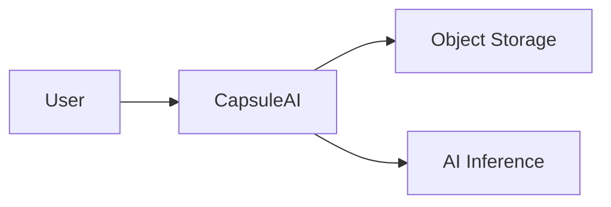

### Container

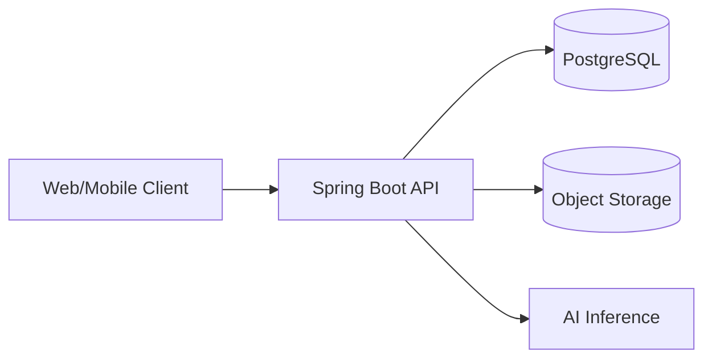

### Component

Chỉ vẽ cho phần phức tạp cần trao đổi, ví dụ `wardrobe` upload flow.

### Deployment

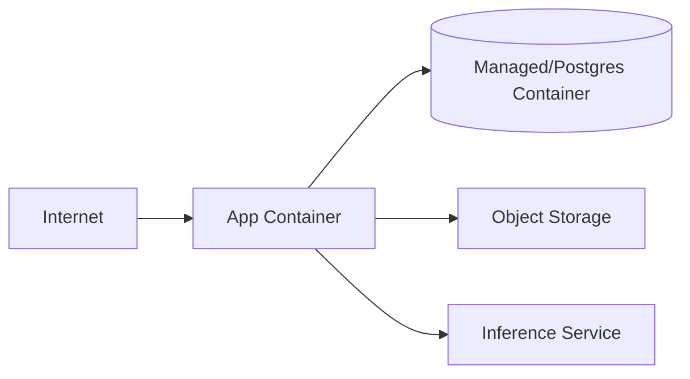

## Nên duy trì diagram nào?

**Essential:** System Context + Container + một Deployment diagram đơn giản.

**Optional:** Component diagram cho module phức tạp.

**Bỏ:** class diagram cho toàn bộ codebase nếu nó luôn stale và IDE đã thể hiện cấu trúc tốt hơn.

---

# 10. Architecture Decision Records (ADR)

ADR ghi lại **vì sao** một technical decision quan trọng được chọn.

## Template

```markdown
# ADR-00X: <Title>

## Status

Proposed | Accepted | Superseded | Deprecated

## Context

Vấn đề, constraints, quality attributes.

## Decision

Quyết định đã chọn.

## Alternatives Considered

- Option A
- Option B

## Consequences

### Positive

### Negative / Trade-offs
```

## ADR nên có cho project

- ADR-001: PostgreSQL thay vì MongoDB.
- ADR-002: JWT vs session authentication.
- ADR-003: Modular monolith thay vì microservices.
- ADR-004: Object storage thay vì lưu image BLOB trong DB.
- ADR-005: Synchronous inference hay queue-based async processing.

**Không cần ADR** cho mọi thư viện nhỏ.

---

# 11. Database Design Workflow

```text
Domain analysis
→ Entities/Aggregates
→ Relationships
→ ERD
→ Logical schema
→ Constraints
→ Indexes
→ Migration
→ Integration tests
```

## Checklist

- PK: ổn định, unique.
- FK: enforce relationships.
- `NOT NULL`: field bắt buộc.
- `UNIQUE`: invariant uniqueness.
- `CHECK`: invariant đơn giản tại DB.
- Index: phục vụ query thực tế; không index mọi column.
- Transaction: bao quanh unit of work cần atomicity.
- Normalization: tránh duplicated mutable facts; denormalize khi có lý do đo được.
- Seed data: deterministic cho dev/test.

## Migration

Ví dụ Flyway:

```text
src/main/resources/db/migration/
├── V1__create_users.sql
├── V2__create_wardrobe_items.sql
└── V3__add_wardrobe_indexes.sql
```

**Không sửa production DB thủ công** vì:

- Không reproducible.
- Không review được.
- Environment drift.
- Không có lịch sử deployment đáng tin.
- Rollback/forward-fix khó.

Schema change nên là code + migration versioned + review + pipeline.

---

# 12. API Design Before Implementation

## Quy tắc REST thực dụng

```http
POST   /api/v1/wardrobe/items
GET    /api/v1/wardrobe/items/{id}
GET    /api/v1/wardrobe/items?page=0&size=20&category=TOP&sort=createdAt,desc
PATCH  /api/v1/wardrobe/items/{id}
DELETE /api/v1/wardrobe/items/{id}
```

## Status codes

- `200 OK`: read/update thành công.
- `201 Created`: resource mới.
- `204 No Content`: delete thành công.
- `400 Bad Request`: malformed/business input chung.
- `401 Unauthorized`: chưa authenticate/credential không hợp lệ.
- `403 Forbidden`: đã authenticate nhưng không có quyền.
- `404 Not Found`: resource không tồn tại/không visible.
- `409 Conflict`: state conflict/duplicate invariant.
- `415 Unsupported Media Type`: type file không hỗ trợ.
- `422 Unprocessable Content`: dùng nếu API convention của team chọn cho semantic validation.

## Error response thống nhất

```json
{
  "code": "WARDROBE_UNSUPPORTED_IMAGE_TYPE",
  "message": "Only JPEG and PNG images are supported",
  "traceId": "abc-123",
  "fieldErrors": []
}
```

## DTO + validation

Không expose JPA entity trực tiếp làm public API contract. Dùng request/response DTOs và validation rõ ràng.

## Pagination/filter/sort

Luôn xác định:

- Default size.
- Max size.
- Stable sort.
- Filter semantics.

## Idempotency

Áp dụng nơi retry có nguy cơ tạo duplicate side effects, ví dụ payment/order creation; upload đơn giản có thể dùng request id/idempotency key nếu retry semantics quan trọng.

## OpenAPI

API contract nên cập nhật cùng code. Với Spring Boot có thể dùng OpenAPI tooling phù hợp để generate/serve spec.

---

# 13. Security Throughout SDLC

Security không phải “bước cuối cùng”.

```text
Discovery: data sensitivity, abuse cases
Requirements: authentication/authorization/privacy requirements
Design: trust boundaries, threat modeling
Coding: validation, secure APIs, secrets
PR/CI: dependency/code scanning, tests
Deployment: least privilege, TLS, secrets, secure config
Production: logging, alerts, incident response, patches
```

## Practical checklist

- Password: password hashing, không plaintext/reversible encryption.
- AuthN: JWT/session lifecycle rõ.
- AuthZ: resource-level authorization, không chỉ role ở UI.
- Input validation: server-side.
- SQL injection: parameterized queries/ORM binding đúng cách.
- Secrets: environment/secret manager, không commit Git.
- Logs: không log password, raw token, secret, sensitive payload không cần thiết.
- Dependency security: scan và update.
- Encryption: HTTPS/TLS in transit; at-rest theo platform/threat model.
- File upload: MIME/size validation, randomized object key, access control.
- Rate limiting: áp dụng cho auth/upload endpoint nếu cần.

## Threat modeling siêu gọn

Với upload flow hỏi 4 câu:

1. What are we building?
2. What can go wrong?
3. What are we going to do about it?
4. Did we do a good enough job?

Ví dụ threats:

- User truy cập ảnh người khác → ownership authorization.
- Malicious file → allow-list content types, size limits, isolated processing.
- Stolen JWT → short-lived access token/secure refresh strategy tùy architecture.
- Object URL public → private bucket + signed/authorized access.

---

# Where UML and Design Diagrams Fit into the Workflow

## 13A.1 Diagram ownership and value matrix

| Diagram / Spec                 | Purpose                                            | Typical Primary Author                                         | Contributors       | Review         | Stage                             | Input                       | Downstream                       | Scope                       | Update Trigger                   | CapsuleAI                            |
| ------------------------------ | -------------------------------------------------- | -------------------------------------------------------------- | ------------------ | -------------- | --------------------------------- | --------------------------- | -------------------------------- | --------------------------- | -------------------------------- | ------------------------------------ |
| **Use Case Diagram**           | thấy actors và goals lớn của hệ thống              | **BA/System Analyst**                                          | PO, UX, QA         | PO             | requirements analysis             | actors + stakeholder needs  | Use Case specs, backlog coverage | project/domain              | actor/use case changes           | **Useful**                           |
| **Use Case Specification**     | mô tả full behavioral flow, alt/error paths        | **BA**                                                         | PO, QA, Dev        | PO             | requirements analysis/refinement  | FR/BR + user goal           | Stories, AC, Test Scenarios      | feature/core journey        | business behavior changes        | **Essential for core journeys only** |
| **Activity Diagram**           | mô tả flow/branch/parallel decisions               | **BA** for business flow; **Tech Lead/Dev** for technical flow | QA, PO, Dev        | relevant owner | analysis or feature design        | Use Case/flow               | AC/tasks/tests                   | feature                     | flow changes                     | **Useful when flow is complex**      |
| **Sequence Diagram**           | runtime interactions between components            | **Tech Lead / implementing Dev**                               | affected engineers | Tech Lead/peer | detailed feature design           | Story/AC + architecture/API | tasks, integration tests         | feature                     | integration changes              | **Useful when integration-heavy**    |
| **State Diagram**              | allowed states/transitions                         | **Backend Dev/Tech Lead**                                      | BA, QA             | Tech Lead      | domain/feature design             | BR + lifecycle              | schema/API/tests                 | feature/domain              | transition rules change          | **Essential for garment processing** |
| **Class Diagram**              | OO structure                                       | **Developer/Tech Lead**                                        | Dev                | peer           | detailed design                   | code/domain model           | implementation                   | module                      | large structural change          | **Usually skip**                     |
| **ERD**                        | entities/relationships/cardinality                 | **Backend Dev/Tech Lead**                                      | BA, data/AI dev    | Tech Lead      | architecture/data design          | domain requirements         | schema/migrations/repositories   | project + feature evolution | data model changes               | **Essential**                        |
| **C4 Context**                 | system boundary + users/external systems           | **Architect/Tech Lead**                                        | PO, Dev            | team           | architecture baseline             | scope + NFR                 | Container diagram/onboarding     | project                     | boundary/external system changes | **Essential**                        |
| **C4 Container**               | deployable/runtime containers and responsibilities | **Architect/Tech Lead**                                        | Dev/DevOps         | team           | architecture baseline             | Context + NFR               | API/integration/deployment       | project                     | container split/merge/change     | **Essential**                        |
| **C4 Component**               | internal components in one container               | **Tech Lead/Dev**                                              | peers              | Tech Lead      | detailed design                   | Container + complex module  | implementation                   | module                      | complexity justifies it          | **Only when needed**                 |
| **Deployment Diagram**         | runtime nodes/environments/network relations       | **DevOps/Tech Lead**                                           | Dev                | Tech Lead      | Sprint 0/release                  | Containers + infra          | deploy/runbook                   | project/environment         | infra topology changes           | **Essential, simple**                |
| **Data Flow / Trust Boundary** | where sensitive data crosses trust zones           | **Tech Lead/security-minded Dev**                              | DevOps, backend    | Tech Lead      | security design                   | Context/Container           | threat model                     | project/feature             | data flow changes                | **Useful**                           |
| **Threat Model**               | threats, controls, assumptions                     | **Tech Lead/Security role**                                    | Dev, QA, DevOps    | team           | architecture + feature refinement | trust boundaries + assets   | security tasks/tests             | project + risky feature     | architecture/security changes    | **Essential lightweight**            |

### Common practice

Diagrams are communication tools, not mandatory ceremony. Strong teams create the smallest artifact that reduces ambiguity/risk.

### Possible variations

A BA-heavy organization may own Use Cases and Activity Diagrams centrally. A product engineering team may skip formal Use Cases and keep behavior in Story + AC + Figma. A senior developer may draw Sequence/State diagrams directly in a PR/design note.

### Recommended for CapsuleAI

Create and maintain:

- C4 Context.
- C4 Container.
- simple Deployment Diagram.
- ERD.
- high-level Use Case Diagram.
- detailed Use Case Specification for 3–5 core journeys.
- State Diagram for garment processing.
- Sequence Diagram only for integration-heavy flows such as upload + AI inference.
- Activity Diagram only for flows with meaningful branches.
- lightweight Threat Model.
- **Skip** “class diagram of every Spring class”.

---

# Use Cases in Detail

## 13A.2 Where a Use Case comes from

```text
Stakeholder Requirement
        ↓ clarified into
FR + Business Rules
        ↓ organized around an actor goal
Use Case
        ↓ sliced by independently deliverable value
User Story / Stories
        ↓ made testable by
Acceptance Criteria
```

This is a **common conceptual relationship**, not a universal one-to-one mapping.

### Who creates Use Cases?

Most commonly:

- **BA/System Analyst — primary author**.
- PO clarifies business intent/priority.
- QA contributes alternative/error paths.
- Developers contribute feasibility/technical constraints.

In smaller product teams, PO or senior developer may write them. The key is not the title of the person; it is that behavioral knowledge has a clear owner.

### Does every Story require a Use Case?

**No.** A small Story may be fully understandable from Story + AC + linked design.

### Can one Use Case generate multiple Stories?

**Yes, often.** A Use Case describes an end-to-end goal; Stories are smaller deliverable slices.

Example:

```text
UC-03 Add Garment to Wardrobe
├─ CAP-42 Upload garment image
├─ CAP-52 Process garment attributes
├─ CAP-58 Review/correct extracted attributes
└─ CAP-61 Save garment into wardrobe
```

Depending on architecture/product slicing, some teams could also keep this as one vertical Story.

### Can a Story exist without a Use Case document?

**Yes.** Bug fixes, technical enablers, small CRUD improvements and UI polish often do.

### Where do Use Cases live?

Recommended:

- overview diagram: `docs/02-requirements/use-cases/use-case-diagram.md`
- detailed specs: `docs/02-requirements/use-cases/UC-03-add-garment.md`
- Jira Story links to the relevant UC rather than duplicating the entire specification.

### What transfers from Use Case into Jira?

Put in Jira what the developer/QA needs to execute the Story:

- story value.
- Story-specific AC.
- relevant business rules.
- links to relevant alternative/error flows.
- design/API/Figma links.
- dependencies.

Keep the full cross-story end-to-end flow in the Use Case spec if duplicating it into each Story would create stale copies.

---

## 13A.3 Complete CapsuleAI Use Case: UC-03 — Add Garment to Wardrobe

```markdown
# UC-03 — Add Garment to Wardrobe

## Actor

Authenticated wardrobe owner.

## Goal

Create a digital wardrobe item from a phone image of a garment.

## Preconditions

- User is authenticated.
- User account is active.
- Upload endpoint and object storage are available.
- Supported image constraints are known.

## Trigger

User chooses/takes a garment image and presses "Add to wardrobe".

## Main Flow

1. Client selects an image.
2. Client sends the image with the user's authenticated request.
3. System validates authentication, MIME type and size.
4. System stores the original image in private object storage.
5. System creates a Garment record owned by the user.
6. System starts garment analysis.
7. AI analysis returns extracted attributes.
8. System stores extracted properties.
9. Client shows the proposed garment properties.
10. User reviews/corrects properties if needed.
11. System saves the final wardrobe item.
12. User sees the item in the wardrobe.

## Alternative Flows

A1. User cancels before upload → nothing is created.
A2. User edits an AI-extracted category/color/pattern → corrected values become current values.
A3. AI analysis takes longer than the interactive threshold → item remains PROCESSING and client polls/refreshes later.

## Exception Flows

E1. Unsupported type/oversized image → reject without persistent garment creation.
E2. Object storage upload fails → return retryable failure; no orphan DB record.
E3. DB write fails after storage succeeds → cleanup/compensation strategy is executed.
E4. AI inference fails → retain uploaded garment in PROCESSING_FAILED so user can retry or edit manually.
E5. User attempts to access another user's item → deny access.

## Postconditions

Success:

- garment belongs to authenticated user;
- image key is persisted;
- processing state is valid;
- extracted/corrected attributes are stored.

Failure:

- no unauthorized data access;
- no inconsistent state that cannot be reconciled;
- failure is observable in logs/metrics where appropriate.

## Business Rules

BR-004: Supported upload formats are JPEG/PNG for MVP.
BR-005: Maximum upload size is 10 MB for the initial MVP.
BR-006: Every garment has exactly one owning user.
BR-007: Only the owner can read/update/delete the garment.
BR-009: Failed AI analysis must not silently delete a successfully uploaded image.

## Related Requirements

FR-012 Upload garment image.
FR-013 Create wardrobe item.
FR-014 Extract garment properties.
FR-015 Review/correct extracted properties.
NFR-006 Authorization must enforce resource ownership.
NFR-009 Processing failures must be observable/recoverable.

## Related Stories

CAP-42 Upload garment image.
CAP-52 Process garment attributes.
CAP-58 Review/correct garment properties.
CAP-61 Save/show garment in wardrobe.
```

### How developers use UC-03

A developer usually does **not** reread every Use Case in the repository. CAP-42 links to UC-03, so the developer uses it when:

- AC references a failure/alternative path.
- implementation needs context across several Stories.
- an edge case is unclear.

### How QA uses UC-03

QA uses main + alternative + exception flows to find cases that Story AC may not enumerate individually, then traces final tests back to the Story/requirement.

---

# Activity Diagram — when it is actually valuable

Activity Diagrams are useful when the value lies in the **flow of decisions/branches**, not merely in naming components.

For CapsuleAI, `Add Garment` is complex enough because there are validation, storage, persistence, AI processing, failure and user-review branches.

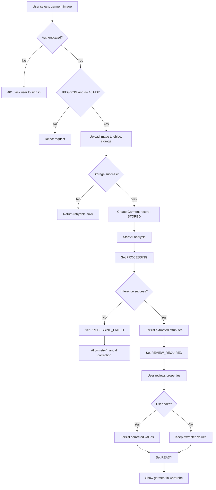

### Ownership

- if diagram explains **business behavior**: BA is often primary author.
- if it explains **technical orchestration**: Tech Lead/implementing developer is often primary author.
- QA contributes failure paths.
- PO validates business meaning.

### Created when

During requirement analysis for a complex business flow, or later during feature design if technical branching only becomes clear in refinement.

### Used by

- Dev: implementation flow and error handling.
- QA: test scenario discovery.
- PO/BA: verify no business path was forgotten.

### Update rule

If the flow changes materially, update the diagram at the same time as Story/AC/design. Do not preserve a knowingly stale diagram “for documentation”.

---

# Sequence Diagram — Upload Garment

Use a Sequence Diagram when interaction ordering, sync/async boundaries or failure propagation matters.

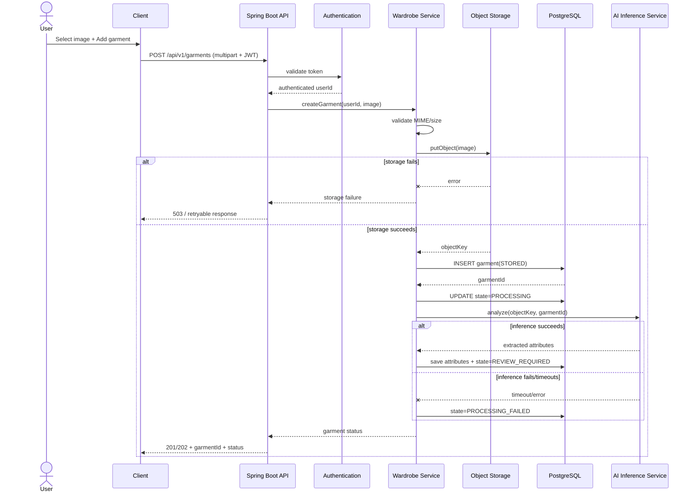

### Who owns it?

Usually Tech Lead or developer implementing the integration-heavy Story. AI developer contributes AI boundary details; QA may add failure scenarios.

### When?

Prefer during refinement/design **before** coding when interaction uncertainty is high. It can be refined during implementation if real constraints appear.

### Why not for trivial CRUD?

A `GET /garments/{id}` that calls one service/repository adds little value as a diagram; code/OpenAPI/tests communicate better.

### How it generates Tasks

The diagram exposes work boundaries:

```text
validate JWT / ownership
→ upload storage adapter
→ create garment persistence
→ AI client integration
→ state transitions
→ failure handling/compensation
→ integration tests
```

Those become candidate Tasks/checklist items.

---

# State Diagram — Garment Processing Lifecycle

A realistic state model should separate “stored”, “being analyzed”, “needs review”, “ready” and failure/retry.

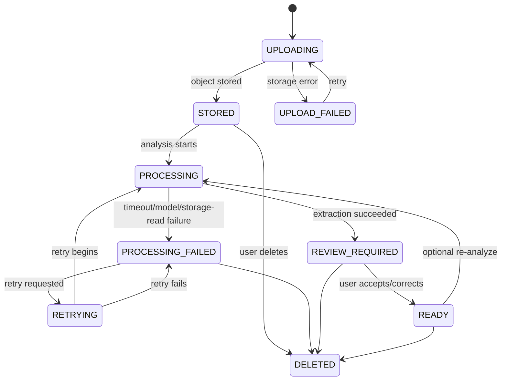

## State Diagram → executable design

| Diagram concept          | Engineering consequence           |
| ------------------------ | --------------------------------- |
| state list               | `processing_status` column / enum |
| allowed transitions      | service-layer guards              |
| transition trigger       | API/service methods/events        |
| invalid transition       | 409/validation/domain error       |
| failed state             | retry UX/API                      |
| terminal `DELETED`       | soft/hard delete decision         |
| transition observability | logs/metrics                      |

### Typical owner

Backend domain owner/Tech Lead, with BA/PO validating business meaning and QA checking transition coverage.

---

# ERD / Database Document Flow

```text
Domain Requirements
      ↓
Entities + relationships
      ↓
ERD (human-readable current model)
      ↓
Logical schema constraints/indexes
      ↓
Versioned migration files
      ↓
Repository/JPA code
      ↓
Integration tests
```

## CapsuleAI initial ERD

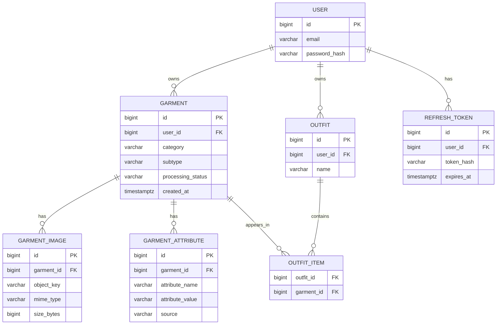

> `REFRESH_TOKEN` chỉ tồn tại nếu JWT design của project dùng server-side refresh-token tracking/revocation. Không thêm table chỉ vì “JWT thường có refresh token”.

### Who proposes/reviews?

- Backend developer or Tech Lead first proposes the ERD.
- BA helps verify business cardinality/rules.
- Tech Lead/peer reviews constraints/indexes/transaction implications.
- implementing developer creates the actual migration.

### What is the source of truth?

- **Executable source of truth for DB structure:** versioned migrations/schema applied by Flyway/Liquibase.
- **ERD:** current human-readable communication view.
- Therefore when schema changes materially, update both migration and ERD, but if they conflict, runtime/versioned schema wins and ERD must be corrected.

### How a Jira Story triggers schema work

```text
CAP-42 requires persisted image/status
↓
ERD impact identified during refinement/design
↓
CAP-44 Create migration
↓
V008__create_garment_and_image_tables.sql
↓
repository/entity changes
↓
integration tests
↓
PR links CAP-42/CAP-44
```

---

# Architecture Document Order

A practical order for CapsuleAI is:

```text
Product Scope + FR/NFR/Business Rules
        ↓
C4 System Context
        ↓
C4 Container Diagram
        ↓
Major ADRs where choices have real trade-offs
        ↓
Initial Domain/Data Model (ERD)
        ↘
         API conventions / contracts
        ↘
Feature-level Sequence/State/Activity design only when needed
        ↓
Implementation
```

This is not rigid. ERD and API work often evolve **in parallel** once core boundaries are stable.

## Dependency logic

- Scope tells architecture what system is/is not responsible for.
- NFRs justify architecture decisions.
- Context identifies users/external systems.
- Container design gives responsibility boundaries.
- ADR records _why_ a significant choice was made.
- ERD expresses persistent domain relationships.
- API contract defines collaboration boundaries.
- feature diagrams clarify runtime behavior where code would otherwise start from ambiguity.

### Important example: sync vs async AI inference

Do **not** choose asynchronous processing merely because it appears more sophisticated.

Start with requirements/NFRs:

```text
If inference usually takes < 2s and acceptable UX waits:
    synchronous may be simplest.

If inference may take 20–60s, needs retries, can outlive request,
or external inference availability is unreliable:
    asynchronous job/state design may be justified.
```

The requirement drives the architecture; architecture does not invent requirements.

---

# 14. Sprint 0 / Engineering Setup

> Sprint 0 không phải khái niệm bắt buộc của Scrum. Ở đây dùng như tên thực dụng cho giai đoạn bootstrap kỹ thuật trước feature sprints.

## Checklist

### Repository

- README.
- `.gitignore`.
- LICENSE nếu cần.
- `CONTRIBUTING.md`.
- Issue templates.
- PR template.

### Environments/config

- `.env.example` hoặc config example không chứa secret.
- Local setup instructions.
- Dev/test/staging/prod config separation.

### Code quality

- Formatter.
- Linter/static analysis.
- Coding conventions.
- Compiler warnings hợp lý.

### GitHub

- `main` protected.
- Require PR.
- Require at least 1 approval cho đồ án nếu plan hỗ trợ.
- Required CI status checks.
- Không force-push/delete `main`.

### CI

- Compile/build.
- Unit tests.
- Integration tests tối thiểu.
- Static checks.
- Package artifact.

### Database

- Docker Compose local DB.
- Flyway/Liquibase.
- Test DB strategy.

### API docs

OpenAPI/Swagger.

## Repository structure đề xuất

```text
project/
├── .github/
│   ├── workflows/
│   │   ├── ci.yml
│   │   └── deploy-staging.yml
│   ├── ISSUE_TEMPLATE/
│   └── pull_request_template.md
├── docs/
├── src/
├── docker/
├── compose.yaml
├── pom.xml
├── README.md
└── CONTRIBUTING.md
```

---

# 15. Git Workflow — GitHub Flow gọn

```text
main
 └─ feat/US-023-upload-garment
      commits...
      ↓
   Pull Request
      ↓ review + CI
   squash merge
      ↓
main
```

## Branch naming

```text
feat/US-023-upload-garment
fix/BUG-014-image-validation
chore/TECH-008-upgrade-flyway
```

## Commit messages

```text
feat(wardrobe): add garment upload endpoint
fix(auth): reject expired refresh token
refactor(media): extract object storage adapter
 test(wardrobe): add upload integration tests
```

## Quy tắc

- Pull latest `main` trước khi bắt đầu/merge khi cần.
- Một branch gắn với một ticket/nhóm thay đổi coherent.
- Không direct push `main`.
- PR nhỏ dễ review hơn PR 2,000 dòng.
- Đồ án: ưu tiên squash merge để history `main` gọn.

---

# 16. Sprint Planning

## Inputs

- Ordered Product Backlog.
- Refined Ready items.
- Team capacity.
- Product Goal/context.
- Previous velocity chỉ dùng tham khảo, không làm KPI cá nhân.

## Outputs

- Sprint Goal.
- Selected Product Backlog Items.
- Plan/task breakdown = Sprint Backlog.

## Ví dụ Sprint 1 — 2 tuần

### Sprint Goal

“User có thể tạo tài khoản, đăng nhập và thêm garment đầu tiên vào wardrobe.”

### Capacity

4 người × khoảng 6 development days hữu dụng = 24 person-days sau khi trừ học/họp.

### Selected items

- US-001 Register — 3.
- US-002 Login — 3.
- US-003 Upload garment — 8.
- US-005 View wardrobe list — 5.
- TECH-01 Integration test foundation — 5.

Nếu tổng vượt capacity/uncertainty cao, bỏ item thấp hơn thay vì “cam kết làm thêm đêm”.

### Breakdown US-003

- Finalize API contract.
- Add DB migration.
- Implement storage adapter.
- Implement service.
- Implement controller/validation.
- Unit tests.
- Integration tests.
- OpenAPI update.
- QA test data.

---

# Jira in a Real Software Workflow

Jira không phải chỉ là “to-do list”. Trong workflow chuyên nghiệp, Jira là **work-management and traceability layer** nối business intent với execution evidence.

Một ticket tốt không copy toàn bộ docs. Nó chứa đủ context để thực hiện công việc và **link đến nguồn authoritative**.

## 16A.1 Who normally creates each ticket type?

| Type               | Typical Primary Creator                                     | Who helps/refines           | Who prioritizes/accepts            | CapsuleAI recommendation               |
| ------------------ | ----------------------------------------------------------- | --------------------------- | ---------------------------------- | -------------------------------------- |
| **Epic**           | PO/PM/BA                                                    | Tech Lead, UX               | PO                                 | PO/BA tạo                              |
| **User Story**     | PO/BA                                                       | Dev + QA during refinement  | PO                                 | PO/BA tạo; Dev/QA refine               |
| **Technical Task** | Developer/Tech Lead                                         | affected Devs               | team/PO for priority if standalone | người kỹ thuật tạo                     |
| **Subtask**        | Developer                                                   | assignee/peers              | parent ticket owner                | chỉ dùng khi có ích                    |
| **Bug**            | QA/Developer/Support/PO — người phát hiện và reproduce được | Dev helps triage            | PO/Tech Lead prioritize            | QA hoặc người reproduce tạo            |
| **Spike**          | Developer/Tech Lead                                         | PO clarifies question/value | PO agrees timebox                  | Dev/Tech Lead tạo                      |
| **Technical Debt** | Developer/Tech Lead                                         | team                        | PO orders against product work     | Dev/Tech Lead tạo và giải thích impact |

### Common practice

PO/BA owns business backlog quality; engineers own technical decomposition.

### Possible variations

Some organizations let any team member create Stories, then PO owns wording/order. Support may create Bugs. Engineering managers may create technical initiatives.

### Recommended for CapsuleAI

Use clear role ownership above, but do not block work on bureaucracy. If developer discovers a missing technical Task, developer creates it and links the parent Story.

---

## 16A.2 Realistic Epic example

```text
CAP-10
Type: Epic
Title: Wardrobe Management

Owner/Reporter:
Product Owner / BA

Product Goal:
Users can build and manage a digital wardrobe that later feeds outfit recommendation.

In Scope:
- add garment
- view wardrobe
- edit garment properties
- delete garment
- search/filter

Out of Scope:
- marketplace
- social sharing
- AR try-on

Success / Exit:
At least one complete wardrobe journey passes UAT on staging.

Related Requirements:
FR-012..FR-022

Related Docs:
UC overview
C4 Container
ERD
Figma wardrobe flow
```

---

## 16A.3 Realistic User Story: CAP-42

```text
CAP-42
Type: Story
Title: Upload garment image to wardrobe

Epic:
CAP-10 — Wardrobe Management

Sprint:
Sprint 2

Status:
Ready

Priority:
High

Story Points:
5

Assignee:
Unassigned while Ready; assigned/pulled by Backend Developer when Sprint work starts

Reporter:
Product Owner / BA

Description:
As a wardrobe owner,
I want to upload a garment image,
so that I can create a digital garment entry in my wardrobe.

Acceptance Criteria:

AC-42-01 — Valid upload
Given an authenticated user
And a JPEG/PNG image <= 10 MB
When the user uploads the image
Then the system stores the image privately
And creates a garment owned by that user
And returns the garment id and processing status.

AC-42-02 — Unsupported type
Given an authenticated user
And a file that is not JPEG/PNG
When upload is attempted
Then the request is rejected
And no garment record is created.

AC-42-03 — Oversized image
Given an image > 10 MB
When upload is attempted
Then the request is rejected with a validation response.

AC-42-04 — Authorization
Given user B
When user B tries to access a garment owned by user A
Then access is denied.

AC-42-05 — AI/storage failure behavior
Given the original image was stored and a garment record exists
When AI analysis fails
Then the garment remains recoverable in PROCESSING_FAILED
And the failure is observable.

Business Rules:
BR-004 Supported formats JPEG/PNG
BR-005 Max image size 10 MB
BR-006 One owning user per garment
BR-007 owner-only access
BR-009 inference failure must not silently delete successfully uploaded data

Design Links:
UC-03 — Add Garment to Wardrobe
ACT-03 — Add Garment activity flow
SEQ-02 — Upload Garment sequence
STATE-01 — Garment Processing lifecycle
OpenAPI: POST /api/v1/garments
ERD: GARMENT / GARMENT_IMAGE
Figma: Wardrobe > Add Garment

Dependencies:
CAP-39 — JWT authentication baseline
SPIKE-07 — Object storage provider decision [only if not yet decided]

Definition of Done:
Project DoD + all CAP-42 AC pass + OpenAPI/migration updated if applicable.

Attachments:
Only evidence that does not belong in a source-of-truth doc.

Comments:
Use for clarification/decision history, not to silently redefine authoritative requirements.
```

This structure is realistic enough to copy into Jira, while durable details remain in linked docs/OpenAPI/migrations.

---

## 16A.4 Engineering Task example

```text
CAP-44
Type: Task
Title: Create schema migration for garment image metadata
Parent/Relates to: CAP-42

Owner:
Backend Developer

Input:
CAP-42 AC
ERD current model
DB conventions

Expected Output:
Versioned Flyway migration adding required garment/image/status fields and constraints.

Dependencies:
Initial users table / auth schema.

Completion Criteria:
- migration applies from clean DB;
- migration applies on current dev schema;
- FK/NOT NULL/unique/check constraints reviewed;
- integration test passes;
- ERD updated if logical model changed.

Produces:
Code + schema documentation update.
```

---

## 16A.5 Subtask example

```text
CAP-44-1
Type: Subtask
Parent: CAP-44
Title: Add index for wardrobe listing by owner and creation time

Done When:
Query plan/test shows intended access path and migration contains the index.
```

Use Subtasks only when they improve visibility or ownership. Do not create 12 tiny subtasks for every private method.

---

## 16A.6 Bug example

```text
BUG-18
Type: Bug
Title: PNG upload leaves orphan object when DB insert fails

Found In:
Staging

Affected Build:
1.2.0-rc.3 / commit a81f2c7

Related Story:
CAP-42

Failed Test:
TC-42-11

Severity:
Major

Priority:
High

Environment:
staging

Preconditions:
Authenticated test user; storage available; DB failure simulated.

Steps to Reproduce:
1. Upload valid PNG.
2. Force DB insert failure after object upload.
3. Inspect storage bucket.

Expected:
Temporary object is removed or reconciled according to compensation design.

Actual:
Object remains without a Garment record.

Evidence:
request id, sanitized logs, object key prefix, screenshots if useful.

Acceptance for Fix:
Regression test covers storage-success + DB-failure path.
```

Severity describes impact; priority describes order/urgency. They are related but not identical.

---

## 16A.7 Spike example

```text
SPIKE-07
Type: Spike
Title: Evaluate object storage options for garment images

Question:
Which storage approach best fits private garment images for the 16-week project?

Timebox:
1 developer-day

Evaluate:
- signed/private access
- Spring integration
- local development story
- cost/free tier constraints
- deletion semantics
- deployment complexity

Output:
1-page recommendation + ADR if a durable architecture decision is made.

Not Output:
Production-ready integration.
```

---

## 16A.8 Technical Debt example

```text
TECH-12
Type: Technical Debt
Title: Extract storage access behind StoragePort

Why now:
WardrobeService directly depends on provider SDK, making tests and provider replacement difficult.

Evidence:
Repeated provider-specific code in 3 paths.

Desired Outcome:
StoragePort + adapter; behavior unchanged; regression suite green.

Priority:
Medium — schedule after core upload stability.
```

---

# How a Story Becomes Developer Tasks

For `CAP-42`, a reasonable decomposition is:

| Task                               | Typical Owner                    | Input                       | Expected Output                   | Depends On      | Completion Criteria                 | Code/Docs?        | Parent                                |
| ---------------------------------- | -------------------------------- | --------------------------- | --------------------------------- | --------------- | ----------------------------------- | ----------------- | ------------------------------------- |
| CAP-43 Define/confirm API contract | Backend Dev + FE/QA contributors | Story/AC, conventions       | OpenAPI operation/schema          | auth baseline   | request/response/errors agreed      | Docs/contract     | CAP-42                                |
| CAP-44 Create DB migration         | Backend Dev                      | ERD, Story                  | Flyway migration                  | existing schema | migration + constraints + test pass | Code + ERD update | CAP-42                                |
| CAP-45 Implement storage adapter   | Backend Dev                      | ADR/provider decision       | `StoragePort` implementation      | storage config  | upload/delete/failure tests pass    | Code              | CAP-42                                |
| CAP-46 Implement GarmentService    | Backend Dev                      | state model, business rules | orchestration/domain logic        | 44/45 partially | unit tests + transition rules       | Code              | CAP-42                                |
| CAP-47 Implement REST endpoint     | Backend Dev                      | OpenAPI + service           | controller/request DTO            | 43/46           | AC happy/validation paths work      | Code              | CAP-42                                |
| CAP-48 Integrate AI inference      | Backend/AI Dev                   | SEQ-02, state diagram       | client/adapter + failure behavior | service/state   | timeout/failure path covered        | Code              | CAP-42 or separate Story if too large |
| CAP-49 Add integration tests       | Backend Dev/QA automation        | AC + API                    | executable integration suite      | implementation  | critical AC automated               | Code/tests        | CAP-42                                |
| CAP-50 Update OpenAPI/examples     | Backend Dev                      | final behavior              | current API spec                  | endpoint        | generated docs match runtime        | Docs/contract     | CAP-42                                |

## Do companies always create each item as a separate Jira Task?

**No.**

Common patterns:

- small Story: implementation checklist inside Story.
- multiple people/dependencies: separate linked Tasks.
- compliance/audit-heavy teams: finer-grained tracking.
- solo ownership: fewer tickets, more PR/checklist detail.

### Recommended for CapsuleAI

Create separate Tasks only when:

- ownership differs;
- dependency can block someone;
- work is independently reviewable;
- it is large enough to be worth board visibility.

Otherwise keep a checklist in the Story to avoid ticket explosion.

---

# Requirements Traceability

Traceability means you can navigate **why a change exists** and **where it was verified**, without maintaining a gigantic spreadsheet manually.

## 16A.9 CAP-42 traceability chain

```text
Product Goal PG-01
"Build a usable digital wardrobe"
↓
FR-012
"Authenticated user can upload a garment image"
↓
UC-03
"Add Garment to Wardrobe"
↓
Epic CAP-10
"Wardrobe Management"
↓
Story CAP-42
"Upload garment image"
↓
AC-42-01..05
↓
OpenAPI POST /api/v1/garments
+ SEQ-02 + STATE-01 + ERD impact
↓
Tasks CAP-43..50
↓
Branch feat/CAP-42-upload-garment
↓
Commits containing [CAP-42]
↓
PR #58
↓
Test Cases TC-42-01..TC-42-12
↓
Build 1.3.0-rc.1
↓
Release v1.3.0
↓
Production image capsuleai-api:1.3.0
```

## 16A.10 Traceability table example

| Requirement                         | Use Case | Story                 | Design                      | PR         | Tests                                 | Release |
| ----------------------------------- | -------- | --------------------- | --------------------------- | ---------- | ------------------------------------- | ------- |
| FR-012 Upload image                 | UC-03    | CAP-42                | OpenAPI + SEQ-02            | PR #58     | TC-42-01..12                          | v1.3.0  |
| FR-015 Correct extracted properties | UC-03    | CAP-58                | Figma + API PATCH           | PR #71     | TC-58-01..08                          | v1.3.0  |
| NFR-006 owner-only authorization    | UC-03/E5 | CAP-42 + auth stories | Threat model + auth ADR     | PR #58/#39 | TC-42-05 + security integration tests | v1.3.0  |
| FR-021 generate outfit              | UC-07    | CAP-90                | SEQ-09 + recommendation ADR | PR #112    | TC-90-\*                              | v1.5.0  |

### Why it matters

When a production bug appears, you can answer:

- Which requirement/Story intended this behavior?
- Which PR introduced it?
- Which tests should have caught it?
- Which release contains it?

Not every organization maintains a formal Requirements Traceability Matrix. For CapsuleAI, **stable IDs + hyperlinks** are enough.

---

# What Should a Developer Read Before Starting a Ticket?

A developer should **not** open every file in `docs/`.

For `CAP-42`, first inspect:

```text
Jira CAP-42
├── Description / value
├── Acceptance Criteria
├── Business Rules referenced by ID
├── Dependency tickets
├── Figma link if UI-facing
├── API contract if predefined
├── relevant Sequence/State diagram if linked
├── relevant ADR if behavior depends on a decision
└── related existing code/tests
```

## Must read for every Story

- Story description/value.
- Acceptance Criteria.
- dependencies/blockers.
- Definition of Done/team conventions.
- relevant existing implementation/tests.

## Read only when relevant

| Artifact         | Consult when                                                                    |
| ---------------- | ------------------------------------------------------------------------------- |
| Product Vision   | Story intent/priority seems inconsistent; major trade-off needs product context |
| Use Case         | Story is one slice of a larger journey or alt/error flow is unclear             |
| NFR              | performance/security/reliability matters to implementation                      |
| ERD              | data model/schema changes                                                       |
| ADR              | code touches a decision boundary such as auth/storage/async architecture        |
| Sequence Diagram | multiple services/integrations and ordering/failure behavior matters            |
| State Diagram    | behavior depends on lifecycle transitions                                       |
| Threat Model     | auth, sensitive data, trust boundary or external integration is affected        |

The Jira ticket is the **entry point**, not necessarily the sole source of all knowledge.

---

# What Does QA Use to Create Test Cases?

```text
User Story
+ Acceptance Criteria
+ Use Case main/alternative/error flows
+ Business Rules
+ API Contract
+ UI/Figma
+ relevant NFR/security risks
        ↓
Test Scenarios
        ↓
Test Cases
        ↓
Execution Evidence
        ↓
Bug ticket if failure
```

## 16A.11 CAP-42 concrete test cases

| Test Case                                          | Source                                 | Expected                                  |
| -------------------------------------------------- | -------------------------------------- | ----------------------------------------- |
| TC-42-01 valid JPG <=10 MB                         | AC-42-01                               | garment created, owner correct            |
| TC-42-02 valid PNG <=10 MB                         | AC-42-01 / BR-004                      | garment created                           |
| TC-42-03 PDF rejected                              | AC-42-02 / BR-004                      | 415/defined validation error; no record   |
| TC-42-04 10.1 MB rejected                          | AC-42-03 / BR-005                      | validation error; no record               |
| TC-42-05 no JWT                                    | auth requirement                       | 401; no storage write                     |
| TC-42-06 expired/invalid JWT                       | auth requirement                       | 401                                       |
| TC-42-07 user B reads user A garment               | AC-42-04 / BR-007                      | 403 or 404 per API policy                 |
| TC-42-08 AI timeout                                | AC-42-05 / UC-03 E4                    | state becomes PROCESSING_FAILED/retryable |
| TC-42-09 object storage failure                    | UC-03 E2                               | no DB item/orphan according to design     |
| TC-42-10 DB failure after storage success          | UC-03 E3                               | cleanup/reconciliation behavior           |
| TC-42-11 duplicate client retry                    | API/idempotency decision if applicable | no unintended duplicates                  |
| TC-42-12 malicious/incorrect content-type metadata | security/validation requirement        | server validates safely                   |

QA does not derive tests from code alone. The expected behavior comes from requirement/AC/contracts, while code helps identify additional risk paths.

---

# Jira Board — CAP-42 Through Its Lifecycle

Recommended board:

```text
Backlog
→ Refinement
→ Ready
→ Sprint Backlog
→ In Progress
→ Code Review
→ QA
→ Ready for Release
→ Done
```

Some teams model `Refinement` or `Sprint Backlog` as flags/fields rather than columns. The exact UI matters less than entry/exit criteria.

| Transition                   | Who moves it?                           | Event                                              | Evidence required                                            | Artifacts that should exist    |
| ---------------------------- | --------------------------------------- | -------------------------------------------------- | ------------------------------------------------------------ | ------------------------------ |
| Backlog → Refinement         | PO/BA                                   | item selected for near-term clarification          | priority/value                                               | draft Story, requirement links |
| Refinement → Ready           | PO/BA or team convention                | DoR satisfied                                      | AC, dependencies, estimate, key design known                 | relevant UC/Figma/design links |
| Ready → Sprint Backlog       | team/PO during Planning                 | selected for Sprint                                | Sprint Goal fit + capacity                                   | Ready Story                    |
| Sprint Backlog → In Progress | developer                               | work actually starts                               | assignee/ownership                                           | Story + AC + relevant design   |
| In Progress → Code Review    | developer                               | PR review-ready                                    | local tests pass; PR opened; CI running/green per convention | branch/commits/PR              |
| Code Review → QA             | merge/deploy automation or developer/QA | review approved, CI green, staging build available | merged SHA + staging deployment                              | PR/CI/build                    |
| QA → In Progress             | QA                                      | defect blocks AC                                   | Bug/evidence                                                 | failed test case               |
| QA → Ready for Release       | QA/release owner                        | AC/regression pass                                 | test evidence                                                | verified build                 |
| Ready for Release → Done     | release owner/PO/team convention        | deployed + smoke/UAT criteria satisfied            | release/version + production evidence                        | release notes/tag/deployed SHA |

### Who moves to Done?

There is no universal answer. Jira permission/workflow varies. For CapsuleAI:

- developer moves to Code Review;
- QA moves pass/fail around QA;
- release owner/PO moves Story to Done **after project DoD is satisfied**.
  Automation can move states when PR/deploy events are reliable.

---

# Jira ↔ Git Relationship

Use one stable work key everywhere:

```text
Jira:
CAP-42

Branch:
feat/CAP-42-upload-garment

Commit:
feat(garment): persist uploaded image metadata [CAP-42]

PR:
CAP-42: Implement garment upload

PR body:
Relates to CAP-42
Implements AC-42-01..05
```

This allows repository search to reconstruct the work trail even without a sophisticated Jira-Git integration.

## Does every Task need its own branch?

No.

## One Story vs multiple PRs?

Possible and often preferable for large but coherent Stories if PRs can merge safely/incrementally:

- PR #55 schema/storage foundation.
- PR #58 endpoint + tests.
  Both relate to CAP-42.

## One PR vs multiple Jira Tasks?

Also possible when several tightly coupled Tasks are implemented together by one owner. The PR should list all related tickets.

## Very large Story?

Do not hide weeks of work behind one giant ticket/PR. Split into independently valuable Stories or at minimum vertical implementation slices.

### CapsuleAI simplest convention

- branch key uses **parent Story** unless a standalone Bug/Task is being delivered.
- PR title starts with primary Jira key.
- PR body lists additional linked Tasks/Bugs.
- squash merge allowed if team wants clean history; Jira key remains in squash commit/PR.

---

# Jira ↔ QA Relationship

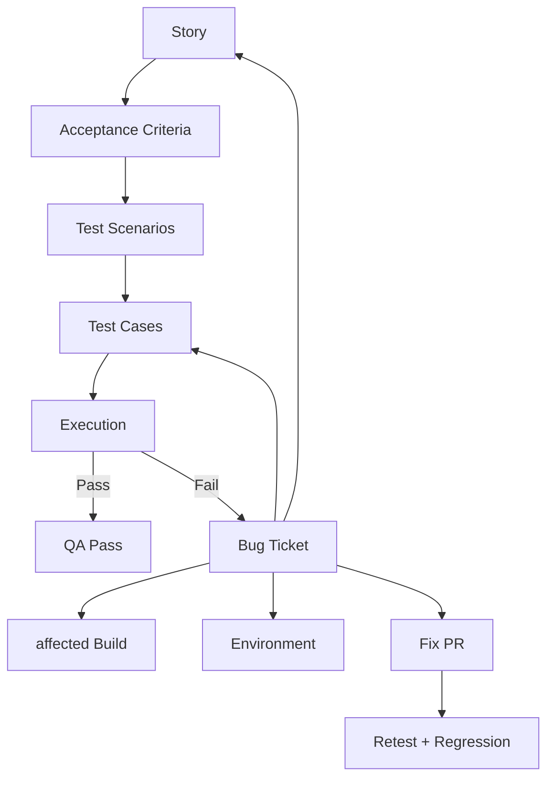

A good Bug links:

- original Story or requirement.
- failed Test Case.
- affected build/commit if known.
- environment.
- evidence/request ID.
- fix PR when resolved.

---

# Jira ↔ Release Relationship

Example:

```text
Release: v1.2.0
├── CAP-42 Upload garment
├── CAP-51 Edit garment
├── CAP-57 View wardrobe
└── BUG-18 Fix upload compensation
```

Traceability fields:

```text
Jira Fix Version / Release: v1.2.0
Git tag: v1.2.0
Docker image: ghcr.io/.../capsuleai-api:1.2.0
Build commit: 9fe23ab
Release Notes: list CAP-42, CAP-51, CAP-57, BUG-18
Production deployment: image digest / commit SHA
```

If a user reports a defect on v1.2.0, the team can trace from production version → image/tag → commit → PRs → Jira → requirements/tests.

---

# 17. Daily Developer Workflow — từ ticket đến production

Đây là workflow cần luyện nhiều nhất.

```text
Ticket
→ Read requirements
→ Clarify
→ Move to In Progress
→ Sync main
→ Create branch
→ Implement small slices
→ Write/run tests
→ Local verification
→ Commit
→ Push
→ Open PR
→ CI
→ Code Review
→ Address feedback
→ Approval
→ Merge
→ Deploy staging
→ QA
→ Ready for Release
→ Production
→ Monitor
→ Done
```

## Step-by-step

### 1. Nhận ticket

Đọc title, description, AC, designs, dependencies, related issues.

### 2. Clarify trước khi code

Nếu AC mâu thuẫn hoặc thiếu behavior: hỏi PO/BA/QA. Nếu design concern: hỏi Tech Lead.

### 3. Move `Ready → In Progress`

Board phải phản ánh thực tế.

### 4. Sync code

```bash
git checkout main
git pull origin main
git checkout -b feat/US-023-upload-garment
```

### 5. Implement theo vertical slice nhỏ

Không viết toàn hệ thống rồi test cuối Sprint.

### 6. Automated tests

Ít nhất unit/integration test cho logic và boundary quan trọng.

### 7. Local verification

```bash
mvn clean verify
```

Kiểm tra API bằng automated test; Postman chỉ nên bổ trợ exploratory/manual verification.

### 8. Commit meaningful changes

Không commit “fix”, “update”, “final-final”.

### 9. Push + PR

PR mô tả why/what/how/test/effects.

### 10. CI

Nếu fail, **author sửa trước**; đừng yêu cầu reviewer review một PR đỏ nếu failure thuộc code hiện tại.

### 11. Code Review

Trả lời comments; không resolve comment mà chưa xử lý/thảo luận.

### 12. Merge

Chỉ merge khi required checks + approvals pass.

### 13. QA/Staging

QA verify AC, error cases, regression risk.

### 14. Release

Item chỉ `Done` khi theo board/DoD của team. Nếu team định nghĩa QA staging là DoD thì code merged chưa phải Done.

## Khi developer nói chuyện với ai?

- **PO/BA:** behavior/business ambiguity.
- **QA:** testability, reproduction, edge case.
- **Tech Lead:** architecture, risky migration, concurrency/security/performance.
- **Other developers:** shared module/API contract/conflict/dependency.

---

# 18. Pull Request Workflow

## PR Template

```markdown
## Summary

What problem does this PR solve?

## Related Issue

Closes #123 / US-023

## Changes

- ...

## Testing

- [ ] Unit tests
- [ ] Integration tests
- [ ] Manual/exploratory verification where relevant

## API Changes

- None / describe endpoint/schema changes

## Database Migration

- None / `V12__...sql`

## Screenshots

If UI change.

## Breaking / Deployment Concerns

- None / describe compatibility, config, migration order

## Checklist

- [ ] Acceptance Criteria covered
- [ ] Local `mvn verify` passes
- [ ] Tests added/updated
- [ ] No secrets committed
- [ ] Docs/OpenAPI updated if needed
- [ ] Migration is backward-compatible where required
```

## Sau khi mở PR

1. CI chạy.
2. Author self-review diff.
3. Reviewer đọc context + code + tests.
4. Comments/request changes.
5. Author push fix; CI rerun.
6. Approval.
7. Merge theo policy.
8. Branch delete.
9. Deployment pipeline tiếp tục.

---

# 19. Code Review

## Reviewer kiểm tra

- Correctness.
- Readability.
- API/DB contract.
- Architecture/module boundaries.
- Error handling.
- Tests.
- Security.
- Concurrency khi có shared state/transaction.
- Performance chỉ khi relevant.
- Backward compatibility/migration risk.

## Comment taxonomy nội bộ đề xuất

- **Blocking:** phải sửa trước merge.
- **Suggestion:** cải thiện đáng làm nhưng không blocker.
- **Question:** cần hiểu intent/assumption.
- **Nit:** style nhỏ, không nên kéo dài review.

## Hội thoại mẫu

**Reviewer — Blocking:** “Endpoint lấy `itemId` nhưng repository query chỉ theo id, chưa theo owner. Authenticated user có thể đoán id người khác. Hãy enforce ownership ở query/service.”

**Author:** “Đúng. Tôi đổi thành `findByIdAndUserId` và thêm integration test user B nhận 404 khi đọc item của user A.”

**Reviewer:** “Test pass, issue đã giải quyết. Approved.”

## Khi bất đồng

1. Làm rõ goal/constraint.
2. Dựa trên codebase conventions, test, benchmark, docs/ADR.
3. Nếu trade-off kiến trúc đáng kể, Tech Lead quyết định và ghi ADR nếu cần.
4. Không biến preference style thành blocker nếu formatter/convention không yêu cầu.

---

# 20. Continuous Integration — GitHub Actions + Maven

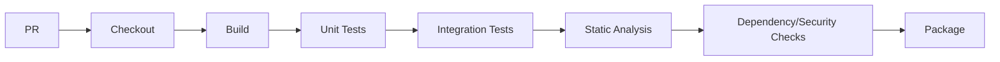

## Workflow mẫu

```yaml
name: CI

on:
  pull_request:
  push:
    branches: [main]

jobs:
  verify:
    runs-on: ubuntu-latest
    steps:
      - uses: actions/checkout@v6

      - uses: actions/setup-java@v4
        with:
          distribution: temurin
          java-version: "21"
          cache: maven

      - name: Verify
        run: mvn --batch-mode clean verify

      - name: Upload artifact
        if: github.ref == 'refs/heads/main'
        uses: actions/upload-artifact@v4
        with:
          name: application-jar
          path: target/*.jar
```

Thực tế có thể bổ sung:

- Checkstyle/SpotBugs/PMD.
- Dependency scanning.
- Testcontainers integration tests.
- Docker image build.

## Vì sao CI fail phải block merge?

Nếu `main` nhận code không build/test được, các developer khác bị chặn và release confidence giảm.

---

# 21. Testing Strategy

| Type               | Objective                      | Ai           | Khi chạy                      | Nên automate?     | Example                     |
| ------------------ | ------------------------------ | ------------ | ----------------------------- | ----------------- | --------------------------- |
| Unit               | Logic nhỏ cô lập               | Dev          | local + CI                    | Yes               | garment rule validator      |
| Integration        | Nhiều component thật tích hợp  | Dev/QA       | CI                            | Yes               | service + PostgreSQL        |
| Repository/DB      | Query/mapping/constraint       | Dev          | CI                            | Yes               | ownership query             |
| API                | Contract/HTTP behavior         | Dev/QA       | CI/staging                    | Mostly            | POST upload returns 415     |
| E2E                | Critical user journey          | QA/Dev       | staging/release               | Một số            | login→upload→view           |
| Regression         | Đảm bảo feature cũ không hỏng  | QA/team      | CI/release                    | Max feasible      | core suite                  |
| Smoke              | Build vừa deploy có sống không | DevOps/QA    | after deploy                  | Yes               | health + login + core read  |
| Security           | Known security classes         | Dev/Security | PR/CI/release                 | Partially         | authz test, dependency scan |
| Performance        | latency/load/capacity          | Dev/SRE      | before risky release/periodic | Automate scenario | upload/list load            |
| Manual exploratory | Tìm issue khó script           | QA/team      | staging                       | No                | unexpected flows            |

## Test Pyramid thực dụng

Nhiều fast unit/component tests ở đáy, ít integration/API hơn, một số E2E critical paths ở đỉnh. Không chạy hàng trăm E2E brittle nếu unit/integration test có thể cover tốt hơn.

---

# 22. QA Workflow

```text
Dev complete
→ PR + CI
→ Merge/deploy staging
→ QA takes ticket
→ Test AC + edge/regression
→ Pass OR Reject
```

## Test case mẫu

| Field         | Value                          |
| ------------- | ------------------------------ |
| Scenario      | Unsupported file upload        |
| Preconditions | Authenticated user             |
| Steps         | Upload `.pdf` as garment       |
| Expected      | 415; no DB record              |
| Actual        | 500; record partially inserted |
| Result        | Fail                           |

## Bug Ticket Template

```markdown
# BUG-014: Uploading PDF returns 500 and creates partial item

## Environment

Staging, build `1.4.0-rc.2`

## Severity

High

## Priority

High

## Preconditions

Authenticated user.

## Steps to Reproduce

1. Open upload screen.
2. Select `sample.pdf`.
3. Submit.

## Expected Result

415 Unsupported Media Type; no item persisted.

## Actual Result

500 Internal Server Error; item row exists without valid media.

## Evidence

Logs / screenshot / request id.

## Regression?

Unknown / first seen in build...
```

### Severity vs Priority

- **Severity:** technical/user impact.
- **Priority:** thứ tự business muốn sửa.

Critical security bug thường cả hai cao; cosmetic issue có thể severity thấp nhưng priority cao trước demo/launch.

---

# 23. Environments

| Env         | Mục đích                    | Data                | Deploy     |
| ----------- | --------------------------- | ------------------- | ---------- |
| Local       | Developer coding/debugging  | local synthetic     | manual     |
| Development | Shared integration tùy team | non-prod            | frequent   |
| Test        | Automated QA/integration    | controlled          | pipeline   |
| Staging     | Release candidate gần prod  | sanitized/synthetic | pipeline   |
| Production  | Real users                  | real data           | controlled |

## Staging nên giống production ở đâu?

- Same application artifact/container image.
- Same major runtime/DB versions.
- Similar config shape.
- Same migration mechanism.
- Same health checks/deployment mechanism.

Không cần cùng scale/cost.

## Config/secrets

```text
Code/config defaults → Git
Environment-specific non-secret config → env/config service
Secrets → platform secret store / protected CI secrets
```

Không commit `.env` thật.

---

# 24. User Acceptance Testing (UAT)

QA hỏi: **“Hệ thống có đúng spec và không bị defect quan trọng không?”**

UAT hỏi: **“Business/user có chấp nhận feature này để dùng/release không?”**

## UAT scenario

```text
Scenario: First wardrobe item
Actor: Product Owner acting as target user
1. Register/login.
2. Upload valid shirt image.
3. Wait for extraction.
4. Confirm category/color are shown.
5. Edit incorrect metadata.
6. Confirm item appears in wardrobe.
Expected: complete journey can be performed without technical assistance.
```

Sign-off đơn giản:

```text
UAT: PASS
Build: 1.4.0-rc.2
Accepted by: Product Owner
Known accepted limitations: HEIC not supported in MVP
```

---

# 25. Sprint Review

## Purpose

Inspect Increment cùng stakeholders và điều chỉnh Product Backlog.

## Flow mẫu

1. Nhắc Sprint Goal.
2. Demo only Done items trên staging.
3. Nói item chưa Done minh bạch.
4. Stakeholder feedback.
5. Thay đổi assumptions/market/scope.
6. PO cập nhật backlog.

**Không biến Sprint Review thành “slide báo cáo tiến độ”.** Nó là working session về product/increment/next steps.

---

# 26. Sprint Retrospective

## Mẫu

### Went well

- PR size trung bình nhỏ hơn Sprint trước.
- Integration tests bắt được migration bug trước staging.

### Went poorly

- QA nhận 4 tickets dồn vào ngày cuối.

### Root cause

- Developer giữ branch 5–6 ngày mới mở PR.
- Story quá lớn.

### Action

- Story > 8 points phải xem xét split trong refinement.
- PR draft mở sau tối đa 2 development days nếu feature dài.
- WIP limit: mỗi developer tối đa 1 primary story.

**Action phải có owner và Sprint áp dụng**, không chỉ “communicate better”.

---

# 27. Release Management

```text
Merge
→ CI
→ Build immutable artifact / Docker image
→ Deploy staging
→ Validation / QA / UAT
→ Release approval
→ Production deploy
→ Migration
→ Smoke test
→ Monitoring
```

## Versioning

Cho đồ án có thể dùng SemVer-like:

```text
1.0.0
1.1.0
1.1.1
```

## Release notes mẫu

```markdown
# v1.3.0

## Added

- Garment image upload
- Wardrobe list

## Fixed

- Ownership authorization bug

## Database

- Applies `V5__add_media_status.sql`

## Known Limitations

- HEIC images not supported
```

## Release checklist

- CI green.
- Image/artifact identified by immutable version/SHA.
- Migrations reviewed.
- Required config/secrets exist.
- Staging pass.
- UAT/approval if required.
- Rollback/forward-fix plan considered.
- Monitoring dashboard/log access ready.

---

# 28. CI/CD rõ ràng

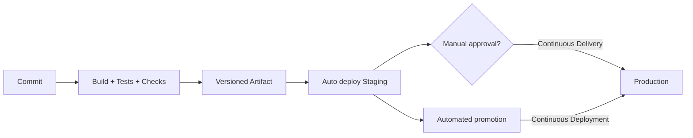

## Đồ án nên automate gì?

**Bắt buộc học:**

- PR build/test.
- Package artifact.
- Deploy staging tự động hoặc one-click reproducible.
- Production deployment reproducible.

**Tốt nếu kịp:**

- Docker image build/push.
- Smoke test after deployment.
- Manual production approval gate.

**Không cần:** multi-region progressive delivery platform chỉ để trình diễn.

---

# 29. Deployment

## Checklist

- Build artifact/Docker image immutable.
- Environment variables available.
- Secrets injected securely.
- DB migration step known.
- Health endpoint.
- Startup validation.
- Deploy.
- Smoke tests.
- Watch logs/metrics.

## Strategies

- **Rolling:** replace instances gradually.
- **Blue-green:** old/new environments song song, switch traffic.
- **Canary:** đưa một phần traffic sang version mới rồi tăng dần.

### Đồ án

Single-instance/reproducible Docker deployment + health check + rollback là đủ. Nếu platform hỗ trợ rolling sẵn, dùng nó; không cần tự xây orchestrator.

---

# 30. Rollback Strategy

## Vì sao cần nghĩ trước?

Release có thể fail vì code, config, migration, dependency hoặc platform.

## Các lớp rollback

- Application: redeploy previous known-good image.
- Configuration: restore previous config.
- Database: ưu tiên backward-compatible forward migrations; DB “down migration” có thể rủi ro dữ liệu.

## Expand/Contract migration ví dụ

Thay vì rename column trực tiếp:

```text
Release A: add new column, app writes both
Release B: backfill/read new column
Release C: stop using old column
Release D: remove old column
```

## Failure scenario

```text
19:00 deploy v1.5.0
19:03 5xx rate tăng mạnh
19:05 stop rollout / switch previous image v1.4.2
19:08 health + smoke test pass
19:10 traffic stable
Next: inspect root cause, fix forward, postmortem if impact significant
```

---

# 31. Observability & Monitoring

## Ba tín hiệu observability cốt lõi

- Logs.
- Metrics.
- Traces.

Cộng thêm dashboards, alerts và health checks để vận hành.

## Backend metrics nên có

- Request count/traffic.
- P50/P95/P99 latency.
- HTTP 4xx/5xx rate.
- JVM heap/GC/thread metrics.
- CPU/memory.
- DB connection pool usage/wait.
- Authentication failures.
- External AI/storage failures.
- Upload processing duration/failure rate.

Google SRE gợi ý bốn “golden signals” cho user-facing systems: **latency, traffic, errors, saturation**.

## Spring Boot stack thực dụng

```text
Spring Boot Actuator
+ Micrometer
+ Prometheus (optional for project)
+ Grafana (optional)
+ OpenTelemetry tracing (optional)
```

### Minimum student implementation

- `/actuator/health` được cấu hình an toàn.
- Structured application logs với request/trace id.
- Một dashboard hoặc ít nhất platform metrics.
- Một alert thực tế: service unavailable hoặc 5xx spike nếu hosting hỗ trợ.

---

# 32. Incident Management

```text
Detection
→ Triage
→ Assign owner
→ Mitigation
→ Recovery
→ Validate service
→ Root Cause Analysis
→ Postmortem
→ Preventive Actions
→ Backlog
```

## Severity mẫu

- SEV-1: core service unavailable/data/security impact nghiêm trọng.
- SEV-2: major feature degraded, workaround hạn chế.
- SEV-3: moderate impact, không cần emergency response.

Đồ án không cần mô phỏng on-call 24/7; hãy chạy **1 incident game day**.

## Full incident example

### Incident

Sau release `v1.5.0`, upload requests trả 500.

### Detection

5xx alert + user report.

### Triage

Log cho thấy DB error: new app expects `media_status` column nhưng migration chưa chạy.

### Mitigation

Rollback application về `v1.4.2`.

### Recovery

Smoke test upload/list; error rate về baseline.

### Root cause

Deployment workflow cho phép app deploy trước migration validation.

### Contributing factors

- Staging DB đã có column do developer từng sửa thủ công.
- Không có clean-environment migration integration test.

### Preventive actions

1. CI tạo fresh DB và chạy toàn bộ Flyway migrations.
2. Không cho manual schema changes trên shared env.
3. Deployment chạy migration job trước app rollout theo strategy đã chọn.
4. Add release checklist item “migration from previous production schema tested”.

### Postmortem principle

Tập trung vào **system/process**, không đổ lỗi cá nhân.

---

# 33. Maintenance

Production không phải “the end”. Các loại work quay lại backlog:

- Bug fixes.
- Dependency upgrades.
- Security patches.
- Refactoring.
- Technical debt.
- Performance improvements.
- Feature requests.
- Monitoring improvements.
- Database maintenance.

Flow:

```text
Production signal/feedback
→ create Bug/Story/Tech Debt item
→ triage/prioritize
→ refinement
→ Sprint
→ normal engineering workflow
```

---

# Source of Truth — Avoiding Duplicate Documentation

Một project dễ hỏng documentation nhất khi cùng một fact được copy vào nhiều nơi.

## 33A.1 Recommended authoritative sources

| Information                     | Recommended Source of Truth                                     | Why                                    |
| ------------------------------- | --------------------------------------------------------------- | -------------------------------------- |
| Product priority/order          | **Product Backlog/Jira**                                        | PO cần một nơi để reorder              |
| Story behavior for current work | **Jira Story + Acceptance Criteria**                            | execution entry point cho Dev/QA       |
| cross-story/core business flow  | **Use Case / requirement docs**                                 | tránh copy full flow vào nhiều Stories |
| Business Rules                  | **versioned `business-rules.md`** with stable IDs               | dùng lại giữa Stories                  |
| NFRs                            | **versioned NFR doc**                                           | cross-cutting                          |
| UI                              | **Figma/design source**                                         | visual source                          |
| API contract                    | **OpenAPI**                                                     | machine-readable contract              |
| DB executable schema history    | **Flyway/Liquibase migrations**                                 | versioned executable truth             |
| DB human model                  | **ERD**                                                         | communication view                     |
| architecture decisions          | **ADRs**                                                        | context + trade-offs                   |
| current high-level architecture | **C4 docs**                                                     | onboarding/communication               |
| source code                     | **Git repository**                                              | executable implementation              |
| build quality                   | **CI result for commit/PR**                                     | repeatable evidence                    |
| environment config              | **deployment/config platform + versioned non-secret manifests** | runtime truth                          |
| release content                 | **Git tag/release + Jira Fix Version/Release Notes**            | traceability                           |
| production version              | **deployment record/image digest/commit SHA**                   | exact provenance                       |
| incidents                       | **Incident record/Postmortem**                                  | operational history                    |

## 33A.2 Why duplication becomes stale

Bad:

```text
Image limit = 10 MB appears in:
SRS + Word + Jira + README + Notion + OpenAPI prose
```

Stakeholder changes it to 20 MB; only some copies are changed.

Better:

```text
BR-005 / canonical requirement
       ↓ referenced by
Jira Story / AC
       ↓ implemented by
validation code/config
       ↓ exposed by
OpenAPI
       ↓ verified by
automated + QA tests
```

Different abstraction levels may repeat a concept, but avoid copying the same authoritative paragraph/value when an ID/link is enough.

### Recommended for CapsuleAI

- Jira: work, priority, Story-specific AC, status.
- Markdown docs: durable cross-feature context/rules/decisions.
- OpenAPI: API contract.
- Flyway: DB executable history.
- Figma: UI source.
- Git/PR/CI: implementation/review/quality evidence.
- Release/ops records: deployed version and incidents.

---

# When Documentation Changes — Change Propagation

Documentation is not “write once and freeze”. A change has an impact radius.

## 33A.3 Example 1 — 10 MB → 20 MB

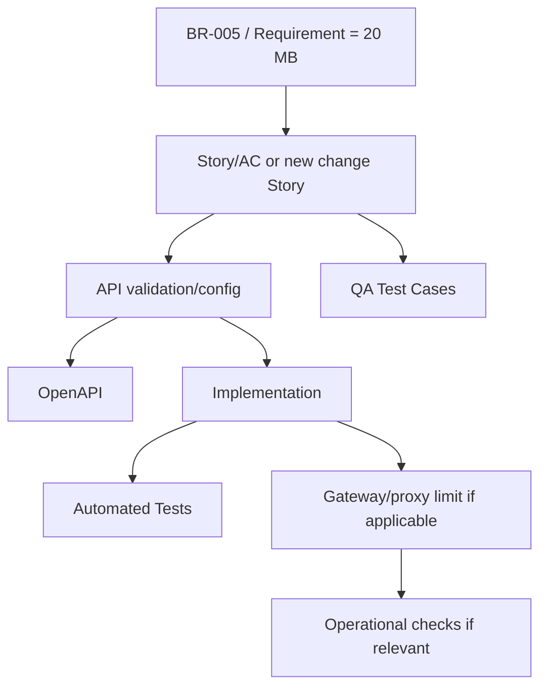

Update:

- canonical BR/requirement;
- active/new Story and AC;
- validation/config;
- OpenAPI;
- automated tests;
- QA boundary cases;
- proxy/gateway body-size config if affected.

Usually no need to update:

- Product Vision;
- C4 Context;
- ERD;
- unrelated Use Cases;
- ADR unless the new limit changes architecture.

If original CAP-42 is already Done/released, do not silently rewrite history as if v1.2.0 always supported 20 MB. Create a linked change Story; current docs show current behavior, while Jira/Git history preserves evolution.

## 33A.4 Example 2 — Synchronous inference → asynchronous processing

```text
New NFR:
Inference can take 20–60s and must survive client disconnect
↓
ADR: choose async processing
↓
C4 Container/Deployment changes if queue/worker introduced
↓
Sequence Diagram + State Diagram change
↓
API contract: 202 + status/retry semantics
↓
ERD/migration for job/state metadata if needed
↓
Tasks/code/tests
↓
deployment/config
↓
metrics/alerts/runbook
```

This is a broad architecture change, so it should not be hidden only in a developer commit.

---

# What Happens Before a Developer Gets a Ticket?

Start:

```text
Stakeholder:
“I want users to add clothes to their wardrobe.”
```

Transformation:

```text
1. Raw stakeholder need
   ↓ BA/PO asks why, who, constraints, failure expectations

2. Product context
   PG-01 Build a usable digital wardrobe
   ↓

3. Requirements
   FR-012 upload garment image
   FR-013 persist owned garment
   FR-014 analyze properties
   ↓

4. Rules/NFRs
   BR-004 JPEG/PNG
   BR-005 <=10 MB
   BR-007 owner-only
   NFR-006 authorization
   ↓

5. Behavioral model
   UC-03 Add Garment to Wardrobe
   + Activity flow where useful
   ↓

6. Product Backlog
   Epic CAP-10 Wardrobe Management
   ↓

7. Story slicing
   CAP-42 Upload Garment Image
   CAP-52 Analyze Properties
   CAP-58 Review Properties
   ↓

8. CAP-42 Acceptance Criteria
   happy + validation + auth + failure behavior
   ↓

9. Backlog Refinement
   PO/BA + Dev + QA + Tech Lead
   clarify + estimate + dependencies + design links
   ↓

10. Supporting design if needed
    OpenAPI draft
    ERD impact
    SEQ-02
    STATE-01
    ↓

11. Meets Definition of Ready
    ↓

12. Sprint Planning selects it
    ↓

Developer sees:
CAP-42 — Upload Garment Image
Status: Ready / Sprint Backlog
```

**A User Story is produced from product/requirement knowledge; it does not magically appear in Jira.**

---

# What Happens After a Developer Finishes Coding?

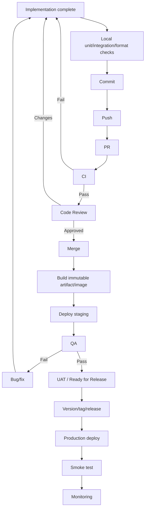

| Step         | Artifact/evidence                      |
| ------------ | -------------------------------------- |
| local verify | transient test output                  |
| commit       | commit SHA                             |
| push         | remote branch                          |
| PR           | description, Jira links, review thread |
| CI           | status checks/logs/test report         |
| review       | approvals/comments                     |
| merge        | merged/squash commit                   |
| package      | JAR/Docker image + version/digest      |
| staging      | deployment record                      |
| QA           | execution evidence/Bugs                |
| UAT          | acceptance/sign-off record             |
| release      | tag/release notes/Jira release         |
| production   | deployed SHA/image                     |
| monitoring   | logs/metrics/dashboard/alerts          |

---

# Documentation Creation Timeline — 14–16 Week CapsuleAI Project

## Week 1 — Discovery

Create:

- Problem Statement — BA/PO.
- Product Vision — PO.
- Stakeholders/actors — BA.
- Scope/MVP — PO/BA + Tech Lead feasibility.
- initial Risk Register — PM/Tech Lead.

## Week 2 — Requirements + Architecture Baseline

Create/refine:

- major FRs — BA.
- NFRs — BA + Tech Lead.
- Business Rules — BA.
- high-level Use Case Diagram — BA.
- core Use Case Specs — BA/PO/QA/Dev.
- initial Epics/Backlog — PO/BA.
- C4 Context/Container — Tech Lead.
- initial ERD — Backend/Tech Lead.
- major ADRs — decision owner.
- lightweight threat model — Tech Lead/security role.
- UX flows/wireframes can run in parallel.

## Week 3 — Sprint 0

Create/setup:

- repo/README/CONTRIBUTING;
- branch/PR rules;
- CI;
- Flyway baseline;
- Docker/local env;
- OpenAPI conventions;
- Test Strategy;
- staging skeleton;
- deploy/rollback baseline;
- logging/health checks.

## Sprint 1+

Per feature:

- Story + AC;
- Figma/API/schema changes if needed;
- Sequence/Activity/State diagram only when valuable;
- Tasks/checklist;
- migration if schema changes;
- branch/PR/tests;
- QA evidence/Bugs;
- docs updated with the same change when practical.

## Release

- release scope/Jira version;
- release notes;
- deployment checklist;
- migration/rollback considerations;
- Git tag/image.

## Production

- deployment record;
- dashboard/alerts for key risks;
- runbook.

## Incident

- incident record/timeline;
- RCA/Postmortem;
- preventive backlog items.

---

# Project-Level vs Feature-Level vs Sprint/Release/Operations Artifacts — Timeline View

| Level            | Examples                                                         | Primary cadence        |
| ---------------- | ---------------------------------------------------------------- | ---------------------- |
| Project-level    | Vision, Scope, C4 Context/Container, baseline ERD, Test Strategy | created early, refined |
| Feature-level    | Story, AC, API change, Sequence/State, migration, Test Cases     | per feature            |
| Sprint-level     | Sprint Goal, Sprint Backlog, Review/Retro actions                | per Sprint             |
| Release-level    | Release Notes, tag, deployment checklist, rollback target        | per release            |
| Operations-level | dashboard, alert, runbook, incident/postmortem                   | ongoing/event-driven   |

---

# Parallel Work — Not Everything Is Sequential

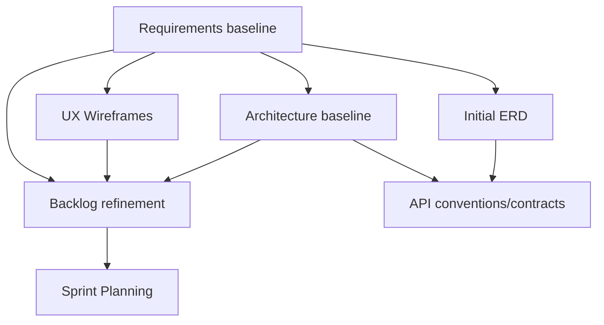

## Must wait

- implementation must wait for **blocking** behavior/contract decisions;
- migration waits for a chosen logical schema;
- expected QA results require agreed behavior;
- release waits for required quality gates.

## Can happen in parallel

- UX + architecture after core requirements are stable enough;
- ERD + API design with synchronization;
- QA scenario design while Dev refines technical design;
- Sprint 0 infrastructure while later Stories are refined;
- frontend + backend after a shared API contract;
- docs updates alongside implementation.

---

# Evolutionary Documentation

| Concept             | Meaning              | Example                            |
| ------------------- | -------------------- | ---------------------------------- |
| Artifact history    | how it evolved       | Git history, ADRs, Flyway V1..V9   |
| Current-state docs  | how system works now | current ERD/C4/OpenAPI             |
| Executable artifact | what runs/enforces   | code, migrations, CI/deploy config |

Example:

```text
Initial ERD
→ Sprint 2 adds Outfit/OutfitItem
→ current ERD updated
→ new Flyway migration added
→ repository/tests updated
```

Do not edit old migration history to make it look like Outfit always existed.

Architecture example:

```text
Initial: API calls AI synchronously
→ new latency/reliability NFR
→ ADR accepted
→ async worker introduced
→ C4/Sequence/State/API/monitoring updated
```

---

# Realistic Meeting Examples for CapsuleAI

| Meeting                 | Participants                             | Input                          | Questions                          | Resulting artifacts/updates    |
| ----------------------- | ---------------------------------------- | ------------------------------ | ---------------------------------- | ------------------------------ |
| Discovery               | stakeholder, PO/BA, UX, Tech Lead        | raw idea                       | user/problem/value/MVP?            | Vision, Scope, risks           |
| Requirement Workshop    | BA, PO, Dev, QA                          | needs                          | limits, permissions, errors?       | FR/BR/NFR/open questions       |
| Refinement              | PO/BA, Dev, QA, Tech Lead                | upcoming Story                 | clear/testable/small/dependencies? | AC, estimate, Ready            |
| Sprint Planning         | PO + Developers                          | ordered Ready backlog/capacity | Goal? what fits? how?              | Sprint Goal/Backlog            |
| Daily Scrum             | Developers                               | Sprint plan                    | adapt plan toward Goal?            | coordination/updated plan      |
| Architecture Discussion | Tech Lead + affected engineers           | NFR/design issue               | options/trade-offs/failure?        | ADR/design/tasks               |
| Code Review             | author + reviewer                        | PR/CI                          | correctness/security/tests?        | comments/approval              |
| QA Handoff              | Dev + QA                                 | staging build + AC             | changed areas/risks/test data?     | test execution/Bugs            |
| Sprint Review           | Scrum Team + stakeholders                | Done Increment                 | feedback/adaptation?               | backlog updates                |
| Retrospective           | Scrum Team                               | Sprint evidence                | root causes/improvements?          | action tickets/process changes |
| Release Decision        | PO/release owner + QA + Tech Lead/DevOps | RC evidence                    | blockers/rollback?                 | go/no-go                       |
| Incident Review         | incident participants                    | timeline/telemetry             | cause/defense gaps/actions?        | Postmortem + tickets           |

Mini requirement workshop:

**BA:** “If AI cannot classify, should upload fail?”

**PO:** “No, keep the image and let user correct it.”

**QA:** “Then upload failure and inference failure are distinct.”

**Backend Dev:** “We need states.”

**Tech Lead:** “Add BR-009, AC-42-05 and STATE-01.”

Outputs: requirement update + Story/AC update + State Diagram + schema/API implications.

---

# Lightweight Reusable Templates for CapsuleAI

## Product Vision

```markdown
# Product Vision

## Problem

## Target Users

## Value Proposition

## Product Goal

## Success Measures

## Constraints

## Out of Scope
```

## Scope / MVP

```markdown
# Scope and MVP

## In Scope

## Out of Scope

## Assumptions

## Constraints

## Exit Criteria
```

## Functional Requirement

```markdown
### FR-XXX — <Name>

Statement:
Actor/Trigger:
Business Value:
Related BR/NFR:
Verification:
```

## Non-Functional Requirement

```markdown
### NFR-XXX — <Quality>

Target:
Conditions:
Measurement:
Rationale:
```

## Business Rule

```markdown
### BR-XXX — <Rule>

Rule:
Owner/Source:
Applies To:
Exceptions:
```

## Use Case Specification

```markdown
# UC-XX — <Goal>

Actor:
Preconditions:
Trigger:
Main Flow:
Alternative Flows:
Exception Flows:
Postconditions:
Business Rules:
Related Requirements:
Related Stories:
```

## ADR

```markdown
# ADR-XXX — <Decision>

Status:

## Context

## Decision

## Alternatives

## Consequences

## Links
```

## User Story

```markdown
# CAP-XX — <Title>

As a ...
I want ...
so that ...

## Acceptance Criteria

## Business Rules

## Design Links

## Dependencies
```

## Jira Task

```markdown
# CAP-XX — <Task>

Parent:
Owner:
Input:
Expected Output:
Dependencies:
Completion Criteria:
Produces:
```

## Bug

```markdown
# BUG-XX — <Symptom>

Environment:
Affected Build:
Related Story/Test:
Severity/Priority:
Steps:
Expected:
Actual:
Evidence:
Fix Acceptance:
```

## Spike

```markdown
# SPIKE-XX — <Question>

Question:
Why:
Timebox:
Options:
Expected Output:
Not in scope:
```

## Test Case

```markdown
# TC-XX

Related Story/AC/Requirement:
Preconditions:
Data:
Steps:
Expected:
Actual:
Status:
Evidence:
```

## Pull Request

```markdown
## Summary

## Related Jira

## Changes

## AC Covered

## Tests

## API/DB Changes

## Security/Operational Impact

## Deployment/Rollback

## Checklist
```

## Release Notes

```markdown
# Release vX.Y.Z

Date:
Deployed commit/image:

## Features

## Fixes

## DB/Config Changes

## Known Issues

## Verification

## Rollback Target
```

## Incident Report

```markdown
# INC-XX

Severity:
Start/End:
Impact:
Detection:
Owner:
Timeline:
Mitigation:
Related release/commit:
```

## Postmortem

```markdown
# Postmortem — INC-XX

## Impact

## Timeline

## Root/Contributing Causes

## What Went Well

## What Failed

## Corrective Actions

| Action | Owner | Ticket |

## Lessons
```

---

# Recommended CapsuleAI `docs/` Structure

```text
docs/
├── 01-product/
│   ├── product-vision.md
│   ├── scope-and-mvp.md
│   ├── stakeholders.md
│   └── roadmap.md
├── 02-requirements/
│   ├── functional-requirements.md
│   ├── non-functional-requirements.md
│   ├── business-rules.md
│   ├── use-cases/
│   │   ├── use-case-overview.md
│   │   └── UC-03-add-garment.md
│   └── workflows/
│       └── add-garment-activity.md
├── 03-architecture/
│   ├── system-context.md
│   ├── container-diagram.md
│   ├── deployment-diagram.md
│   ├── sequences/
│   │   └── SEQ-02-upload-garment.md
│   ├── states/
│   │   └── STATE-01-garment-processing.md
│   └── adr/
├── 04-data/
│   ├── erd.md
│   └── data-dictionary.md
├── 05-api/
│   └── api-conventions.md
├── 06-security/
│   └── threat-model.md
├── 07-testing/
│   ├── test-strategy.md
│   └── regression-checklist.md
└── 08-operations/
    ├── deployment.md
    ├── rollback.md
    ├── monitoring.md
    ├── incident-runbook.md
    └── postmortems/
```

| Directory         | Maintainer              | Update trigger                            |
| ----------------- | ----------------------- | ----------------------------------------- |
| `01-product`      | PO/BA                   | direction/scope change                    |
| `02-requirements` | BA/PO                   | behavior/rule change                      |
| `03-architecture` | Tech Lead/affected Dev  | design/architecture change                |
| `04-data`         | Backend/Tech Lead       | logical model change                      |
| `05-api`          | Backend/API owners      | conventions; endpoint truth stays OpenAPI |
| `06-security`     | Tech Lead/security role | threat/boundary/control change            |
| `07-testing`      | QA/Tech Lead            | strategy/regression baseline changes      |
| `08-operations`   | DevOps/service owners   | deploy/monitor/incident changes           |

Keep in Jira/GitHub instead of duplicating:

- Story status/assignee/Sprint;
- ticket-specific implementation checklists;
- PR review threads;
- CI logs;
- transient investigation comments;
- raw release item list if Jira already tracks it.

---

# FAQ — Common Beginner Questions

1. **Does every requirement become one User Story?** No. Mapping is many-to-many.
2. **Does every Story have a Use Case?** No; core journeys benefit most.
3. **Does every Story require a Sequence Diagram?** No; only when interactions/order/failures warrant it.
4. **Does every DB change require ERD update?** Every DB change needs migration; update ERD when logical model changes meaningfully.
5. **Does every Story create multiple Tasks?** No; use checklist for small work.
6. **Does every Task need a branch?** No.
7. **Does every Story have one PR?** No; one or several PRs are possible.
8. **Who creates a Jira Story?** Usually PO/BA; team refines.
9. **Who assigns it?** Varies; self-managing teams often pull/agree ownership, other companies assign via lead/manager.
10. **Who moves it to Done?** Workflow-specific; CapsuleAI should do it only after DoD/release criteria, not after coding.
11. **Who writes AC?** PO/BA primary, Dev/QA contribute.
12. **Who writes Test Cases?** QA primary; developers write automated tests from the same behavior.
13. **Who creates Use Case Diagram?** BA/System Analyst usually.
14. **Who creates Activity Diagram?** BA for business flow; Dev/Tech Lead for technical flow.
15. **Who creates Sequence Diagram?** Tech Lead/implementing Dev.
16. **Who creates ERD?** Backend Dev/Tech Lead/Data Architect depending org.
17. **Who maintains OpenAPI?** Backend/API owner with consumer review.
18. **Who writes ADRs?** Decision proposer/owner, often Tech Lead/senior Dev.
19. **Who decides architecture?** Tech Lead/Architect drives with affected engineers; requirements/NFRs constrain.
20. **What should an intern read before coding?** Ticket + AC + linked relevant design/contracts + existing code/tests.
21. **If Jira has requirements, why docs?** Jira is work slices; docs hold durable cross-feature context/rules/architecture.
22. **If OpenAPI is API spec, why API docs?** Additional docs explain conventions/rationale; do not duplicate endpoint contract.
23. **If Flyway defines schema, why ERD?** Flyway is executable history; ERD is human mental model.
24. **When update docs?** When represented behavior/design changes, ideally in same Story/PR.
25. **Which docs are mandatory for CapsuleAI?** Vision/MVP, core FR/NFR/BR, backlog/AC, C4 Context/Container, ERD+migrations, OpenAPI, major ADRs, test strategy, deployment/rollback/monitoring basics. Selective Use Case/Activity/Sequence/State docs only where useful.

---

# CapsuleAI Company Simulation — One Feature From Idea to Production

Phần này là **playbook thực hành quan trọng nhất**. Nó nối toàn bộ artifact chain bằng một feature duy nhất:

> **Add Garment to Wardrobe**

Mục tiêu là để bạn có thể chỉ vào bất kỳ bước nào và trả lời được:

- input đến từ đâu;
- ai làm;
- artifact nào được tạo/cập nhật;
- ai dùng artifact đó tiếp;
- Jira/Git/Test/Release liên kết ra sao.

---

## Step 1 — Stakeholder request

Raw wording:

> “Tôi muốn người dùng chụp hoặc chọn ảnh một món đồ rồi thêm nó vào wardrobe. Hệ thống tự nhận diện loại đồ, màu, pattern và các thuộc tính khác để sau này gợi ý outfit.”

**Primary owner capturing it:** BA/PO.

**Artifact:** discovery note / stakeholder requirement.

**Không code ngay.** Wording trên còn mơ hồ về:

- format/size ảnh;
- privacy/ownership;
- AI latency/failure;
- user có được sửa kết quả AI không;
- upload và analysis là một transaction hay hai giai đoạn;
- object storage;
- success/failure UX.

---

## Step 2 — Discovery

### Questions

**BA → Stakeholder/PO**

- Mục tiêu business là gì?
- Một ảnh có một hay nhiều garment?
- Nếu AI sai thì user làm gì?
- Nếu AI fail thì ảnh có bị mất không?
- User có cần upload nhiều ảnh cùng lúc không?
- MVP hỗ trợ JPEG/PNG/HEIC?
- Maximum size?
- Wardrobe có private không?
- Kết quả AI có cần tức thời?
- Những attributes nào bắt buộc cho recommendation?

### Example answers

```text
MVP:
- one garment per upload
- JPEG/PNG
- max 10 MB
- wardrobe private to owner
- user can review/correct AI properties
- AI failure must not delete stored garment
- multi-image garment and social sharing are out of scope
```

### Outputs

- open questions resolved/recorded;
- scope confirmed;
- raw requirement ready for analysis.

---

## Step 3 — Requirements

```text
FR-012 — Upload Garment Image
Authenticated user can submit one supported garment image.

FR-013 — Persist Owned Garment
System creates a garment associated with exactly one authenticated owner.

FR-014 — Analyze Garment Properties
System can derive configured garment properties from the image.

FR-015 — Review/Correct Extracted Properties
User can review and correct extracted properties before final use.

NFR-006 — Resource Authorization
Wardrobe resources must enforce owner-only access.

NFR-009 — Recoverable Processing Failure
Inference failure must be observable and must not silently lose a successfully stored image.

BR-004 — Supported Image Type
MVP supports JPEG and PNG.

BR-005 — Maximum Image Size
MVP accepts images up to 10 MB.

BR-006 — Garment Ownership
Each garment belongs to exactly one user.

BR-007 — Owner Access
Only the owner can view/update/delete the garment.

BR-009 — AI Failure Preservation
A successful image upload must remain recoverable even if inference fails.
```

**Primary authors**

- BA: FR/BR.
- BA + Tech Lead: NFR.
- PO: confirms business intent/priority.

---

## Step 4 — Use Case `UC-03`

Use the detailed `UC-03 — Add Garment to Wardrobe` defined earlier.

Key relation:

```text
FR-012/13/14/15 + BR-004/005/006/007/009
                    ↓
                   UC-03
                    ↓
CAP-42 + CAP-52 + CAP-58 + CAP-61
```

UC-03 is broader than CAP-42. This is why one Use Case can generate several Stories.

---

## Step 5 — Use Case Diagram

High-level product view:

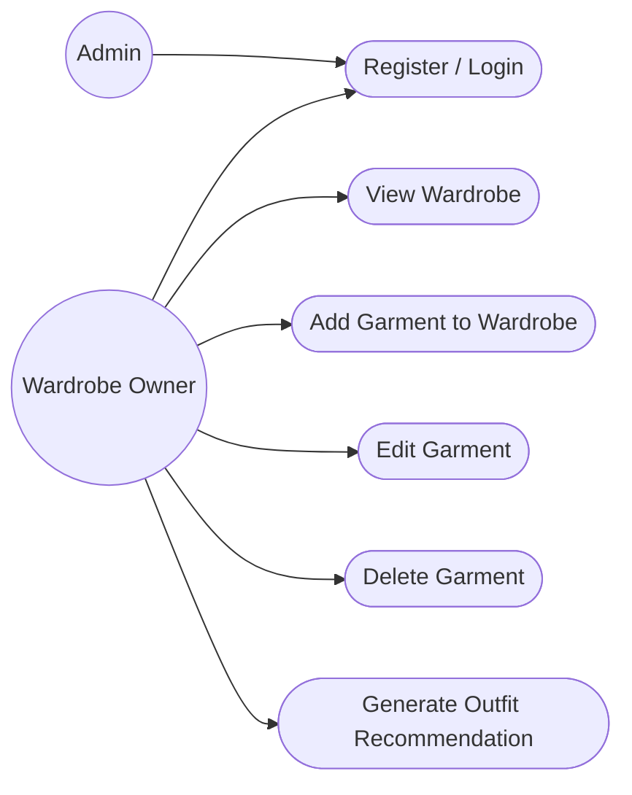

**Primary author:** BA/System Analyst.

UC-03 appears as one actor goal; internal object storage/AI/DB are **not actors in a business Use Case Diagram** just because they exist technically.

---

## Step 6 — Activity Diagram

Use the Add Garment Activity Diagram from the design section:

```text
select image
→ auth + validation
→ store image
→ create garment
→ invoke/process AI
→ success/failure state
→ user review/correction
→ READY
```

**Why it exists:** the branch/error flow is important enough to communicate to BA/Dev/QA.

---

## Step 7 — Product Backlog

PO creates/maintains:

```text
CAP-10 — Epic: Wardrobe Management
├─ CAP-42 — Story: Upload garment image
├─ CAP-52 — Story: Analyze garment properties
├─ CAP-58 — Story: Review/correct properties
├─ CAP-61 — Story: Save/show garment
└─ ...
```

Priority is based on the product goal and dependency chain, not because CAP-42 has the lowest numeric ID.

---

## Step 8 — Full Jira Story

Use the `CAP-42` example defined in **Jira in a Real Software Workflow**.

Minimum Story contents:

```text
CAP-42
Type: Story
Title: Upload garment image to wardrobe
Epic: CAP-10
Priority: High
Estimate: 5
Status: Ready

As a wardrobe owner,
I want to upload a garment image,
so that I can create a digital garment entry.

Links:
UC-03
BR-004/005/006/007/009
OpenAPI operation
SEQ-02
STATE-01
ERD
```

---

## Step 9 — Acceptance Criteria

Example:

```gherkin
AC-42-01
Given an authenticated user
And a JPEG/PNG image <= 10 MB
When the image is uploaded
Then a garment owned by that user is created
And the image is stored privately
And the response contains garment id and processing status
```

```gherkin
AC-42-02
Given an unsupported file
When upload is attempted
Then the system rejects it
And no garment is created
```

```gherkin
AC-42-03
Given an image > 10 MB
When upload is attempted
Then validation fails
And no object/garment is left behind
```

```gherkin
AC-42-04
Given user B
When user B requests a garment owned by user A
Then access is denied according to the API authorization policy
```

```gherkin
AC-42-05
Given the original image and garment were created
When inference fails
Then the garment remains in a recoverable failed-processing state
And failure evidence is observable
```

---

## Step 10 — Backlog Refinement

### Participants

- PO/BA.
- Backend Developer.
- AI Developer.
- QA.
- Tech Lead.

### Conversation

**PO:** “CAP-42 should let the user add an image and get garment properties.”

**Backend Dev:** “Do we need inference to finish before POST returns?”

**AI Dev:** “Our current model may take several seconds and occasional retries.”

**QA:** “What should happen if inference times out after the image is already stored?”

**PO:** “Keep the garment; user should retry or correct manually.”

**Tech Lead:** “Then we need explicit processing states. For MVP we can keep integration simple, but failure must be durable.”

**Backend Dev:** “Does size limit mean HTTP body limit too, or only business validation?”

**Tech Lead:** “Both need to be compatible. Put 10 MB in BR-005 and check gateway/app configuration.”

**QA:** “I will add cases for 10.1 MB, bad content type, no JWT, storage failure, inference timeout.”

**PO:** “Good. Multi-image is out of scope.”

### Result

- AC-42-05 added/clarified.
- `STATE-01` required.
- `SEQ-02` created because the flow crosses multiple boundaries.
- estimate updated.
- dependency on auth/storage decision confirmed.
- Story moves to `Ready`.

---

## Step 11 — Architecture Impact

Affected containers/modules:

```text
Client
  ↓
Spring Boot API
  ├─ auth
  ├─ wardrobe
  ├─ media/storage adapter
  └─ ai/inference adapter
       ↓
PostgreSQL
Object Storage
AI Inference
```

Review:

- no need for a new microservice merely for this Story;
- object storage is external infrastructure;
- AI component may be in-process or separate according to existing architecture;
- privacy/trust boundary needs review.

---

## Step 12 — ADR

Does CAP-42 need a new ADR?

If object storage choice is not already recorded, yes:

```markdown
# ADR-004 — Store garment images in object storage

Status: Accepted

## Context

Garment images are binary, can be large compared with relational metadata, and need private access.

## Decision

Store image bytes in object storage; persist object key/metadata in PostgreSQL.

## Alternatives

1. PostgreSQL BLOB
2. local filesystem
3. object storage

## Consequences

- DB remains focused on relational metadata.
- storage lifecycle/access can be handled separately.

* consistency between DB and storage requires explicit failure handling.
* local dev needs an emulator/provider strategy.
```

If ADR-004 already exists, CAP-42 simply links it. Do **not** create duplicate ADRs.

---

## Step 13 — Sequence Diagram

Use `SEQ-02 — Upload Garment`:

```text
Client
→ API
→ Auth
→ WardrobeService
→ Object Storage
→ PostgreSQL
→ AI Inference
→ status/response
```

Failure paths:

- storage failure;
- DB failure after storage success;
- inference failure.

This diagram directly informs CAP-45/46/48 and integration tests.

---

## Step 14 — State Diagram

`STATE-01 — Garment Processing`:

```text
UPLOADING
→ STORED
→ PROCESSING
→ REVIEW_REQUIRED
→ READY
```

Failures/retries:

```text
UPLOAD_FAILED
PROCESSING_FAILED
RETRYING
DELETED
```

This becomes:

- DB state field.
- transition guards.
- API response semantics.
- QA cases.

---

## Step 15 — ERD / Schema Impact

Relevant entities:

```text
USER 1 ─── * GARMENT
GARMENT 1 ─── * GARMENT_IMAGE
GARMENT 1 ─── * GARMENT_ATTRIBUTE
```

Example migration intent:

```sql
CREATE TABLE garment (
    id BIGINT GENERATED ALWAYS AS IDENTITY PRIMARY KEY,
    user_id BIGINT NOT NULL REFERENCES app_user(id),
    processing_status VARCHAR(32) NOT NULL,
    category VARCHAR(80),
    subtype VARCHAR(80),
    created_at TIMESTAMPTZ NOT NULL DEFAULT now()
);

CREATE TABLE garment_image (
    id BIGINT GENERATED ALWAYS AS IDENTITY PRIMARY KEY,
    garment_id BIGINT NOT NULL REFERENCES garment(id) ON DELETE CASCADE,
    object_key VARCHAR(500) NOT NULL UNIQUE,
    mime_type VARCHAR(100) NOT NULL,
    size_bytes BIGINT NOT NULL CHECK (size_bytes > 0),
    created_at TIMESTAMPTZ NOT NULL DEFAULT now()
);

CREATE INDEX idx_garment_user_created
    ON garment(user_id, created_at DESC);
```

Exact migration must match the project's actual naming/conventions.

---

## Step 16 — API Contract

Example:

```http
POST /api/v1/garments
Authorization: Bearer <access-token>
Content-Type: multipart/form-data
```

Form:

```text
image: <binary JPEG/PNG>
```

Possible response:

```http
201 Created
```

```json
{
  "id": 845,
  "processingStatus": "PROCESSING",
  "image": {
    "contentType": "image/jpeg"
  }
}
```

Validation example:

```http
413 Payload Too Large
```

or another project-defined error contract, but it must be consistent.

Example error body:

```json
{
  "code": "GARMENT_IMAGE_TOO_LARGE",
  "message": "Garment image must not exceed 10 MB",
  "traceId": "..."
}
```

If inference is deliberately asynchronous, `202 Accepted` may be more semantically appropriate. That choice belongs in API/ADR design, not an arbitrary controller return code.

---

## Step 17 — Sprint Planning

Sprint Goal example:

> “User can securely create and view the first usable wardrobe item on staging.”

CAP-42 enters because:

- High priority.
- Ready.
- dependencies satisfied.
- contributes directly to Sprint Goal.
- capacity exists.

Developers create/confirm the implementation plan and related Tasks.

---

## Step 18 — Task Breakdown

```text
CAP-43 Confirm POST /api/v1/garments OpenAPI
CAP-44 Create garment/image migration
CAP-45 Implement object-storage adapter
CAP-46 Implement garment creation/state orchestration
CAP-47 Implement REST endpoint + validation
CAP-48 Integrate inference/failure path
CAP-49 Add integration tests
CAP-50 Update OpenAPI/examples
```

If one Backend Dev owns most work, CAP-43..50 can be a Story checklist instead of eight board cards. Separate tickets only where visibility/ownership/dependency benefits.

---

## Step 19 — Developer Starts Work

Board:

```text
CAP-42
Ready / Sprint Backlog
        ↓ developer pulls it
In Progress
```

Before coding, developer checks:

- Story/AC.
- UC-03 only for relevant broader flow.
- BRs/NFRs.
- OpenAPI.
- ADR-004.
- ERD/STATE/SEQ.
- existing code/tests.

If key behavior is still ambiguous, stop **that decision**, not necessarily all work; ask PO/QA/Tech Lead and update authoritative artifact.

---

## Step 20 — Git Branch

```bash
git switch main
git pull --ff-only
git switch -c feat/CAP-42-upload-garment
```

Branch naming:

```text
feat/CAP-42-upload-garment
```

If CAP-44 is a separate independently reviewed change, a separate branch/PR may be justified; otherwise one Story branch is simpler for the student team.

---

## Step 21 — Implementation

Likely Spring Boot files/classes might include:

```text
src/main/java/.../wardrobe/
├── api/
│   ├── GarmentController.java
│   ├── CreateGarmentResponse.java
│   └── ...
├── application/
│   └── GarmentService.java
├── domain/
│   ├── Garment.java
│   └── GarmentProcessingStatus.java
├── persistence/
│   ├── GarmentRepository.java
│   └── ...
└── infrastructure/
    ├── storage/
    │   └── ObjectStorageAdapter.java
    └── inference/
        └── GarmentInferenceClient.java

src/main/resources/db/migration/
└── V008__create_garment_tables.sql
```

Do not copy this exact package structure blindly; follow the actual architecture.

Implementation concerns:

- user ID comes from authenticated principal, not request body.
- server validates content.
- object key is generated safely.
- ownership always scoped in queries.
- storage/DB partial failures have defined behavior.
- inference timeout/failure changes state predictably.
- logs contain request/garment IDs but not JWT/password/sensitive image bytes.

---

## Step 22 — Local Tests

Developer writes/runs:

### Unit

- image validation.
- transition rules.
- service behavior for inference failure.
- ownership guard logic if unit-testable.

### Integration

- API + auth + DB.
- migration from clean DB.
- valid upload path with storage/inference test double.
- unauthorized access.
- partial failure behavior.

Commands may be:

```bash
mvn test
mvn verify
```

or project-specific wrapper commands.

---

## Step 23 — Commits

Examples:

```text
feat(garment): add upload API contract [CAP-42]
feat(garment): persist garment image metadata [CAP-42]
feat(storage): add private garment storage adapter [CAP-42]
test(garment): cover upload validation and failures [CAP-42]
docs(api): update garment upload OpenAPI [CAP-42]
```

Commit boundaries should be understandable, not “final”, “fix”, “stuff”.

---

## Step 24 — Pull Request

```markdown
# CAP-42: Implement garment image upload

## Summary

Implements the upload slice of UC-03. Authenticated users can upload one JPEG/PNG <=10 MB and create an owned garment record.

## Related

- Story: CAP-42
- Epic: CAP-10
- UC-03
- ADR-004
- SEQ-02
- STATE-01

## Changes

- POST /api/v1/garments
- garment/image schema migration
- object storage adapter
- processing-state handling
- integration tests

## Acceptance Criteria

- [x] AC-42-01
- [x] AC-42-02
- [x] AC-42-03
- [x] AC-42-04
- [x] AC-42-05

## Tests

- mvn verify
- integration test suite
- manual valid/invalid multipart checks

## API/DB

- OpenAPI updated
- Flyway V008 added

## Security

- owner derived from authenticated principal
- private object access
- no token/image content in logs

## Deployment

- requires object-storage config/secrets
- migration runs before app becomes healthy according to deployment design

## Rollback

- application can roll back only if schema compatibility is preserved; see release checklist.
```

Status:

```text
In Progress → Code Review
```

---

## Step 25 — CI

Example result:

```text
PR #58
✓ checkout
✓ Java setup
✓ compile
✓ unit tests
✓ integration tests
✓ static analysis
✓ dependency/security checks
✓ package
✓ artifact/image build
```

If integration test fails:

```text
✗ GarmentUploadIT.aiTimeoutPreservesGarment
```

PR cannot merge until the required check is green.

---

## Step 26 — Code Review

Realistic comments:

**Reviewer — blocking**

> `findById(id)` is not owner-scoped. Please query by both `id` and authenticated `userId` or enforce equivalent ownership before returning the entity. Add an integration test.

**Author**

> Updated to `findByIdAndUserId(...)`; added cross-user test `TC-42-07` equivalent.

**Reviewer — question**

> What happens if storage succeeds but DB insert fails?

**Author**

> Added cleanup compensation. The failure path is now covered by integration test and described in SEQ-02.

**Reviewer — suggestion**

> Consider extracting MIME/size validation to a dedicated validator to keep controller thin.

**Reviewer — nit**

> Rename `img` to `imageFile`.

After changes:

- CI reruns.
- reviewer approves.
- merge allowed.

---

## Step 27 — QA

Staging build deployed.

QA executes:

```text
TC-42-01 valid JPG
TC-42-02 valid PNG
TC-42-03 PDF rejected
TC-42-04 >10 MB rejected
TC-42-05 no JWT
TC-42-06 invalid/expired JWT
TC-42-07 cross-user access denied
TC-42-08 AI timeout
TC-42-09 storage failure
TC-42-10 DB failure after storage success
TC-42-11 retry behavior
TC-42-12 malformed/spoofed content metadata
```

Evidence references:

- staging build.
- request IDs.
- expected vs actual.
- linked AC.

---

## Step 28 — Bug Discovered

QA finds:

> storage object remains after DB insert failure.

Create:

```text
BUG-18
Title: PNG upload leaves orphan object when DB insert fails
Related: CAP-42
Failed Test: TC-42-10
Environment: staging
Build: 1.3.0-rc.1
Severity: Major
Priority: High
```

CAP-42 does **not** move to Ready for Release while a blocking AC defect remains.

---

## Step 29 — Bug Fix

Developer:

- reproduces.
- links BUG-18 to CAP-42.
- creates branch:

```bash
git switch -c fix/BUG-18-upload-compensation
```

Possible commit:

```text
fix(storage): clean up object when garment persistence fails [BUG-18]
```

PR:

- references BUG-18 and CAP-42.
- adds regression test.
- CI/review.
- staging redeploy.

QA retests TC-42-10 plus relevant regression cases.

---

## Step 30 — Staging

Verify:

- exact candidate version is visible.
- migration succeeded.
- object storage permissions/config correct.
- upload API works.
- logs contain trace/request IDs.
- no secret leakage.
- core auth/wardrobe smoke tests pass.
- AI failure path observable.

Status:

```text
QA → Ready for Release
```

when required test evidence is green.

---

## Step 31 — UAT

PO/stakeholder runs business scenario:

```text
login
→ add real garment image
→ observe processing
→ review extracted attributes
→ see item in wardrobe
```

UAT is not “QA again”. It asks whether the increment satisfies user/business intent.

Example sign-off:

```text
UAT CAP-42/UC-03 upload slice: Accepted on staging build 1.3.0-rc.2.
Known limitation: multi-image upload remains out of MVP.
```

---

## Step 32 — Release

Example Release Notes:

```markdown
# CapsuleAI v1.3.0

## Added

- CAP-42 Upload garment image
- CAP-52 Basic garment analysis

## Fixed

- BUG-18 Clean up stored object when garment persistence fails

## Database

- V008 creates garment/image tables

## Configuration

- object storage endpoint/bucket/credentials required

## Verification

- staging regression passed
- UAT accepted

## Rollback

- previous known-good: v1.2.1
- validate migration compatibility before application rollback
```

Trace:

- Jira release `v1.3.0`.
- Git tag `v1.3.0`.
- Docker image `capsuleai-api:1.3.0`.
- deployed commit SHA recorded.

---

## Step 33 — Production

Pipeline:

```text
approved artifact
→ production config
→ migration step/startup
→ deploy app
→ health checks
→ smoke test
```

Smoke:

- authenticate test account.
- upload a safe test image.
- verify garment state.
- verify no 5xx spike.
- verify storage/DB behavior.

Ticket becomes Done only according to team DoD, not simply because merge happened.

---

## Step 34 — Monitoring

Watch at least:

```text
HTTP request count
HTTP 4xx/5xx
upload latency
upload rejected count by reason
object storage failures
AI inference success/failure/latency
PROCESSING_FAILED count
DB pool usage
JVM memory/CPU
authentication failures
```

Useful structured logs:

- request/trace ID.
- garment ID.
- user ID only if privacy/logging policy permits and appropriately handled.
- processing transition.
- external dependency error category.

Do not log:

- password.
- raw JWT.
- image bytes.
- sensitive secret values.

---

## Step 35 — Incident

Production symptom:

> AI provider latency rises. API request threads wait too long, P95 latency and 5xx increase.

Workflow:

```text
alert/log signal
→ triage
→ identify inference dependency
→ mitigate
→ recover
→ RCA
```

Mitigation examples depending architecture:

- temporarily disable auto-analysis while preserving uploads.
- tighten timeout/circuit breaker.
- rollback release if regression caused by new code.
- switch to processing queue only if already supported; do not invent new architecture during incident.

Incident record:

```text
INC-03
Severity: SEV-2 (team-defined)
Impact: 34% garment uploads experienced >10s latency for 18 minutes
Start: ...
Detection: 5xx/latency alert
Owner: Backend/incident lead
Related release: v1.3.0
```

---

## Step 36 — Postmortem

Example:

```markdown
# Postmortem — INC-03 AI inference timeout saturation

## Impact

Uploads slowed/failed for 18 minutes.

## Root / contributing causes

- inference timeout was too high relative to request budget;
- no bulkhead/concurrency limit around external AI call;
- alert detected API latency but no dedicated inference saturation metric.

## What worked

- request IDs allowed fast correlation;
- rollback/feature-disable path was known.

## Corrective Actions

| Action                                              | Owner          | Ticket   |
| --------------------------------------------------- | -------------- | -------- |
| define inference timeout budget                     | Backend        | TECH-31  |
| add inference latency/error metrics                 | Backend/DevOps | TECH-32  |
| evaluate async processing based on measured latency | Tech Lead      | SPIKE-33 |
| add failure-load test                               | QA/Dev         | TEST-34  |
```

Do not write “developer X caused incident”. Focus on system/process defenses.

---

## Step 37 — New Feedback → Backlog

Users ask:

> “I want to upload front and back images of the same garment.”

Do not silently expand CAP-42 after it is Done.

Create:

```text
CAP-104
Story: Upload multiple images for one garment
Epic: CAP-10
Source: production user feedback
```

Impact analysis may touch:

- UC-03.
- `GARMENT_IMAGE` cardinality (already supports many in this example).
- UI/Figma.
- API multipart contract.
- storage costs.
- AI inference input.
- tests.

Then the cycle starts again:

```text
Feedback
→ Backlog
→ Refinement
→ Sprint
→ Design
→ Code/PR/CI
→ QA
→ Release
→ Production
```

---

## Master trace for this feature

```text
Stakeholder need
↓
PG-01
↓
FR-012 + NFR-006 + BR-004/005/006/007/009
↓
UC-03
↓
CAP-10
↓
CAP-42
↓
AC-42-01..05
↓
OpenAPI + ERD + ADR-004 + SEQ-02 + STATE-01
↓
CAP-43..50
↓
feat/CAP-42-upload-garment
↓
PR #58
↓
CI
↓
TC-42-01..12
↓
BUG-18 → fix PR
↓
v1.3.0 / deployed SHA
↓
production metrics + INC-03
↓
Postmortem actions
↓
CAP-104 / TECH-31..34
```

This is the chain you should be able to **reproduce and explain in an internship interview**.

# Visualizing the Relationship Between Documents, Tickets, Code, Tests and Releases

## Information / documentation flow

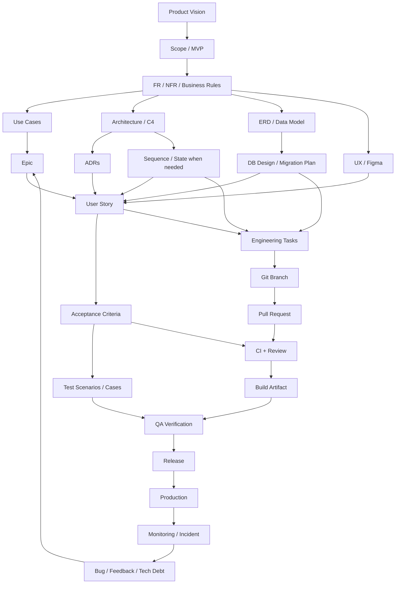

## Cross-links you should deliberately maintain

```text
NFR ───────────────────────→ Architecture / Threat Model / Test Strategy
Business Rule ─────────────→ Use Case + Acceptance Criteria + Tests
Use Case ──────────────────→ Epic / User Stories
Figma ─────────────────────→ Story + Frontend implementation + QA
ERD ───────────────────────→ DB Task / Migration
OpenAPI ───────────────────→ Backend + Client + API tests
ADR ───────────────────────→ implementation constraints
Story + AC ────────────────→ QA Test Cases
Jira key ──────────────────→ branch + commits + PR
PR / merge SHA ────────────→ build artifact
Release version ───────────→ Jira items + Git tag + Docker image + deployed SHA
Incident ──────────────────→ affected release + corrective backlog items
```

A traceable project should let you move **forward** from need → code and **backward** from production version → ticket → requirement.

---

# Documentation Budget — What CapsuleAI Should Definitely Create, Create Only When Useful, or Skip

| Artifact                                       | Recommendation                                 | Reason                                         |
| ---------------------------------------------- | ---------------------------------------------- | ---------------------------------------------- |
| Product Vision                                 | **Definitely create**                          | shared product direction                       |
| Scope/MVP                                      | **Definitely create**                          | controls semester scope                        |
| Stakeholder list                               | **Definitely create, short**                   | clarifies source/approval                      |
| FR/NFR/Business Rules                          | **Definitely create**                          | reusable behavioral constraints                |
| 100-page SRS                                   | **Skip unless university mandates**            | duplicate/stale risk                           |
| Product Backlog                                | **Definitely create**                          | executable product planning                    |
| User Story + AC                                | **Definitely create**                          | Dev/QA entry point                             |
| high-level Use Case Diagram                    | **Create**                                     | useful overview                                |
| Use Case Specs                                 | **Create only for core journeys**              | high value for cross-story flow                |
| Activity Diagram                               | **Only when flow branches are non-trivial**    | avoid CRUD ceremony                            |
| C4 Context/Container                           | **Definitely create**                          | high-value architecture overview               |
| C4 Component                                   | **Only when module complexity warrants**       | otherwise code is clearer                      |
| Class Diagram of all Spring classes            | **Skip**                                       | expensive and quickly stale                    |
| ERD                                            | **Definitely create**                          | human-readable data model                      |
| Flyway migrations                              | **Definitely create**                          | executable schema history                      |
| Sequence Diagram                               | **Only for integration-heavy features**        | good for upload/AI; unnecessary for simple GET |
| State Diagram                                  | **Definitely create for garment processing**   | states affect DB/API/tests                     |
| Deployment Diagram                             | **Definitely create, simple**                  | environment/operations clarity                 |
| ADRs                                           | **Create for durable choices**                 | preserves why, not every small dependency      |
| OpenAPI                                        | **Definitely create/maintain**                 | API source of truth                            |
| Threat Model                                   | **Definitely create lightweight**              | auth/private images/external AI                |
| Test Strategy                                  | **Definitely create, short**                   | aligns automation/manual responsibilities      |
| test case document for every trivial unit test | **Skip**                                       | automated test code is better                  |
| Release Notes                                  | **Definitely create**                          | production traceability                        |
| Runbook                                        | **Create minimal**                             | learn operations                               |
| Postmortem                                     | **Create for at least one simulated incident** | learn production feedback loop                 |

The target is **lightweight but professionally traceable**, not maximum document count.

---

# What I Should Do Next for CapsuleAI

This is the concrete execution order to follow with teammates. Some rows can overlap; the `Depends On` column shows true blockers.

|   # | Action                                           | Owner                    | Artifact / Tool                         | Depends On                 | Done When                                             |
| --: | ------------------------------------------------ | ------------------------ | --------------------------------------- | -------------------------- | ----------------------------------------------------- |
|   1 | Confirm the problem statement                    | PO/BA                    | `01-product/product-vision.md`          | existing proposal          | team can state problem in 2–3 sentences               |
|   2 | Confirm target users/stakeholders                | BA                       | stakeholders doc                        | #1                         | actors/decision makers identified                     |
|   3 | Freeze initial MVP boundary                      | PO + Tech Lead           | `scope-and-mvp.md`                      | #1–2                       | in/out scope agreed                                   |
|   4 | Define measurable project success                | PO/Tech Lead             | Vision/MVP                              | #3                         | product + engineering success indicators written      |
|   5 | Create initial risk register                     | Tech Lead/PM role        | risk list                               | #3                         | top delivery/AI/security risks have owner/mitigation  |
|   6 | Define major Functional Requirements             | BA                       | `functional-requirements.md`            | #3                         | core MVP behavior covered with IDs                    |
|   7 | Define Business Rules                            | BA/PO                    | `business-rules.md`                     | #6                         | ownership/upload/recommendation rules explicit        |
|   8 | Define prioritized NFRs                          | Tech Lead + BA           | `non-functional-requirements.md`        | #3/6                       | security/performance/reliability targets are testable |
|   9 | Identify actors and core use cases               | BA                       | Use Case overview                       | #6–8                       | major actor goals visible                             |
|  10 | Write only core Use Case Specs                   | BA + PO/QA/Dev           | e.g. `UC-03-add-garment.md`             | #9                         | core main/alt/error flows clear                       |
|  11 | Create initial UX user flows/wireframes          | UX/FE role               | Figma                                   | #9–10                      | core user journeys reviewable                         |
|  12 | Build initial Product Backlog                    | PO/BA                    | Jira                                    | #6–10                      | Epics/Stories reflect MVP                             |
|  13 | Create C4 System Context                         | Tech Lead                | architecture doc                        | #3/8                       | system boundary/external systems agreed               |
|  14 | Create C4 Container diagram                      | Tech Lead + Devs         | architecture doc                        | #13/8                      | responsibilities and containers agreed                |
|  15 | Record major architecture decisions              | Tech Lead/decision owner | ADRs                                    | #13–14                     | DB/auth/storage/architecture choices have rationale   |
|  16 | Create initial ERD                               | Backend/Tech Lead        | `04-data/erd.md`                        | #6–10/14                   | core entities/cardinalities sufficient for Sprint 1   |
|  17 | Create garment processing State Diagram          | Backend/Tech Lead        | `STATE-01`                              | #10/16                     | states/transitions agreed                             |
|  18 | Define API conventions                           | Backend Lead             | `api-conventions.md` + OpenAPI skeleton | #14–16                     | error/auth/pagination/version conventions clear       |
|  19 | Create lightweight threat model                  | Tech Lead/security role  | `06-security/threat-model.md`           | #13–18                     | assets/trust boundaries/key controls listed           |
|  20 | Configure Jira hierarchy/workflow                | PO/Tech Lead             | Jira                                    | #12                        | Epic/Story/Task/Bug workflow works                    |
|  21 | Configure Git/PR conventions                     | Tech Lead                | GitHub + CONTRIBUTING                   | —                          | branch/commit/PR convention documented                |
|  22 | Set up Spring Boot repo skeleton                 | Backend/Tech Lead        | Git                                     | #14/15                     | app starts locally                                    |
|  23 | Set up Docker/local PostgreSQL                   | Backend/DevOps role      | Docker Compose                          | #16/22                     | teammate can start dependencies reproducibly          |
|  24 | Set up Flyway                                    | Backend                  | migrations                              | #16/23                     | clean DB reaches current schema automatically         |
|  25 | Set up JWT auth baseline                         | Backend                  | code/OpenAPI/tests                      | auth ADR/requirements      | protected endpoint works end-to-end                   |
|  26 | Set up CI                                        | DevOps/Tech Lead         | GitHub Actions                          | #21–24                     | PR runs `mvn verify` and blocks on failure            |
|  27 | Set up branch protection + PR template           | Tech Lead                | GitHub                                  | #21/26                     | no direct unreviewed merge to main                    |
|  28 | Create Test Strategy                             | QA + Tech Lead           | `07-testing/test-strategy.md`           | #6–8                       | unit/integration/manual responsibilities clear        |
|  29 | Set up staging baseline                          | DevOps role              | deployment platform                     | #22–26                     | main/release artifact can deploy                      |
|  30 | Add health/logging baseline                      | Backend/DevOps           | Actuator/log config                     | #22/29                     | health endpoint/log correlation works                 |
|  31 | Refine Sprint 1 Stories                          | PO/BA + Dev + QA         | Jira                                    | #12–30 relevant items      | top Stories meet DoR                                  |
|  32 | Hold Sprint 1 Planning                           | Scrum Team               | Sprint Goal/Backlog                     | #31                        | realistic scope selected                              |
|  33 | Execute each Story via branch → PR → CI → review | Developers               | Jira + GitHub                           | #32                        | merged code has traceability                          |
|  34 | Deploy each testable increment to staging        | Dev/DevOps               | staging                                 | #33                        | QA can test exact build                               |
|  35 | QA from AC/use cases/business rules              | QA                       | test cases/Bugs                         | #34                        | expected paths verified                               |
|  36 | Run Sprint Review + Retro                        | team/stakeholders        | Jira/notes                              | Sprint end                 | feedback + concrete improvement action                |
|  37 | Repeat refinement/planning for next Sprint       | PO/team                  | Jira/docs                               | feedback                   | next Stories Ready                                    |
|  38 | Before first release, rehearse rollback          | DevOps/Tech Lead         | rollback runbook                        | stable staging             | previous known-good can be restored                   |
|  39 | Create release record + notes                    | Release owner/PO         | Jira release/Git tag                    | QA/UAT pass                | tickets ↔ tag ↔ image ↔ SHA linked                    |
|  40 | Deploy production + smoke test                   | DevOps/service owner     | pipeline                                | #39                        | production healthy                                    |
|  41 | Add minimal dashboards/alerts                    | Backend/DevOps           | monitoring                              | #40 or just before         | upload/auth/AI failures observable                    |
|  42 | Simulate one incident                            | team                     | incident ticket                         | prod/staging realistic env | detect→mitigate→recover exercised                     |
|  43 | Write Postmortem + preventive tickets            | incident owner           | postmortem/Jira                         | #42                        | actions have owners/tickets                           |
|  44 | Run internship readiness review                  | each teammate            | checklist                               | several Sprints completed  | each person can explain/practice the workflow         |

## Practical sequencing note

Rows `11–19` can overlap. For example:

```text
Requirements
├─ UX
├─ C4 architecture
├─ initial ERD
├─ threat model
└─ backlog refinement
```

Do not wait for every diagram to be “perfect” before engineering setup begins. Wait only for decisions that genuinely block safe progress.

---

# 35. Project Board Workflow

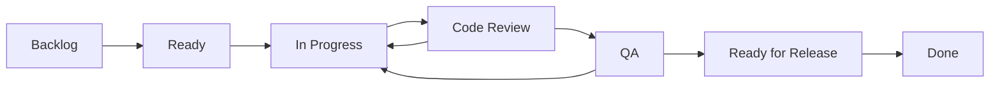

| State             | Khi vào                    | Khi ra                                       |
| ----------------- | -------------------------- | -------------------------------------------- |
| Backlog           | Idea/story chưa sẵn sàng   | Refined + DoR → Ready                        |
| Ready             | Có thể lấy vào Sprint/work | Developer bắt đầu → In Progress              |
| In Progress       | Coding/testing local       | PR ready → Code Review                       |
| Code Review       | PR + CI                    | Approved/merged → QA; changes → In Progress  |
| QA                | Build trên staging         | Pass → Ready for Release; fail → In Progress |
| Ready for Release | Verified, chờ release      | Production + verification → Done             |
| Done              | Meets team DoD             | Không reopen tùy tiện; defect mới tạo Bug    |

## Trường hợp đặc biệt

### CI fails

Ticket/PR không rời Code Review path; author sửa build/test.

### Reviewer requests changes

`Code Review → In Progress` hoặc giữ state Code Review nhưng dùng sub-status; đồ án nên chuyển về `In Progress` để board trực quan.

### QA rejects

`QA → In Progress`, attach bug evidence hoặc reopen linked ticket tùy convention.

### Requirement changes giữa Sprint

PO + developers đánh giá impact; không silently đổi AC. Nếu làm Sprint Goal obsolete thì Scrum có cơ chế hủy Sprint bởi Product Owner, nhưng đồ án hầu như không cần dùng trừ tình huống cực đoan.

### Production bug

Tạo `BUG-*`, triage severity/priority, hotfix nếu cần; sau đó regression + release workflow bình thường.

---

# 36. Documentation Structure — final recommendation for CapsuleAI

The authoritative project structure is the one defined earlier in **Recommended CapsuleAI `docs/` Structure**:

```text
docs/
├── 01-product/
├── 02-requirements/
├── 03-architecture/
├── 04-data/
├── 05-api/
├── 06-security/
├── 07-testing/
└── 08-operations/
```

The numbering is intentional: it helps a student team understand the information flow without implying Waterfall. Documents continue to evolve during Sprints.

## What belongs in Git docs vs Jira/GitHub tools?

**Keep in versioned docs**

- durable product context;
- cross-feature requirements/business rules/NFRs;
- Use Cases for core journeys;
- C4/ERD/architecture diagrams;
- ADRs;
- API conventions;
- threat model;
- test strategy;
- deployment/rollback/monitoring/runbooks.

**Keep in Jira**

- backlog priority;
- Story/Task/Bug/Spike state;
- Sprint assignment;
- Story-specific Acceptance Criteria;
- ticket-specific implementation checklist;
- links to designs/PRs/tests/releases.

**Keep in GitHub/Git**

- branch/commit/PR;
- code review conversation;
- source code;
- migrations;
- CI workflow/results;
- tags/releases.

**Keep in OpenAPI/Figma/runtime platforms**

- API contract → OpenAPI;
- UI source → Figma;
- runtime secrets/config/deployment state → deployment platform.

This avoids recreating the same information in five places.

---

# 37. Definition of Done cho project

Một Product Backlog Item được xem là Done khi, nếu applicable:

- [ ] Acceptance Criteria pass.
- [ ] Code hoàn tất và theo coding conventions.
- [ ] Unit tests added/updated.
- [ ] Integration/API tests added cho behavior quan trọng.
- [ ] Local verification pass.
- [ ] Pull Request reviewed và approved.
- [ ] Required CI checks pass.
- [ ] Security implications reviewed.
- [ ] No secrets/sensitive logs introduced.
- [ ] Database migration versioned/reviewed/tested.
- [ ] API/OpenAPI/docs updated.
- [ ] Deployed to staging.
- [ ] QA pass.
- [ ] UAT nếu story/release yêu cầu.
- [ ] Monitoring/logging updated cho behavior operationally important.
- [ ] No known blocker/critical defect.

**“Code completed” không bằng “Done”** vì chưa chứng minh integration, review, test, deployability và acceptance.

---

# 38. Kế hoạch 14–16 tuần

## Week 1 — Discovery

**Objectives:** hiểu problem/users/MVP.

**Activities:** stakeholder workshop, product vision, scope, success metrics, risks.

**Deliverables:** vision, MVP, in/out scope, initial backlog themes.

**Exit:** team thống nhất “xây cái gì và không xây cái gì”.

## Week 2 — Requirements + Architecture Baseline

**Objectives:** biến MVP thành implementable backlog.

**Activities:** elicitation, business rules, NFRs, stories/AC, C4, initial ERD/API conventions, ADRs lớn.

**Deliverables:** refined top backlog, context/container diagram, initial data model.

**Exit:** đủ Ready items cho Sprint 1.

## Week 3 — Engineering Setup / Sprint 0

**Objectives:** tạo đường ray kỹ thuật.

**Activities:** repo, branch protection, CI, Docker Compose, Flyway, test foundation, staging skeleton, observability baseline.

**Deliverables:** green CI, deployable skeleton, contribution workflow.

**Exit:** Hello-world/simple endpoint có thể đi qua PR→CI→staging.

## Weeks 4–5 — Sprint 1

**Goal:** auth + first core vertical slice.

**Practice focus:** tickets, branches, PR, review, CI, QA.

**Exit:** một user journey usable trên staging.

## Weeks 6–7 — Sprint 2

**Goal:** core wardrobe flows.

**Practice focus:** DB migrations, API integration, integration tests, refinement quality.

## Weeks 8–9 — Sprint 3

**Goal:** AI/recommendation integration.

**Practice focus:** external dependency failure, timeout/retry, observability.

## Weeks 10–11 — Sprint 4

**Goal:** complete MVP value flow + UX polish.

**Practice focus:** regression, security checks, performance hotspots.

## Weeks 12–13 — Hardening Sprint

**Objectives:** chất lượng, không feature race.

**Activities:** bugs, technical debt, test gaps, security review, performance baseline, documentation/runbook, deployment rehearsal.

**Exit:** release candidate.

## Week 14 — UAT + Release

**Activities:** staging validation, UAT, release notes, production deployment, smoke tests, monitoring.

**Exit:** production release có evidence.

## Week 15 — Incident Simulation + Maintenance

**Activities:** inject failure (bad config/dependency outage), detect, triage, rollback/mitigate, write postmortem, create action items.

**Exit:** team đã thực hành operational lifecycle.

## Week 16 — Final Improvement + Retrospective

**Activities:** close critical actions, final retro, internship readiness checklist, architecture/docs cleanup.

**Exit:** có portfolio evidence không chỉ về code mà về engineering process.

---

# 39. Minimum Professional Workflow I Should Actually Implement

Nếu thời gian hạn chế, **đây là phần bắt buộc nên làm**:

1. Product vision + MVP + in/out scope.
2. Product Backlog với User Stories + Acceptance Criteria.
3. Backlog Refinement trước Sprint.
4. 2-week Sprints với Sprint Goal, Planning, Review, Retro.
5. Board: `Backlog → Ready → In Progress → Code Review → QA → Ready for Release → Done`.
6. Mỗi feature gắn ticket.
7. Feature branch; không direct push `main`.
8. Pull Request template + ít nhất 1 reviewer.
9. Branch protection + required CI.
10. `mvn clean verify` trong GitHub Actions.
11. Unit + integration tests cho core behavior.
12. Flyway/Liquibase migrations.
13. Local + staging + production tách config.
14. Deploy staging trước production.
15. Release checklist + release notes.
16. Health check + logs + vài metrics thiết yếu.
17. Rollback/redeploy previous version được thử thật.
18. Ít nhất một simulated production incident + postmortem.
19. Retro actions được đưa thành task/process change.
20. README/runbook đủ để teammate mới chạy project.

### Những thứ **không cần** chỉ để “trông enterprise”

- Kubernetes nếu project không cần.
- Microservices nếu modular monolith đủ.
- Kafka nếu không có async/event problem thật.
- Nhiều approval layers.
- Hàng chục môi trường.
- Bộ tài liệu UML khổng lồ.

---

# 40. Internship Readiness Checklist

## Requirements / Product

- [ ] Tôi có thể đọc một ticket và chỉ ra requirement chưa rõ.
- [ ] Tôi từng hỏi clarification trước khi code.
- [ ] Tôi viết được User Story + Given/When/Then Acceptance Criteria.
- [ ] Tôi từng tham gia refinement và estimate.
- [ ] Tôi biết phân biệt bug, story, task, technical debt, spike.

## Agile / Teamwork

- [ ] Tôi từng làm ít nhất 3–4 Sprints thực sự.
- [ ] Tôi hiểu Sprint Goal và Sprint Backlog.
- [ ] Tôi từng demo Sprint Review.
- [ ] Tôi từng tham gia Retro và thực hiện action item ở Sprint sau.

## Git / Collaboration

- [ ] Tôi dùng feature branch từ `main`.
- [ ] Tôi viết meaningful commits.
- [ ] Tôi mở Pull Request đầy đủ context.
- [ ] Tôi review PR của người khác.
- [ ] Tôi nhận và xử lý review comments.
- [ ] Tôi từng giải quyết merge conflict.
- [ ] Tôi không direct push protected `main`.

## Testing / Quality

- [ ] Tôi viết unit tests.
- [ ] Tôi viết integration tests với database thật/test container.
- [ ] Tôi biết đọc test failure trong CI.
- [ ] Tôi từng reproduce bug từ QA ticket.
- [ ] Tôi thực hiện regression/smoke test cơ bản.

## Database

- [ ] Tôi tạo schema change bằng Flyway/Liquibase migration.
- [ ] Tôi hiểu PK/FK/unique/check/not-null/index.
- [ ] Tôi từng xử lý migration conflict/failure ở non-prod.
- [ ] Tôi không dựa vào manual DB changes.

## CI/CD / DevOps

- [ ] PR tự chạy build + tests.
- [ ] Tôi từng debug một CI failure.
- [ ] Tôi build được versioned artifact/Docker image.
- [ ] Tôi deploy staging.
- [ ] Tôi deploy production bằng procedure reproducible.
- [ ] Tôi biết config và secret khác nhau thế nào.
- [ ] Tôi chạy smoke tests sau deploy.

## Operations

- [ ] Tôi đọc production logs để tìm request failure.
- [ ] Tôi biết health check đang kiểm tra gì.
- [ ] Tôi theo dõi latency/error/traffic/resource signal cơ bản.
- [ ] Tôi từng rollback/redeploy previous known-good version.
- [ ] Tôi từng tham gia simulated incident.
- [ ] Tôi viết được incident timeline + root cause + corrective actions.
- [ ] Tôi viết postmortem không đổ lỗi cá nhân.

## Architecture / Communication

- [ ] Tôi giải thích được system bằng C4 Context/Container diagram.
- [ ] Tôi viết ADR cho một decision có trade-off thật.
- [ ] Tôi giải thích được tại sao project chọn modular monolith/PostgreSQL/auth strategy.
- [ ] Tôi có thể onboarding teammate mới bằng README + docs hiện có.

---

# 41. Master Workflow — Information Flow + Work Execution Flow

This final view combines the two realities of software development:

1. **Information/documentation flow** — why the work exists and what knowledge constrains it.
2. **Execution flow** — how a selected work item becomes tested production software.

## 41.1 Information / documentation flow

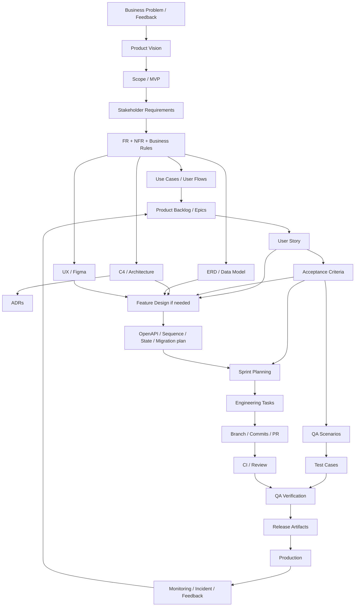

## 41.2 Work execution flow

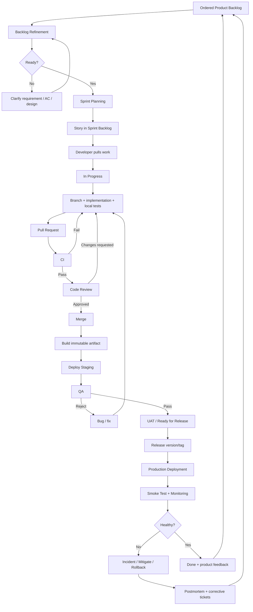

## 41.3 One line that explains the whole system

```text
A Jira ticket exists because product/requirement information created a need.
The ticket links to the design needed to implement that need.
Git/PR implements it.
Tests/QA verify it against Acceptance Criteria.
A release delivers the verified code.
Production telemetry/feedback creates the next backlog work.
```

---

# 42. Một ngày làm việc mẫu của intern/junior trong workflow này

```text
09:00  Check board/PR/CI
09:15  Daily Scrum
09:30  Continue US-023
10:30  Clarify one AC with PO/QA
11:00  Implement + tests
13:30  Run local verify
14:00  Push + open PR
14:10  CI fails integration test → inspect logs → fix
15:00  CI green
15:15  Review teammate PR
16:00  Address reviewer comment on own PR
16:30  PR approved + merged
16:40  staging deployment succeeds
17:00  QA finds edge-case bug → ticket moves back In Progress
17:15  reproduce + plan fix for next work block
```

Điều quan trọng không phải lịch giờ chính xác, mà là bạn quen với **work item → collaboration → automation → verification → delivery**.

---

# 43. Các artefact nên có khi kết thúc đồ án

```text
Product
- Vision/MVP/scope
- Product Backlog export/screenshot
- Sample refined tickets

Architecture
- C4 Context + Container
- ERD/data model
- 3–5 ADRs

Engineering
- Protected main
- PR history + review discussions
- CI workflow history
- Unit/integration tests
- Versioned migrations

Delivery
- Staging URL/environment
- Production deployment evidence
- Release notes/tags
- Rollback procedure

Operations
- Health/metrics/log screenshots or dashboard
- Incident simulation record
- Postmortem + corrective actions

Process
- Sprint Goals
- Sprint Reviews
- Retrospective actions
```

Đây là evidence mạnh cho internship interview vì bạn có thể trả lời bằng trải nghiệm thực tế thay vì chỉ định nghĩa lý thuyết.

---

# 44. Sources / Authoritative References

Tài liệu này tổng hợp engineering practice, không giả định một nguồn đơn lẻ định nghĩa toàn bộ software-company workflow.

1. **The Scrum Guide (official, 2020)** — Scrum Team, Product Backlog, Sprint Planning, Daily Scrum, Sprint Review, Sprint Retrospective, Increment, Definition of Done.  
   https://scrumguides.org/scrum-guide.html

2. **GitHub Docs — About Pull Requests** — branch/PR/review/check/merge collaboration workflow.  
   https://docs.github.com/en/pull-requests/get-started/about-pull-requests

3. **GitHub Docs — Protected Branches** — required reviews/status checks and branch protection.  
   https://docs.github.com/en/repositories/configuring-branches-and-merges-in-your-repository/managing-protected-branches/about-protected-branches

4. **GitHub Docs — Building and testing Java with Maven** — GitHub Actions CI for Maven projects.  
   https://docs.github.com/en/actions/tutorials/build-and-test-code/java-with-maven

5. **NIST SP 800-218 — Secure Software Development Framework (SSDF) v1.1** — secure development practices integrated into SDLC.  
   https://csrc.nist.gov/pubs/sp/800/218/final

6. **OWASP Threat Modeling Cheat Sheet** — threat modeling as an iterative SDLC activity.  
   https://cheatsheetseries.owasp.org/cheatsheets/Threat_Modeling_Cheat_Sheet.html

7. **C4 Model — official site by Simon Brown** — Context/Container/Component/Deployment concepts and pragmatic diagram selection.  
   https://c4model.com/diagrams

8. **AWS — Practicing CI/CD** — distinction among CI, Continuous Delivery and Continuous Deployment; deployment approaches.  
   https://docs.aws.amazon.com/whitepapers/latest/practicing-continuous-integration-continuous-delivery/what-is-continuous-integration-and-continuous-deliverydeployment.html

9. **Google Site Reliability Engineering — Monitoring Distributed Systems** — monitoring principles and four golden signals.  
   https://sre.google/sre-book/monitoring-distributed-systems/

10. **Google SRE — Incident Management Guide** — prepare, respond, remediate, learn, blameless postmortems.  
    https://sre.google/resources/practices-and-processes/incident-management-guide/

11. **Google SRE — Postmortem Culture** — incident learning, root cause, preventive actions and blameless practice.  
    https://sre.google/sre-book/postmortem-culture/

12. **Spring Boot Reference — Observability / Metrics** — Actuator, Micrometer, metrics/traces/OpenTelemetry integration.  
    https://docs.spring.io/spring-boot/reference/actuator/observability.html  
    https://docs.spring.io/spring-boot/reference/actuator/metrics.html

13. **Atlassian — Jira Workflows** — Jira workflow is modeled with statuses and transitions; work types can use different workflows.  
    https://support.atlassian.com/jira-software-cloud/docs/what-are-jira-workflows/

14. **Atlassian — User Stories** — user stories capture user-centered outcomes and are clarified through conversation/acceptance criteria rather than acting as full technical specifications.  
    https://www.atlassian.com/agile/project-management/user-stories

15. **Atlassian — Jira Workflow Transitions** — transitions define allowed movement between statuses and can represent team handoffs.  
    https://support.atlassian.com/jira-cloud-administration/docs/create-workflow-transitions/

---

# 45. Final Recommendation

Nếu mục tiêu là **đi thực tập không bỡ ngỡ**, hãy đánh giá thành công của đồ án bằng câu hỏi:

> “Nhóm đã thực hiện bao nhiêu lần một feature đi trọn đường từ requirement → ticket → branch → PR → CI → review → QA → staging → production → monitoring/feedback?”

Một project có **8–12 feature nhỏ nhưng đi đúng workflow nhiều lần** sẽ dạy engineering habits tốt hơn một project có 40 feature được code song song rồi merge gấp trước ngày demo.

Ưu tiên cuối cùng:

```text
Clear requirements
+ small tickets
+ disciplined Git/PR workflow
+ automated tests/CI
+ real staging/release process
+ basic observability
+ incident/rollback practice
+ retrospectives that change behavior
```

Đó là phiên bản “professional software company simulation” thực tế, đủ sâu để chuẩn bị internship nhưng không biến đồ án sinh viên thành một enterprise bureaucracy giả lập.
